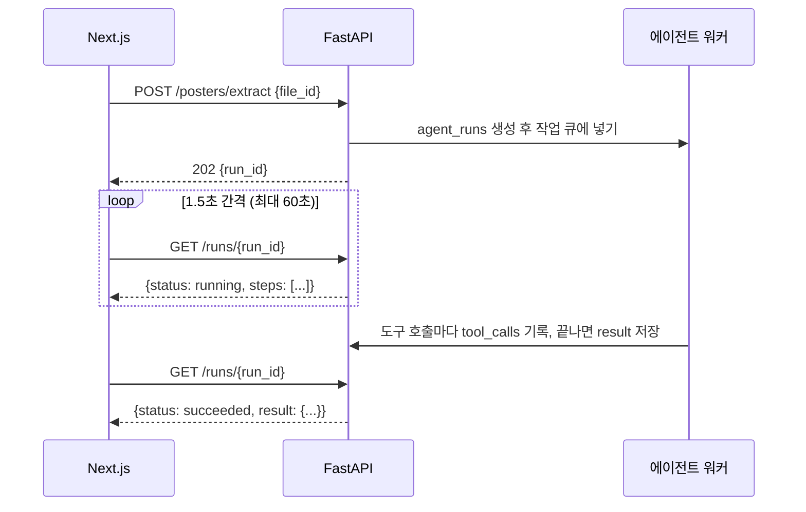

# API 명세 — 학내 정보 에이전트 MVP

> 📝 문서 상태: 초안 v0.3 · 2026-10-05 · 기준 문서: PRD v0.8, ERD v0.8
>
> v0.3 변경: 디자인 초안 대조 반영 — 엔드포인트 6개 추가(동의 기록, 설정, 알림함 목록·읽음, 과목 상세), 피드·상세에 `display_status`·`easy_summary`·`is_new`·조건 문구·`eligibility.summary`, 서류와 플래너 할 일 연결, 포스터 2쪽 PDF, 플래너 마감 `markers`, 상시 공고 `target_date`, LMS 과목 새 자료 수·`course.html_url`, 알림 `link.course_id`, 에러 코드 4개(`CONSENT_REQUIRED`·`PAGE_LIMIT_EXCEEDED`·`DB_UNAVAILABLE`·`INTERNAL_ERROR`)
>
> v0.2 변경: 강의자료 API를 구간 요약 + 선택 구간 번역 구조로 변경, 분량 상한을 토큰 기준으로 변경
>
> 이 문서는 **프론트(Next.js)와 백엔드(FastAPI) 사이의 계약**이다. W1에 확정하면 프론트는 이 형식의 목데이터로 화면을 먼저 만들고, 백엔드는 같은 형식으로 실제 응답을 맞춘다. FastAPI가 자동 생성하는 OpenAPI(`/docs`)가 최종 기준이 되도록 Pydantic 모델을 이 문서대로 작성하고, 프론트 타입은 `openapi-typescript`로 생성한다.

---

## 목차

1. 공통 규칙
2. 비동기 작업(에이전트 실행) 패턴
3. 엔드포인트 한눈에 보기
4. 인증 · 내 정보
5. 공고 피드 · 상세 · 신고
6. 업로드 · 포스터
7. 준비하기 · 플래너 · 캘린더
8. 강의계획서 · 강의자료
9. LMS 연동
10. 알림
11. 에이전트 실행 조회
12. 내부 · 운영 API
13. 에러 코드
14. 결정이 필요한 것

---

## 1. 공통 규칙

| 항목 | 규칙 |
| --- | --- |
| Base URL | `https://{api-host}/api/v1` |
| 인증 | `Authorization: Bearer {Supabase access token}`. FastAPI가 Supabase JWT를 검증해 `user_id`를 얻는다. 4장의 로그인 콜백을 제외한 모든 사용자 API에 필요 |
| 데이터 접근 | **프론트는 DB를 직접 읽지 않고 모든 데이터를 이 API로 받는다.** Supabase는 로그인(supabase-js)에만 직접 사용. 마스킹·판정 결합·과목 한정 노출을 한 곳에서 처리하기 위함 |
| 형식 | JSON, 필드명 `snake_case`, UTF-8 |
| 시간 | 일시는 ISO 8601 + 오프셋 (`2026-10-15T23:59:00+09:00`), 날짜만은 `YYYY-MM-DD`. DB는 UTC 저장 |
| ID | UUID 문자열. Canvas ID는 숫자 그대로 |
| 목록 | 커서 페이지네이션: `?limit=20&cursor={next_cursor}` → 응답 `{ "items": [...], "next_cursor": "..." \| null }` |
| 업로드 | `multipart/form-data`, 파일 1개, 최대 20MB. 강의자료 분량 상한은 업로드가 아니라 요약 요청 때 토큰 기준으로 판정(8장) |
| 에러 | `{ "error": { "code": "LMS_TOKEN_INVALID", "message": "사람이 읽는 메시지", "details": {} } }` (13장) |
| 상태 코드 | 200 조회·수정, 201 생성, 202 비동기 작업 접수, 204 삭제, 400 잘못된 요청, 401 인증 없음, 403 권한 없음, 404 없음, 409 충돌·중복, 413 파일 초과, 422 검증 실패, 429 한도 초과, 502 외부 서비스 오류 |
| 비밀값 | LMS 토큰·Google 토큰은 **요청 본문으로 받기만 하고 어떤 응답에도 내보내지 않는다.** 로그·`tool_calls.input`에도 남기지 않는다 |

## 2. 비동기 작업(에이전트 실행) 패턴

LLM을 부르는 작업(포스터 추출, 준비하기, 계획서 추출, 강의자료 요약, LMS 동기화)은 수 초–수십 초가 걸린다. 그래서 요청은 바로 `202`와 `run_id`를 돌려주고, 프론트는 실행 상태를 조회한다. 이 실행 기록이 곧 "처리 과정 표시"(F-42)와 성공률·응답시간·비용 측정의 원천이다.



- 접수 응답: `202 { "run_id": "uuid", "status": "running" }`
- 폴링 간격 1.5초, 60초가 지나도 끝나지 않으면 "백그라운드에서 계속 처리 중" 안내 후 폴링 중단(완료되면 웹 푸시)
- 같은 작업을 중복 요청하면 진행 중인 `run_id`를 그대로 돌려준다(예: 같은 공고 준비하기 연타)
- MVP 작업 큐는 FastAPI `BackgroundTasks`로 시작하고, 부하가 생기면 별도 워커로 분리

## 3. 엔드포인트 한눈에 보기

| 분류 | 메서드 · 경로 | 설명 | 기능 | 우선 |
| --- | --- | --- | --- | --- |
| 인증 | `POST /auth/google/tokens` | 로그인 직후 Google 캘린더 토큰 저장 | F-01 | P0 |
| 인증 | `GET /auth/hyin/start` · `GET /auth/hyin/callback` | HY-in 재학생 인증 | F-05 | P1 |
| 내 정보 | `GET /me` | 내 계정·연동 상태 요약 | F-01 | P0 |
| 내 정보 | `GET /me/profile` · `PATCH /me/profile` | 판정용 프로필 조회·수정(수정 시 재판정) | F-02–F-04 | P0 |
| 내 정보 | `POST /me/consents` | 약관·개인정보 동의 기록 | F-02 | P0 |
| 내 정보 | `GET /me/settings` · `PATCH /me/settings` | 알림·LMS 과제 자동 등록 설정 | F-06 | P1 |
| 내 정보 | `DELETE /me` | 탈퇴(모든 개인 데이터·토큰 삭제) | 7장 | P0 |
| 공고 | `GET /opportunities` | 추천 피드 | F-40 | P0 |
| 공고 | `GET /opportunities/{id}` | 공고 상세(조건별 판정표·서류·준비 상태) | F-41 | P0 |
| 공고 | `GET /opportunities/{id}/alternatives` | 대체 공고 | F-23 | P1 |
| 공고 | `POST /opportunities/{id}/reports` | 신고 | F-17 | P0 |
| 업로드 | `POST /files` | 파일 업로드 → `file_id` | F-13–F-15 | P0 |
| 포스터 | `POST /posters/extract` | 포스터 추출(비동기) | F-13 | P0 |
| 포스터 | `POST /posters/confirm` | 확인·수정 후 공고 등록(중복이면 병합) | F-13, F-16 | P0 |
| 준비 | `POST /opportunities/{id}/prepare` | 준비하기(서류·역산 일정·캘린더, 비동기) | F-30–F-32 | P0 |
| 플래너 | `GET /planner/tasks` · `POST /planner/tasks` | 플래너 조회·직접 추가 | F-43 | P0 |
| 플래너 | `PATCH /planner/tasks/{id}` · `DELETE /planner/tasks/{id}` | 완료 체크·수정·삭제 | F-31, F-43 | P0 |
| 캘린더 | `POST /calendar/events` · `DELETE /calendar/events/{id}` | 캘린더 등록·해제 | F-32 | P0 |
| 캘린더 | `GET /calendar/ics` | .ics 내려받기 | F-34 | P1 |
| 계획서 | `POST /syllabi/extract` · `POST /syllabi/{id}/confirm` | 계획서 일정 추출·확정 | F-14 | P0 |
| 강의자료 | `POST /materials` · `GET /materials/{file_id}` | 요약 요청(구간별+전체)·조회 | F-15 | P0 |
| 강의자료 | `POST /materials/{file_id}/translations` | 고른 구간만 번역 | F-15 | P0 |
| 강의자료 | `GET /materials` | 내 문서함 | F-44 | P1 |
| LMS | `POST /lms/connection` · `GET /lms/connection` · `DELETE /lms/connection` | 토큰 연결·상태·해제 | F-50 | P0 |
| LMS | `POST /lms/sync` | 즉시 동기화(대시보드 접속 시) | F-51 | P0 |
| LMS | `GET /lms/courses` | 수강 과목 + 계획서 바로가기 | F-14, F-51 | P0 |
| LMS | `GET /lms/courses/{id}` | 과목 상세: 과제·주차 자료·공지·계획서·내 자료, 열람 기록 | F-14, F-15, F-51–F-53 | P0 |
| LMS | `GET /lms/assignments` | 과제·제출 상태 | F-51 | P0 |
| LMS | `GET /lms/updates` | 새 주차학습 항목·과목 공지 피드 | F-52, F-53 | P0 |
| 알림 | `POST /push/subscriptions` · `DELETE /push/subscriptions` | 웹 푸시 구독·해제 | F-33 | P0 |
| 알림 | `GET /notifications` | 알림함 목록과 안 읽은 수 | F-35 | P0 |
| 알림 | `POST /notifications/read` | 읽음 처리(선택 또는 전체) | F-35 | P0 |
| 실행 | `GET /runs/{id}` | 에이전트 실행 상태·처리 과정·결과 | F-42 | P0 |
| 내부 | `POST /internal/jobs/{job}` | 스케줄러 배치(크롤링·LMS 동기화·알림) | 6장 | P0 |
| 내부 | `POST /internal/eval/run` | 테스트 시나리오 실행 | 8장 | P0 |
| 운영 | `POST /admin/opportunities/{id}/restore` | 신고 숨김 공고 복구 | F-17 | P1 |

## 4. 인증 · 내 정보

### `POST /auth/google/tokens`

로그인은 프론트에서 supabase-js로 처리한다. Google 로그인 시 캘린더 권한과 refresh token을 함께 받도록 요청한다(scope `https://www.googleapis.com/auth/calendar.events`, `access_type=offline`, `prompt=consent`). 로그인 콜백에서 받은 provider 토큰을 이 API로 한 번 보내면 백엔드가 암호화해 `oauth_tokens`에 저장한다. 동시에 `profiles` 행이 없으면 만든다.

```json
// Request
{ "provider_token": "ya29...", "provider_refresh_token": "1//0g..." }

// Response 200
{ "calendar_connected": true, "scope": "calendar.events" }
```

에러: `GOOGLE_REFRESH_TOKEN_MISSING`(422, 재로그인 필요)

### `GET /auth/hyin/start` · `GET /auth/hyin/callback` (P1)

`start`는 HY-in OAuth 인증 페이지로 302 리다이렉트한다. `callback`은 받은 정보 중 **재학 여부·소속 학과·입학년도만** 프로필에 반영하고 학번·성명은 버린 뒤 프론트 설정 화면으로 리다이렉트한다.

### `GET /me`

```json
{
  "user_id": "uuid",
  "display_name": "김현준",
  "hyin_verified": false,
  "calendar_connected": true,
  "lms": { "status": "active", "last_synced_at": "2026-10-01T10:30:00+09:00" },
  "profile_completion": { "filled": 6, "total": 15 },
  "consented": true,
  "unread_notifications": 3
}
```

- `consented`: 약관·개인정보 동의를 마쳤는지. false면 프론트가 온보딩 동의 단계로 보낸다
- `unread_notifications`: 헤더 알림 배지 숫자

### `POST /me/consents`

```json
// Request
{ "consent_version": "2026-10-05", "agree_terms": true, "agree_privacy": true }

// Response 200
{ "terms_agreed_at": "2026-10-05T17:20:00+09:00", "privacy_agreed_at": "2026-10-05T17:20:00+09:00", "consent_version": "2026-10-05" }
```

- 둘 중 하나라도 false면 `422 VALIDATION_FAILED`
- 동의 전에는 `/me/profile` 수정과 공고·플래너 API가 `403 CONSENT_REQUIRED`를 돌려준다

### `GET /me/profile` · `PATCH /me/profile`

모든 필드 nullable. `PATCH`는 보낸 필드만 바꾸고 `null`을 보내면 지운다. 수정되면 해당 사용자의 판정을 다시 계산한다(코드 비교라 동기 처리).

```json
// PATCH Request (F-03 즉석 입력도 같은 API 사용)
{ "gpa_last_semester": 3.62, "semesters_completed": 5 }

// Response 200
{
  "profile": {
    "department": "인공지능학과", "grade": 3, "enrollment_status": "enrolled",
    "semesters_completed": 5,
    "credits_total": 98.0, "credits_last_semester": 18.0,
    "gpa_total": 3.71, "gpa_last_semester": 3.62, "gpa_scale": 4.5,
    "birth_date": null, "military_service_months": null,
    "region_sido": "경기도", "region_sigungu": "안산시",
    "income_bracket": null, "median_income_pct": null, "welfare_status": null,
    "admission_year": null, "hyin_verified_at": null
  },
  "rejudged": { "changed": 3, "eligible": 12, "undetermined": 7, "ineligible": 9 }
}
```

에러: `VALIDATION_FAILED`(422, 예: `gpa_last_semester > gpa_scale`)

### `GET /me/settings` · `PATCH /me/settings` (P1)

```json
{ "push_enabled": true, "muted_notification_types": ["new_material"], "calendar_auto_lms": true }
```

- `PATCH`는 보낸 필드만 바꾸고, 행이 없으면 기본값으로 만든다
- `calendar_auto_lms`를 끄면 이후 새 과제만 캘린더에 넣지 않는다. 이미 등록한 일정은 지우지 않는다

### `DELETE /me`

`204`. Google·LMS 토큰, 프로필, 업로드 파일, 판정·플래너·캘린더 기록을 삭제한다. 사용자가 올린 공유 포스터 공고는 남기되 업로더를 비운다(ERD `on delete set null`). Google 캘린더에 이미 등록된 일정은 지우지 않는다.

## 5. 공고 피드 · 상세 · 신고

### `GET /opportunities`

| 파라미터 | 값 | 기본 |
| --- | --- | --- |
| `eligibility` | `eligible` \| `undetermined` \| `ineligible` \| `all`, 쉼표로 여러 개 | `all` |
| `category` | ERD `opportunity_category` 값, 쉼표로 여러 개 | 전체 |
| `source_type` | ERD `source_type` 값, 쉼표로 여러 개 | 전체 |
| `sort` | `deadline` \| `recent` | `deadline` |
| `include_expired` | `true` \| `false` | `false` |
| `limit`, `cursor` | 1–50 | 20 |

서버는 `status = active`이고, `visible_canvas_course_id`가 없거나 사용자가 그 과목 수강생인 공고만 내려준다.

- `eligibility`는 쉼표로 여러 값을 받는다. 홈은 기본 목록을 `eligibility=eligible,undetermined`로 부르고, "지원 어려움 N개" 묶음을 펼칠 때 `eligibility=ineligible`로 따로 부른다
- `sort=deadline`은 마감일 없는 공고를 맨 뒤로 보낸다
- `counts`는 카테고리 필터와 상관없이 전체 기준이다(ERD 집계 쿼리)

```json
{
  "items": [
    {
      "id": "uuid",
      "title": "2026-2 한양브레인 장학금",
      "organizer": "ERICA 학생지원팀",
      "category": "scholarship",
      "source_type": "school_notice",
      "deadline_at": "2026-10-15T23:59:00+09:00",
      "d_day": 14,
      "easy_summary": "직전학기 성적이 좋은 학생에게 등록금 일부를 감면해 줘요.",
      "is_new": true,
      "eligibility": {
        "status": "undetermined",
        "display_status": "missing_info",
        "summary": "직전학기 취득학점을 입력하면 판정할 수 있어요",
        "missing_fields": ["credits_last_semester"]
      },
      "recommend_reason": "인공지능학과 · 성적장학",
      "needs_review": false,
      "uploader_masked": null,
      "course_name": null,
      "prepared": false
    },
    {
      "id": "uuid",
      "title": "데이터베이스 연구실 연구 참여 학생 모집",
      "category": "research",
      "source_type": "lms_announcement",
      "deadline_at": null,
      "easy_summary": "데이터베이스 연구실에서 학부 연구 참여 학생을 모집해요.",
      "is_new": false,
      "eligibility": { "status": "eligible", "display_status": "eligible", "summary": "제시된 조건 없음", "missing_fields": [] },
      "needs_review": true,
      "uploader_masked": null,
      "course_name": "데이터베이스",
      "prepared": false
    }
  ],
  "next_cursor": "eyJkIjoiMjAyNi0xMC0xNSJ9",
  "counts": {
    "eligible": 8, "new_eligible": 2,
    "undetermined": 3, "missing_info": 2, "needs_review": 1,
    "ineligible": 9,
    "deadline_soon": 2
  }
}
```

- `uploader_masked`: 포스터 공고일 때만 값이 있다(예: `"김*지"`)
- `recommend_reason`(F-24, P1)은 MVP 초기엔 `null`이어도 된다
- `eligibility.display_status`: `eligible` \| `missing_info` \| `needs_review` \| `ineligible`. 화면 라벨(지원 가능·정보 필요·원문 확인 필요·지원 어려움)에 1:1로 대응한다
- `easy_summary`는 카드 설명 한 줄, `is_new`는 등록 7일 이내이고 아직 상세를 열지 않은 지원 가능 공고다

### `GET /opportunities/{id}`

```json
{
  "id": "uuid",
  "title": "2026-2 한양브레인 장학금",
  "organizer": "ERICA 학생지원팀",
  "category": "scholarship",
  "source_type": "school_notice",
  "original_url": "https://...",
  "easy_summary": "직전학기 성적이 좋은 학생에게 등록금 일부를 감면해주는 장학금이에요.",
  "apply_start_at": "2026-10-01T09:00:00+09:00",
  "deadline_at": "2026-10-15T23:59:00+09:00",
  "needs_review": false,
  "extraction_confidence": 0.92,
  "uploader_masked": null,
  "course_name": null,
  "poster_url": null,
  "eligibility": {
    "status": "ineligible",
    "display_status": "ineligible",
    "summary": "직전학기 장학용 평점이 기준보다 낮아요",
    "missing_fields": ["credits_last_semester"],
    "reason_text": "직전학기 장학용 평점 3.5 이상이 필요해요. 현재 3.2예요.",
    "conditions": [
      {
        "requirement_id": "uuid",
        "field": "gpa_last_semester",
        "label": "직전학기 장학용 평점",
        "operator": "gte",
        "value": 3.5,
        "user_value": 3.2,
        "condition_text": "직전학기 장학용 평점 3.5 이상",
        "user_value_text": "3.2",
        "outcome": "fail",
        "evidence_text": "직전학기 장학용 평점평균 3.5 이상자 중 석차순 선발",
        "is_ambiguous": false
      },
      {
        "requirement_id": "uuid",
        "field": "credits_last_semester",
        "label": "직전학기 취득학점",
        "operator": "gte",
        "value": 10,
        "user_value": null,
        "condition_text": "직전학기 10학점 이상",
        "user_value_text": null,
        "outcome": "unknown",
        "evidence_text": "직전학기 취득학점 기본 10학점 이상",
        "is_ambiguous": false
      }
    ],
    "evaluated_at": "2026-10-01T10:31:00+09:00"
  },
  "documents": [
    { "id": "uuid", "name": "재학증명서", "issuer": "한양인 포털", "how_to": "포털 > 증명서 발급", "lead_days": 1, "effort_minutes": null, "form_url": null, "is_required": true, "task_id": "uuid", "is_done": true },
    { "id": "uuid", "name": "장학금 신청서", "issuer": "공고 첨부파일", "how_to": "공고 첨부 양식을 내려받아 작성", "lead_days": 0, "effort_minutes": 30, "form_url": "https://...", "is_required": true, "task_id": "uuid", "is_done": false }
  ],
  "prep": {
    "prepared": true,
    "prep_plan_id": "uuid",
    "tasks_total": 3,
    "tasks_done": 1,
    "calendar_events": [ { "id": "uuid", "provider": "google" } ]
  },
  "process": {
    "extraction": [
      { "seq": 1, "label": "공고 원문 읽기", "status": "succeeded", "latency_ms": 2100 },
      { "seq": 2, "label": "지원 자격 정리", "status": "succeeded", "latency_ms": 2340 }
    ],
    "evaluated_at": "2026-10-05T09:12:00+09:00",
    "prepare_run_id": null
  },
  "reported_by_me": false
}
```

- 조건 `outcome`: `pass` \| `fail` \| `unknown`
- `label`은 백엔드가 `field` → 한글 이름으로 변환해 내려준다(프론트에 매핑표를 두지 않기 위함)
- `condition_text`·`user_value_text`는 백엔드가 field·operator·value로 만든 화면용 문구다. 미입력이면 `user_value_text`는 null
- `eligibility.summary`는 상태 카드에 쓰는 사유 한 줄이다
- `missing_fields`는 정보 입력창(F-03)에 띄울 항목이다
- 서류의 `task_id`·`is_done`은 준비하기 전에는 null이고, 체크는 기존 `PATCH /planner/tasks/{task_id}`로 한다
- `poster_url`은 포스터 공고의 원본 이미지(Storage 서명 URL, 1시간), `course_name`은 과목 공지에서 온 공고의 과목명이다
- `process.extraction`은 추출 실행에서 라벨·상태·소요 시간만 뽑은 것이라 배치 실행이나 남의 포스터도 내려준다. `GET /runs/{id}`의 본인 실행 제한은 그대로 둔다
- 이 API를 부르면 `opportunity_views`를 upsert한다(`first_viewed_at` 유지, `last_viewed_at` 갱신)

### `GET /opportunities/{id}/alternatives` (P1)

부적격 공고에 대해 같은 카테고리·비슷한 난이도의 **적격** 공고 최대 3개. 응답은 피드 아이템과 같은 형식의 `items` 배열.

### `POST /opportunities/{id}/reports`

```json
// Request
{ "reason": "wrong_info", "detail": "마감일이 10/20으로 바뀌었어요" }

// Response 201
{ "reported": true, "hidden": false }
```

- 포스터 공고(`source_type = poster`)만 신고 가능. 그 외는 `400 REPORT_NOT_ALLOWED`
- 같은 사용자가 다시 신고하면 `409 ALREADY_REPORTED`
- 서로 다른 3명째 신고에서 `hidden: true`

## 6. 업로드 · 포스터

### `POST /files`

```
Content-Type: multipart/form-data
file: (binary)
kind: poster | syllabus | lecture_material
lms_course_id: (선택) uuid
lms_module_item_id: (선택) uuid — 새 자료 알림에서 넘어온 경우
```

```json
// Response 201
{ "file_id": "uuid", "kind": "lecture_material", "page_count": 42, "duplicate_of": null }
```

- 본인이 같은 파일(sha256)을 이미 올렸으면 새로 저장하지 않고 기존 `file_id`를 돌려주며 `duplicate_of`에 표시
- 에러: `FILE_TOO_LARGE`(413), `PAGE_LIMIT_EXCEEDED`(413), `UNSUPPORTED_FILE_TYPE`(400), `DAILY_UPLOAD_LIMIT`(429)
- 허용 형식: poster는 jpg·png·webp·heic와 **2쪽 이하 PDF**, syllabus·lecture_material은 pdf. 포스터 PDF가 3쪽 이상이면 `413 PAGE_LIMIT_EXCEEDED`
- 업로드한 파일 이름을 `files.original_name`에 저장한다

### `POST /posters/extract`

```json
// Request
{ "file_id": "uuid" }

// Response 202
{ "run_id": "uuid", "status": "running" }
```

완료 시 `GET /runs/{run_id}`의 `result`:

```json
{
  "kind": "poster_extract",
  "draft": {
    "title": "2026 전국 대학생 SW 창업 아이디어톤",
    "organizer": "과학기술정보통신부",
    "category": "contest",
    "apply_start_at": null,
    "deadline_at": "2026-10-20T18:00:00+09:00",
    "easy_summary": "...",
    "requirements": [
      { "field": "enrollment_status", "operator": "in", "value": ["enrolled", "on_leave"], "condition_text": "재학생 또는 휴학생", "evidence_text": "국내 대학 재학생 및 휴학생", "is_ambiguous": false }
    ],
    "documents": [ { "name": "참가신청서", "issuer": "주최측 홈페이지", "lead_days": 2, "effort_minutes": 60, "form_url": null } ],
    "extraction_confidence": 0.71,
    "low_confidence_fields": ["deadline_at"]
  },
  "duplicate_candidate": { "opportunity_id": "uuid", "title": "2026 전국 대학생 SW 창업 아이디어톤" }
}
```

- `low_confidence_fields`는 확인 화면에서 강조 표시
- 확인 화면은 요건을 `condition_text` 문장으로 보여주고 행 단위로 지울 수 있다
- `duplicate_candidate`가 있으면 "이미 등록된 공고예요" 안내 후 그 공고로 이동 선택지 제공

### `POST /posters/confirm`

```json
// Request: 사용자가 확인 화면에서 고친 최종값
{ "run_id": "uuid", "draft": { "...": "위 draft와 같은 형식" } }

// Response 201
{ "opportunity_id": "uuid", "merged": false }
```

- 같은 공고가 이미 있으면 `merged: true`와 기존 공고 ID를 돌려준다(F-16)
- 등록 즉시 업로더 본인 판정을 계산하고, 다른 사용자 판정은 다음 배치에서 계산

## 7. 준비하기 · 플래너 · 캘린더

### `POST /opportunities/{id}/prepare`

```json
// Request
{ "register_calendar": true, "calendar_provider": "google", "target_date": null }

// Response 202 (처음) 또는 200 (이미 준비한 공고면 기존 결과)
{ "run_id": "uuid", "status": "running" }
```

- 판정이 `ineligible`이면 `409 NOT_ELIGIBLE`. 프론트는 "그래도 준비하기"를 누르면 `{"force": true}`로 다시 보낸다
- `calendar_provider`가 `ics`면 캘린더 API를 부르지 않고 결과에 .ics 링크를 포함
- `target_date`는 `deadline_at`이 null인 상시 공고에서 **필수**다. `planner_tasks.due_date`가 NOT NULL이라 화면에서 목표일을 받는다
- `build_prep_plan` 역산 규칙: 서류 할 일 = 마감 2일 전 − `lead_days`. 오늘보다 앞서면 오늘로 둬서 지난 날짜가 생기지 않게 한다

완료 시 `result`:

```json
{
  "kind": "prepare",
  "prep_plan_id": "uuid",
  "documents": [ { "id": "uuid", "name": "재학증명서", "issuer": "한양인 포털", "how_to": "...", "lead_days": 1 } ],
  "tasks": [
    { "id": "uuid", "title": "재학증명서 발급", "due_date": "2026-10-12", "document_id": "uuid" },
    { "id": "uuid", "title": "신청서 작성·제출", "due_date": "2026-10-14", "document_id": null }
  ],
  "calendar_event": { "id": "uuid", "provider": "google", "external_event_id": "abc123", "starts_at": "2026-10-15T23:59:00+09:00" }
}
```

### `GET /planner/tasks`

`?from=2026-09-29&to=2026-10-12&include_done=false`

```json
{
  "items": [
    {
      "id": "uuid",
      "title": "재학증명서 발급",
      "due_date": "2026-10-12",
      "is_done": false,
      "source": "prep_plan",
      "link": { "type": "opportunity", "id": "uuid", "title": "2026-2 한양브레인 장학금", "category": "scholarship" }
    },
    {
      "id": "uuid",
      "title": "과제.창업시장조사(개인별 제출)",
      "due_date": "2026-10-08",
      "is_done": true,
      "source": "lms_assignment",
      "link": { "type": "lms_assignment", "id": "uuid", "title": "AI창업캡스톤디자인", "html_url": "https://learning.hanyang.ac.kr/..." },
      "auto_completed": true
    }
  ],
  "markers": [
    { "kind": "deadline", "date": "2026-10-10", "title": "2026-2 한양브레인 장학금 마감", "opportunity_id": "uuid", "category": "scholarship" }
  ]
}
```

- `link.type`: `opportunity` \| `syllabus_item` \| `lms_assignment` \| `lms_announcement` \| `null`
- `auto_completed`: LMS 제출로 자동 완료된 항목(F-51)
- `markers`는 체크할 수 없는 표시 항목이다. 지금은 준비 중인 공고의 마감일(`kind = deadline`)만 있다
- `link.category`는 공고에서 온 할 일에만 있고, LMS·강의계획서 할 일은 칩에 과목명(`link.title`)을 쓴다
- LMS 과제의 `is_done`은 사용자가 바꿀 수 있고, 동기화는 미제출에서 제출로 바뀔 때만 true로 바꾼다

### `POST /planner/tasks` · `PATCH /planner/tasks/{id}` · `DELETE /planner/tasks/{id}`

```json
// POST (직접 추가, source = manual)
{ "title": "스터디 자료 정리", "due_date": "2026-10-05" }

// PATCH (보낸 필드만)
{ "is_done": true }
{ "due_date": "2026-10-11", "title": "재학증명서 발급(포털)" }
```

- `source = lms_assignment` 항목은 `is_done`만 수정 가능(제목·날짜는 LMS가 기준). 다른 필드는 `400 FIELD_READ_ONLY`
- `DELETE`는 `manual` 항목만 가능. 나머지는 `400 TASK_NOT_DELETABLE`

### `POST /calendar/events`

```json
// Request: 대상 셋 중 정확히 하나
{ "provider": "google", "opportunity_id": "uuid" }
{ "provider": "google", "syllabus_item_id": "uuid" }
{ "provider": "google", "lms_assignment_id": "uuid" }

// Response 201 (이미 등록돼 있으면 200 + 기존 이벤트)
{ "id": "uuid", "provider": "google", "external_event_id": "abc123", "title": "[마감] 2026-2 한양브레인 장학금", "starts_at": "2026-10-15T23:59:00+09:00", "all_day": false }
```

에러: `CALENDAR_NOT_CONNECTED`(409, 재로그인 유도), `GOOGLE_API_ERROR`(502)

### `DELETE /calendar/events/{id}`

`204`. Google 캘린더에서도 삭제한다.

### `GET /calendar/ics` (P1)

`?opportunity_ids=uuid,uuid&lms_assignment_ids=uuid` → `Content-Type: text/calendar`, 파일 다운로드. 동시에 `calendar_events`에 `provider = ics`로 기록.

## 8. 강의계획서 · 강의자료

### `POST /syllabi/extract`

```json
// Request (계획서 PDF를 /files로 올린 뒤)
{ "file_id": "uuid", "lms_course_id": "uuid" }

// Response 202
{ "run_id": "uuid", "status": "running" }
```

완료 시 `result`:

```json
{
  "kind": "syllabus_extract",
  "syllabus_id": "uuid",
  "course_name": "데이터베이스",
  "items": [
    { "id": "uuid", "item_type": "midterm", "title": "중간고사", "starts_at": "2026-10-21T10:30:00+09:00" },
    { "id": "uuid", "item_type": "presentation", "title": "팀 프로젝트 발표", "starts_at": "2026-12-09T10:30:00+09:00" }
  ]
}
```

- 이미 계획서가 있는 과목이면 `409 SYLLABUS_EXISTS`(교체하려면 `{"replace": true}`)

### `POST /syllabi/{id}/confirm`

```json
// Request: 사용자가 고친 최종 일정과 등록 여부
{
  "items": [
    { "id": "uuid", "title": "중간고사", "starts_at": "2026-10-21T10:30:00+09:00", "selected": true },
    { "id": "uuid", "title": "팀 프로젝트 발표", "starts_at": "2026-12-09T10:30:00+09:00", "selected": false }
  ],
  "register_calendar": true,
  "calendar_provider": "google"
}

// Response 200
{ "confirmed": 1, "planner_tasks_created": 1, "calendar_events_created": 1 }
```

### `POST /materials`

강의자료 요약을 요청한다. 번역은 여기서 하지 않고, 요약이 끝난 뒤 사용자가 고른 구간만 따로 요청한다.

```json
// Request
{ "file_id": "uuid" }
{ "file_id": "uuid", "page_range": { "start": 1, "end": 48 } }   // 상한 초과 문서를 범위 지정해 다시 요청할 때

// Response 202 (이미 요약이 있으면 200 + GET /materials/{file_id}와 같은 본문)
{ "run_id": "uuid", "status": "running" }
```

처리 순서: 텍스트 추출(글자 없는 스캔 페이지만 Vision) → 토큰 상한 확인 → 구간 분할 → 구간별 요약 → 전체 요약. 텍스트 추출과 상한 확인은 요청 안에서 바로 하므로, 상한을 넘으면 실행을 만들지 않고 즉시 `413`을 돌려준다.

```json
// Response 413
{
  "error": {
    "code": "MATERIAL_TOO_LONG",
    "message": "자료가 길어서 한 번에 요약할 수 없어요. 요약할 쪽 범위를 골라주세요.",
    "details": {
      "total_pages": 142,
      "text_tokens": 185000,
      "limit_tokens": 80000,
      "suggested_ranges": [ { "start": 1, "end": 61 }, { "start": 62, "end": 118 }, { "start": 119, "end": 142 } ]
    }
  }
}
```

- `suggested_ranges`는 상한 안에 들어가도록 백엔드가 나눈 범위. 프론트는 이걸 버튼으로 보여주고, 사용자가 직접 범위를 입력할 수도 있게 한다
- 상한 초과는 `materials.over_limit = true`로 기록한다(유료화 수요 근거)
- 처리 중 `GET /runs/{run_id}`의 `steps`에 구간 진행이 나온다. 예: `{ "tool": "summarize_section", "label": "구간 요약 (4/12)" }`

완료 시 `result`: `{ "kind": "material_summary", "file_id": "uuid", "sections": 12, "source_language": "en" }`

### `POST /materials/{file_id}/translations`

요약이 끝난 문서에서 사용자가 고른 구간만 번역한다.

```json
// Request
{ "section_ids": ["uuid", "uuid"] }

// Response 202
{ "run_id": "uuid", "status": "running", "queued": 2, "already_translated": 0 }
```

- 이미 번역된 구간은 건너뛰고 `already_translated`로 알려준다. 전부 번역돼 있으면 `200`
- 한국어 문서면 `400 ALREADY_KOREAN`
- 요약 전이면 `409 MATERIAL_NOT_READY`
- 요청 시각을 `material_sections.translation_requested_at`에 남긴다(유료화 수요 근거)
- 구간이 끝날 때마다 상태가 바뀌므로, 프론트는 `GET /materials/{file_id}`를 다시 불러 구간별로 결과를 보여준다

### `GET /materials/{file_id}`

```json
{
  "file_id": "uuid",
  "file_name": "ML_Lectures_Week1-8.pdf",
  "course": { "lms_course_id": "uuid", "name": "기계학습" },
  "source_language": "en",
  "total_pages": 142,
  "processed_range": { "start": 1, "end": 61 },
  "status": "succeeded",
  "overall_summary": "## 전체 요약\n- 지도학습의 기본 개념부터 ...",
  "sections": [
    {
      "id": "uuid",
      "seq": 1,
      "title": "02 - Supervised Learning",
      "page_start": 1,
      "page_end": 18,
      "summary": "- 학습 데이터로 입력과 정답의 관계를 배우는 방법 ...",
      "translation": { "status": "succeeded", "download_url": "https://...signed...", "expires_at": "2026-10-01T11:30:00+09:00" }
    },
    {
      "id": "uuid",
      "seq": 2,
      "title": "03 - Parametric Estimation",
      "page_start": 19,
      "page_end": 37,
      "summary": "- 최대우도 추정 ...",
      "translation": null
    }
  ]
}
```

- `translation: null`이면 아직 번역을 요청하지 않은 구간. 프론트는 체크박스로 골라 `POST /materials/{file_id}/translations`를 부른다
- 목차를 못 찾은 문서는 `title`이 `"1–18쪽"`처럼 쪽 범위로 나온다
- `download_url`은 1시간짜리 서명 URL, 요약 필드는 Markdown

### `GET /materials` (P1)

내 문서함. `?lms_course_id=uuid&cursor=` → `{ "items": [{ "file_id", "file_name", "course", "created_at", "status", "total_sections", "translated_sections" }], "next_cursor" }`

## 9. LMS 연동

### `POST /lms/connection`

```json
// Request
{ "access_token": "18742~xxxxxxxx" }

// Response 201
{ "status": "active", "token_last4": "a9f2", "courses": 8, "first_sync_run_id": "uuid" }
```

- 저장 전에 `GET /api/v1/users/self`로 검증한다. 실패하면 저장하지 않고 `422 LMS_TOKEN_INVALID`
- 성공하면 바로 첫 동기화를 시작하고 `first_sync_run_id`를 돌려준다
- 이미 연결돼 있으면 토큰을 교체한다

### `GET /lms/connection`

```json
{ "status": "active", "token_last4": "a9f2", "last_synced_at": "2026-10-01T10:30:00+09:00", "last_error": null }
```

`status = error`이면 `last_error`에 사용자용 메시지(예: "토큰이 만료되었거나 삭제되었어요"). 연결 안 됨은 `404 LMS_NOT_CONNECTED`.

### `DELETE /lms/connection`

`204`. 토큰을 즉시 삭제한다. 과목·과제 기록은 남기되 동기화를 멈춘다. 프론트는 "LearningX 설정에서 토큰도 삭제하세요" 안내를 띄운다.

### `POST /lms/sync`

대시보드 접속 시 프론트가 호출한다.

```json
// Response 202
{ "run_id": "uuid", "status": "running" }

// Response 200 (마지막 동기화 5분 이내면 건너뜀)
{ "skipped": true, "last_synced_at": "2026-10-01T10:30:00+09:00" }
```

완료 시 `result`:

```json
{
  "kind": "lms_sync",
  "courses": 8,
  "assignments": { "new": 1, "due_changed": 0, "submitted": 2 },
  "new_module_items": 1,
  "new_announcements": 2
}
```

### `GET /lms/courses`

```json
{
  "items": [
    {
      "id": "uuid",
      "canvas_course_id": 23525,
      "name": "202620HY23525_데이터베이스",
      "short_name": "데이터베이스",
      "has_syllabus": false,
      "portal_syllabus_url": "https://portal.hanyang.ac.kr/openPop.do?header=hidden&url=/haksa/SughAct/findSuupPlanDocHyIn.do&flag=BB&year=2026&term=20&suup=23525&language=ko",
      "open_assignments": 2,
      "new_materials": 2,
      "next_due": { "kind": "assignment", "title": "Quiz 3", "due_at": "2026-10-11T23:59:00+09:00" }
    }
  ]
}
```

- `portal_syllabus_url`은 사용자 브라우저에서 여는 링크다. **서버는 이 주소에 요청하지 않는다**(포털 robots.txt)
- `new_materials`는 `last_viewed_at` 이후 생긴 주차 항목 수다. `next_due`는 미제출 과제와 확정된 강의계획서 일정 중 가장 가까운 것이고, 없으면 null이다

### `GET /lms/courses/{id}`

```json
{
  "course": { "id": "uuid", "short_name": "선형대수", "has_syllabus": true, "portal_syllabus_url": "https://portal.hanyang.ac.kr/...", "html_url": "https://learning.hanyang.ac.kr/courses/..." },
  "assignments": [ { "id": "uuid", "title": "Homework 4", "due_at": "2026-10-13T23:59:00+09:00", "submission_state": "unsubmitted", "html_url": "https://learning.hanyang.ac.kr/..." } ],
  "module_items": [ { "id": "uuid", "module_name": "8주차", "title": "08 - Eigenvalues", "html_url": "https://learning.hanyang.ac.kr/...", "is_new": true, "uploaded_file_id": null } ],
  "announcements": [ { "id": "uuid", "title": "강의실 변경 안내", "summary": "다음 주 수업은 다른 강의실에서 한다", "category": "schedule_change", "posted_at": "2026-10-04T14:00:00+09:00", "opportunity_id": null } ],
  "syllabus_items": [ { "id": "uuid", "item_type": "midterm", "title": "중간고사", "starts_at": "2026-10-20T10:30:00+09:00", "is_confirmed": true } ],
  "materials": [ { "file_id": "uuid", "original_name": "08_eigen.pdf", "status": "succeeded" } ]
}
```

- 부르면 그 과목의 `last_viewed_at`을 지금으로 바꾼다. `is_new`는 바꾸기 전 값으로 계산한다
- `course.html_url`은 "LMS에서 열기" 링크다

### `GET /lms/assignments`

`?state=open|submitted|all&lms_course_id=uuid`

```json
{
  "items": [
    {
      "id": "uuid",
      "course": { "id": "uuid", "short_name": "AI창업캡스톤디자인" },
      "title": "과제.비즈니스모델(개인별 제출)",
      "due_at": "2026-10-13T23:59:00+09:00",
      "submission_state": "unsubmitted",
      "html_url": "https://learning.hanyang.ac.kr/courses/.../assignments/...",
      "planner_task_id": "uuid",
      "calendar_registered": true
    }
  ]
}
```

### `GET /lms/updates`

새 주차학습 항목과 과목 공지를 한 피드로 보여준다(F-52, F-53).

`?since=2026-09-24T00:00:00+09:00&type=module_item,announcement,assignment&lms_course_id=uuid`

```json
{
  "items": [
    {
      "type": "module_item",
      "id": "uuid",
      "course": { "id": "uuid", "short_name": "기계학습" },
      "module_name": "8주차",
      "title": "08 - Ensemble Methods",
      "html_url": "https://learning.hanyang.ac.kr/courses/.../modules/items/...",
      "first_seen_at": "2026-10-01T09:00:00+09:00",
      "uploaded_file_id": null
    },
    {
      "type": "announcement",
      "id": "uuid",
      "course": { "id": "uuid", "short_name": "컴퓨터구조" },
      "title": "휴강 안내",
      "summary": "다음 주 월요일 수업은 휴강한다",
      "posted_at": "2026-09-23T14:00:00+09:00",
      "category": "schedule_change",
      "attachment_count": 0,
      "opportunity_id": null,
      "planner_task_id": "uuid"
    }
  ],
  "next_cursor": null
}
```

- `uploaded_file_id`: 사용자가 이 항목 알림에서 넘어가 PDF를 올렸으면 해당 파일. 프론트는 "업로드하기" 버튼 대신 "요약 보기"를 띄운다
- 공지 `category`: `schedule_change` \| `material` \| `opportunity` \| `general` \| `null`(분류 전)
- `opportunity`로 분류된 공지는 `opportunity_id`로 공고 상세에 연결
- `type`에 `assignment`(새 과제, 마감 D-3 이내 미제출 과제)를 더한다

> 모듈 항목 알림에서 올린 파일은 `files.lms_module_item_id`로 연결된다(ERD v0.6). `POST /files`에 `lms_module_item_id`를 함께 보내면 된다.

## 10. 알림

### `GET /notifications`

`?unread_only=false&limit=20&cursor=...`

```json
{
  "items": [
    {
      "id": "uuid", "type": "deadline_soon",
      "title": "장학금 마감이 가까워요", "body": "한양 브레인 보완 장학금 · D-3",
      "scheduled_at": "2026-10-05T09:00:00+09:00", "read_at": null,
      "link": { "type": "opportunity", "id": "uuid" }
    },
    {
      "id": "uuid", "type": "profile_needed",
      "title": "프로필 정보가 필요해요", "body": "경기도 청년 역량개발 지원사업 · 거주지역을 입력하면 판정할 수 있어요",
      "scheduled_at": "2026-10-05T08:00:00+09:00", "read_at": null,
      "link": { "type": "opportunity", "id": "uuid", "focus": "profile_input" }
    },
    {
      "id": "uuid", "type": "new_material",
      "title": "기계학습 8주차 자료가 올라왔어요", "body": "08 - Ensemble Methods",
      "scheduled_at": "2026-10-05T07:00:00+09:00", "read_at": "2026-10-05T07:40:00+09:00",
      "link": { "type": "lms_module_item", "id": "uuid", "course_id": "uuid" }
    }
  ],
  "unread_count": 3,
  "next_cursor": null
}
```

- `scheduled_at`이 지난 알림만 최신순으로 내려준다
- `link.type`은 `opportunity` \| `planner_task` \| `lms_assignment` \| `lms_module_item` \| `lms_announcement`이고, `focus: profile_input`이면 상세에서 정보 입력창을 바로 연다
- `lms_*` 링크에는 `course_id`를 함께 내려준다. `link.id`는 과제·자료·공지 ID라서 그것만으로는 과목 탭으로 이동할 수 없다

### `POST /notifications/read`

```json
// Request: 둘 중 하나
{ "ids": ["uuid", "uuid"] }
{ "all": true }

// Response 200
{ "unread_count": 0 }
```

### `POST /push/subscriptions`

브라우저 `PushManager.subscribe()` 결과를 그대로 보낸다.

```json
// Request
{ "endpoint": "https://fcm.googleapis.com/fcm/send/...", "keys": { "p256dh": "...", "auth": "..." }, "user_agent": "Chrome 129 / Android" }

// Response 201
{ "subscribed": true }
```

### `DELETE /push/subscriptions`

`{ "endpoint": "..." }` → `204`

### 푸시 페이로드 (서버 → 서비스 워커)

```json
{
  "type": "new_material",
  "title": "기계학습 8주차 자료가 올라왔어요",
  "body": "08 - Ensemble Methods",
  "url": "/lms/updates?focus=uuid",
  "notification_id": "uuid"
}
```

`type`: ERD `notification_type`(`new_eligible`, `new_assignment`, `new_material`, `schedule_change`, `task_due`, `deadline_soon`, `profile_needed`)

## 11. 에이전트 실행 조회

### `GET /runs/{id}`

본인 실행만 조회 가능(배치 실행은 403).

```json
{
  "id": "uuid",
  "trigger_type": "poster_upload",
  "status": "succeeded",
  "started_at": "2026-10-01T10:40:01+09:00",
  "finished_at": "2026-10-01T10:40:09+09:00",
  "latency_ms": 8120,
  "steps": [
    { "seq": 1, "tool": "extract_from_image", "label": "포스터에서 글자·날짜 읽기", "status": "succeeded", "latency_ms": 5210 },
    { "seq": 2, "tool": "extract_requirements", "label": "지원 자격 정리", "status": "succeeded", "latency_ms": 2340 },
    { "seq": 3, "tool": "check_eligibility", "label": "내 프로필과 비교", "status": "succeeded", "latency_ms": 12 }
  ],
  "result": { "kind": "poster_extract", "...": "작업별 결과(6–9장)" },
  "error": null
}
```

- `steps`가 처리 과정 표시(F-42)의 데이터. `label`은 백엔드가 도구 이름 → 사용자용 문구로 바꿔서 준다
- 토큰 수·비용은 사용자 응답에 넣지 않고 내부 지표로만 쓴다
- 실패 시 `status: "failed"`, `error: { "code": "LLM_TIMEOUT", "message": "..." }`

## 12. 내부 · 운영 API

`/internal/*`, `/admin/*`는 사용자 토큰이 아니라 **서비스 키**(`X-Internal-Key`) 또는 운영자 계정으로만 호출한다. 프론트에서 부르지 않는다.

| 경로 | 호출 주체 | 설명 |
| --- | --- | --- |
| `POST /internal/jobs/crawl-notices` | 스케줄러 | 학교 공지 수집 → 요건 추출 → 전체 판정 |
| `POST /internal/jobs/fetch-policies` | 스케줄러 | 온통청년 정책 수집 |
| `POST /internal/jobs/crawl-contests` | 스케줄러 | 공모전 수집 |
| `POST /internal/jobs/lms-sync` | 스케줄러(30분) | LMS 연결된 전체 사용자 동기화 |
| `POST /internal/jobs/send-notifications` | 스케줄러(5분) | 예약된 알림 발송 |
| `POST /internal/jobs/expire-opportunities` | 스케줄러(매일) | 마감 지난 공고 `expired` 처리 |
| `POST /internal/eval/run` | 개발자 | `{ "scenario_codes": ["S01", "S08"] }` → 테스트 시나리오 실행, `agent_runs.scenario_code`로 기록 |
| `GET /internal/metrics` | 개발자 | 기간별 성공률·응답시간(p50·p95)·호출비용 집계 |
| `POST /admin/opportunities/{id}/restore` | 운영자 | 신고로 숨겨진 공고 복구 |

## 13. 에러 코드

| 코드 | HTTP | 의미 | 프론트 처리 |
| --- | --- | --- | --- |
| `UNAUTHORIZED` | 401 | 토큰 없음·만료 | 로그인 화면 |
| `FORBIDDEN` | 403 | 남의 데이터·권한 없음 | 에러 화면 |
| `CONSENT_REQUIRED` | 403 | 약관·개인정보 동의 전 | 온보딩 동의 단계로 이동 |
| `NOT_FOUND` | 404 | 대상 없음(숨김·과목 비공개 포함) | 에러 화면 |
| `VALIDATION_FAILED` | 422 | 입력값 검증 실패, `details.fields`에 필드별 사유 | 필드 아래 표시 |
| `FILE_TOO_LARGE` | 413 | 파일 크기 초과(20MB) | 안내 문구 |
| `PAGE_LIMIT_EXCEEDED` | 413 | 포스터 PDF 쪽수 초과(2쪽까지) | 안내 문구 |
| `MATERIAL_TOO_LONG` | 413 | 강의자료 토큰 상한 초과, `details.suggested_ranges` 제공 | 쪽 범위 선택 화면 |
| `MATERIAL_NOT_READY` · `ALREADY_KOREAN` | 409 · 400 | 요약 전 번역 요청·한국어 문서 번역 요청 | 토스트 |
| `UNSUPPORTED_FILE_TYPE` | 400 | 허용되지 않은 형식 | 안내 문구 |
| `DAILY_UPLOAD_LIMIT` | 429 | 하루 업로드 한도 초과, `details.reset_at` | 안내 문구 |
| `REPORT_NOT_ALLOWED` · `ALREADY_REPORTED` | 400 · 409 | 신고 불가·중복 신고 | 토스트 |
| `NOT_ELIGIBLE` | 409 | 부적격 공고 준비하기 | "그래도 준비하기" 확인 |
| `SYLLABUS_EXISTS` | 409 | 과목 계획서 이미 있음 | 교체 여부 확인 |
| `FIELD_READ_ONLY` · `TASK_NOT_DELETABLE` | 400 | LMS 과제 등 수정·삭제 불가 | 토스트 |
| `CALENDAR_NOT_CONNECTED` | 409 | Google 캘린더 권한·토큰 없음 | 재로그인 유도 |
| `GOOGLE_REFRESH_TOKEN_MISSING` | 422 | 로그인 시 refresh token 못 받음 | 재로그인(동의 화면 다시) |
| `LMS_NOT_CONNECTED` | 404 | LMS 미연결 | 연결 가이드로 이동 |
| `LMS_TOKEN_INVALID` | 422 | 토큰 검증 실패·폐기됨 | 재연결 안내 |
| `GOOGLE_API_ERROR` · `LMS_API_ERROR` · `YOUTH_API_ERROR` | 502 | 외부 서비스 오류 | 잠시 후 재시도 |
| `LLM_TIMEOUT` · `LLM_ERROR` | 502 | LLM 호출 실패(실행 결과의 error로도 전달) | 재시도 버튼 |
| `RATE_LIMITED` | 429 | 같은 작업 과다 요청 | 잠시 후 재시도 |
| `DB_UNAVAILABLE` | 503 | DB 연결 실패 | 잠시 후 재시도 |
| `INTERNAL_ERROR` | 500 | 처리하지 못한 예외 | 에러 화면 |

## 14. 결정이 필요한 것

- [ ] **강의자료 상한** — 토큰 상한(`limit_tokens`)과 Vision 페이지 상한은 W1 모델 비교 때 실제 강의자료로 재서 결정. 구간 크기 기준(목차를 못 찾을 때 몇 쪽씩 자를지)도 같이 결정
- [ ] **일일 업로드 한도** — 제안: 사용자당 하루 20개
- [ ] **작업 큐** — MVP는 FastAPI `BackgroundTasks`로 시작하고, 동기화 배치가 무거워지면 별도 워커(RQ 등)로 분리할지
- [ ] **강의자료 응답 필드 이름(8장)** — Figma Make 시안의 `src/types/api.ts`와 대조가 `TODO(api)`로 남아 있다
- [ ] **실행 상태 전달 방식** — MVP는 폴링. 처리 과정을 더 부드럽게 보여주고 싶으면 Supabase Realtime 구독으로 전환 가능
