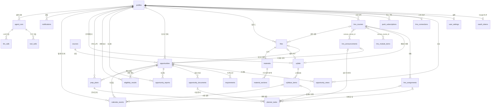
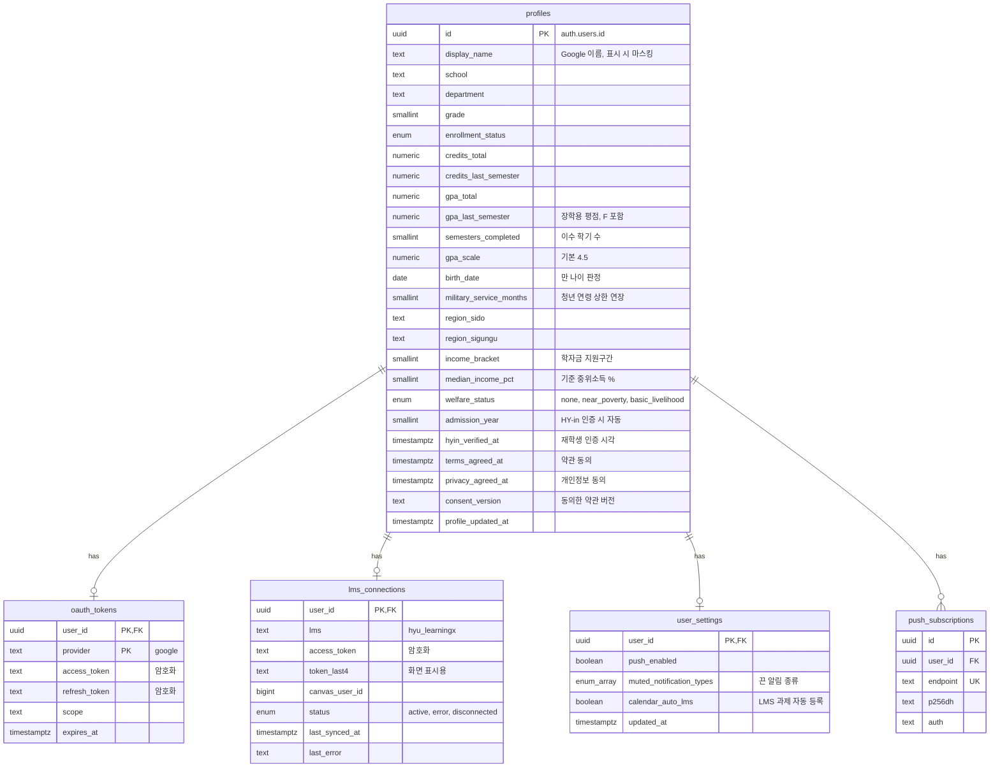
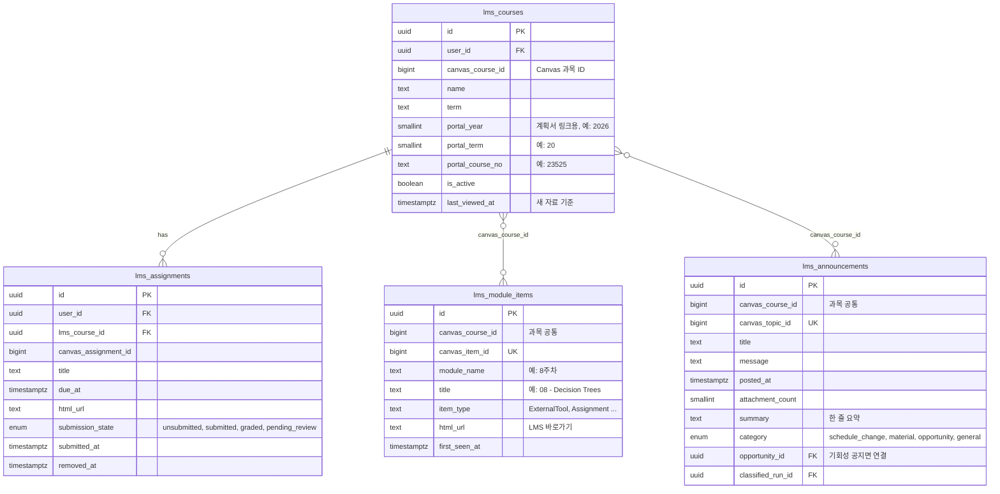
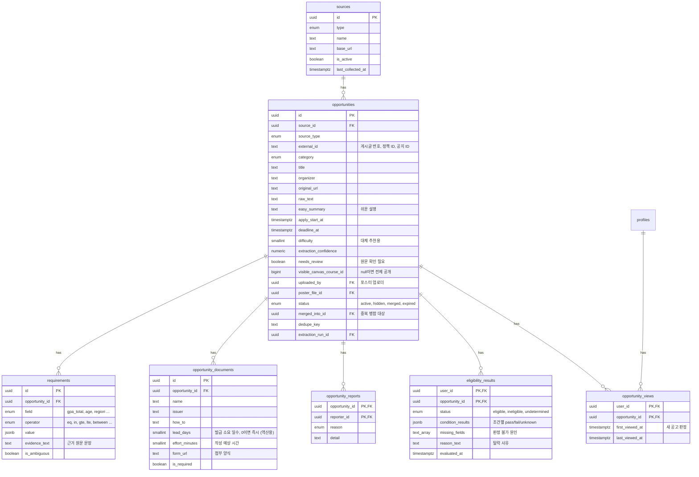
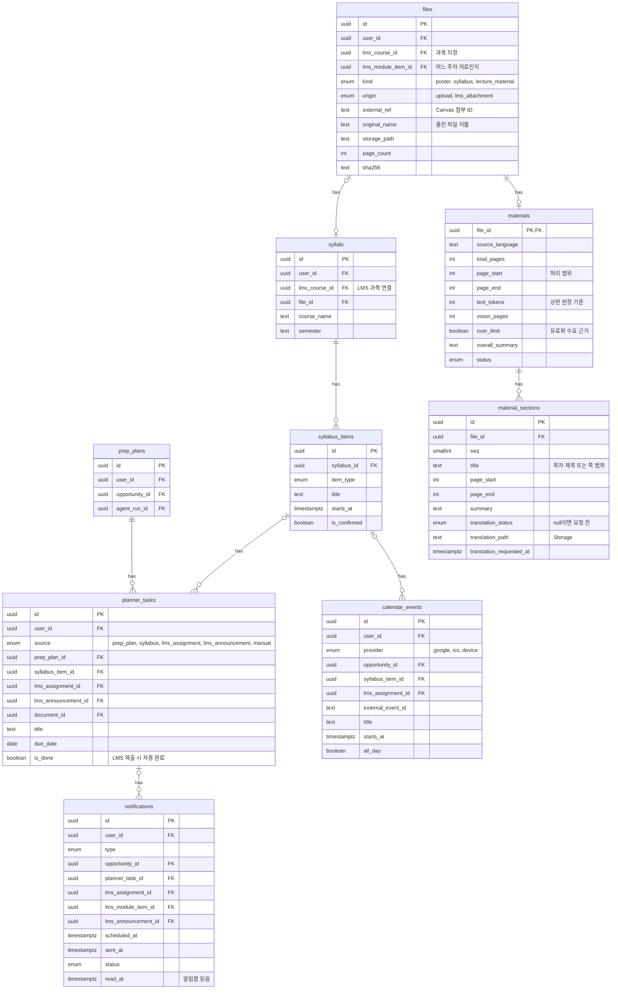
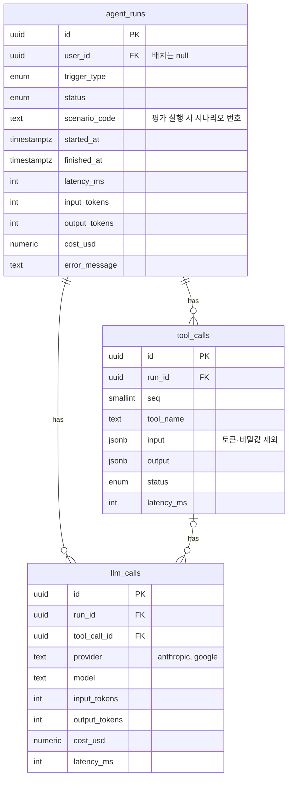

# ERD — 학내 정보 에이전트 MVP

> 📝 문서 상태: 초안 v0.8 · 2026-10-05 · 기준 문서: PRD v0.8, API 명세 v0.3 · DB: Supabase (PostgreSQL 15+)
>
> v0.8 변경: 알림함 읽음 상태와 profile_needed, user_settings·opportunity_views 신설, 동의 기록, 서류 작성 시간·양식 링크, 서류–할 일 1:1 유니크, 과목 마지막 열람·공지 요약, 파일 원래 이름
>
> v0.7 변경: `material_outputs`를 `materials`(문서 단위: 분량·처리 범위·전체 요약) + `material_sections`(구간 단위: 구간 요약·구간 번역)로 교체, `run_trigger`에 `material_translate` 추가
>
> v0.6 변경: `files.lms_module_item_id` 추가 (새 자료 알림에서 올린 파일을 해당 주차학습 항목에 연결)
>
> v0.5 변경: 요건 조사 반영 — `profiles`에 이수 학기 수·수급 자격·병역 복무 개월·HY-in 인증 필드 추가, `req_field` 확장, 신고 숨김 기준(3명)·동기화 주기·번역/요약 저장 방식 확정
>
> v0.4 변경: `lms_courses`에 포털 계획서 링크용 연도·학기·과목번호 추가, `syllabi`를 LMS 과목에 연결
>
> v0.3 변경: LMS 연동을 개인 액세스 토큰 API로 전환 — `lms_courses`, `lms_module_items`, `lms_announcements` 추가, `lms_connections`·`lms_assignments` 재설계, 과목 공지에서 만든 공고의 수강생 한정 노출

---

## 목차

1. 설계 원칙
2. 전체 관계도
3. 도메인별 ERD
4. 테이블 목록
5. 핵심 설계 결정
6. Enum 정의
7. DDL (PostgreSQL)
8. RLS 정책 요약
9. 확인 필요 사항
10. 집계 쿼리 (API 구현 참고)

---

## 1. 설계 원칙

- **공고는 테이블 하나로 통합한다.** 학교 공지·청년 정책·공모전·포스터·LMS 과목 공지를 `opportunities` 하나에 저장하고 `source_type`으로 구분한다. 판정·플래너·캘린더 로직이 출처와 무관하게 하나로 돌아간다
- **요건은 행 단위로 쪼갠다.** 공고마다 요건이 다르므로 `requirements`에 "항목 · 연산자 · 값"을 한 행씩 저장한다. 판정은 이 행들과 프로필을 코드로 비교한다
- **프로필은 전부 nullable.** 온보딩에서 건너뛸 수 있으므로 비어 있으면 판정 결과가 "판정 불가"가 된다
- **LMS 데이터는 개인 것과 과목 공통을 나눈다.** 과제 제출 여부는 사람마다 다르므로 사용자별로, 모듈 항목과 과목 공지는 같은 과목 수강생에게 똑같으므로 과목 단위로 한 번만 저장·분류한다
- **로그는 1주차부터.** 에이전트 실행·도구 호출·LLM 호출을 3단 테이블로 남겨 성공률·응답시간·비용을 측정한다
- **사용자 데이터는 탈퇴 시 삭제, 공유 데이터는 남긴다.** 사용자에 딸린 행은 `on delete cascade`, 다른 사람도 보는 공고의 업로더 참조는 `on delete set null`

## 2. 전체 관계도



## 3. 도메인별 ERD

### 3-1. 사용자 · 연동



### 3-2. LMS (LearningX)



### 3-3. 공고 · 요건 · 판정



### 3-4. 실행 · 업로드 · 알림



### 3-5. 에이전트 로깅



## 4. 테이블 목록

| 도메인 | 테이블 | 역할 | 관련 기능 |
| --- | --- | --- | --- |
| 사용자 | profiles | 사용자 표시 이름과 판정용 프로필 (전부 선택 입력) | F-02, F-03, F-04 |
| 사용자 | oauth_tokens | Google 캘린더 access/refresh 토큰 | F-01, F-32 |
| 사용자 | push_subscriptions | 브라우저별 웹 푸시 구독 정보 | F-33 |
| 사용자 | user_settings | 알림·캘린더 자동 등록 같은 사용자 설정 | F-06, F-33, F-35 |
| LMS | lms_connections | 사용자별 LearningX 개인 액세스 토큰(암호화)과 동기화 상태 | F-50 |
| LMS | lms_courses | 사용자별 수강 과목 (Canvas 과목 ID로 과목 공통 데이터와 연결, 포털 계획서 링크 생성) | F-14, F-51–F-54 |
| LMS | lms_assignments | 사용자별 과제·마감일·제출 상태 | F-51 |
| LMS | lms_module_items | 과목 공통 주차학습 항목, 새 항목 감지용 | F-52 |
| LMS | lms_announcements | 과목 공통 공지와 분류 결과 | F-53, F-54 |
| 공고 | sources | 수집 출처 설정 (게시판, 온통청년, 공모전 사이트, LMS) | F-10–F-12, F-53 |
| 공고 | opportunities | 모든 출처의 공고 통합 저장, 포스터 공유·병합·숨김, 과목 한정 노출 | F-10–F-13, F-16, F-17, F-53 |
| 공고 | requirements | 공고별 자격 조건 (항목·연산자·값·근거 문장) | F-20, F-25 |
| 공고 | opportunity_documents | 공고별 필요 서류와 발급처·소요 일수 | F-30, F-31 |
| 공고 | opportunity_reports | 공유 공고 신고 (사용자당 1회) | F-17 |
| 공고 | opportunity_views | 사용자별 공고 첫 조회·최근 조회 시각. 새 공고 판정과 조회→준비 전환율 지표 | F-40 |
| 판정 | eligibility_results | 사용자 × 공고 판정 결과와 조건별 상세 | F-21, F-22, F-40 |
| 실행 | prep_plans | "준비하기"를 누른 기록 (사용자 × 공고 1개) | F-31 |
| 실행 | planner_tasks | 앱 내 플래너 항목 (준비 단계, 강의 일정, LMS 과제, 휴강 등) | F-31, F-43, F-51, F-53 |
| 실행 | calendar_events | 외부 캘린더 등록 기록, provider로 구분 | F-32, F-34, F-51 |
| 업로드 | files | 업로드·자동 수집 파일 메타데이터 | F-13–F-15, F-54 |
| 업로드 | syllabi / syllabus_items | 강의계획서(LMS 과목에 연결)와 추출된 시험·발표 일정 | F-14 |
| 업로드 | materials | 강의자료 문서 단위 정보: 분량(토큰·쪽)·처리 범위·전체 요약 | F-15, F-44 |
| 업로드 | material_sections | 강의자료 구간 단위: 구간 요약, 사용자가 고른 구간 번역 | F-15 |
| 알림 | notifications | 알림 예약·발송 기록(중복 발송 방지)과 앱 내 알림함 읽음 상태 | F-33, F-35 |
| 로깅 | agent_runs / tool_calls / llm_calls | 에이전트 실행·도구·LLM 호출 로그 | F-42, 8장 지표 |

## 5. 핵심 설계 결정

### 요건 구조화와 판정

- `requirements.field`는 프로필 컬럼과 1:1로 대응하는 enum이다. 판정 코드는 field를 보고 해당 프로필 값을 꺼내 operator로 비교한다
- `value`는 jsonb라서 연산자에 따라 모양이 다르다. 예: `gte` → `3.0`, `in` → `["경기도 안산시", "경기도 시흥시"]`, `between` → `{"min": 19, "max": 34}`
- 프로필 컬럼에 대응되지 않는 조건(예: "봉사활동 20시간 이상")은 `field = 'other'`로 저장하고 판정 불가로 처리한다
- `is_ambiguous = true`인 조건이 하나라도 있으면 판정 불가 + "원문 확인 필요" 배지
- 조건별 결과는 `eligibility_results.condition_results`(jsonb)에 넣는다. 프로필이 바뀌면 통째로 다시 계산하므로 행 단위로 관리할 이유가 적다

### LMS 연동

- **토큰 보관**: 점검 결과 LearningX 개인 토큰은 학생 계정으로 발급되며, 만료·범위 제한 없이 계정 전체 권한을 가질 수 있다. `lms_connections.access_token`은 암호화 저장하고 백엔드만 복호화한다. 화면에는 `token_last4`만 보여준다. `tool_calls.input`에 토큰이 들어가지 않게 한다
- **개인 vs 과목 공통**: 과제는 제출 상태가 사람마다 달라서 `lms_assignments`를 사용자별로 둔다. 주차학습 항목과 과목 공지는 수강생 모두에게 같으므로 `canvas_course_id` 기준으로 한 번만 저장하고, 공지 분류(LLM)도 과목당 한 번만 한다. 수강 여부는 `lms_courses`로 판단한다
- **새 자료 감지**: 동기화 때 `canvas_item_id`가 처음 보이면 `lms_module_items`에 넣고, 그 과목 수강생에게 `new_material` 알림을 만든다. 같은 제목의 항목이 여러 개인 과목이 있어서(영상·슬라이드 추정) 비교 기준은 제목이 아니라 ID다
- **제출 연동**: `submission_state`가 submitted·graded로 바뀌면 연결된 `planner_tasks.is_done = true`로 바꾸고, 아직 안 보낸 마감 임박 알림을 취소한다
- **공지 → 공고**: 기회성 공지는 `opportunities`에 `source_type = 'lms_announcement'`, `visible_canvas_course_id = 과목 ID`로 넣는다. 이 공고는 해당 과목 수강생에게만 보이고, 배치 판정도 수강생에게만 돌린다
- **강의계획서**: LMS 계획서는 포털 iframe이고 포털은 robots.txt로 자동 접근을 막아서 서버가 수집하지 않는다. 과목명 `202620HY23525_…`을 파싱해 `portal_year = 2026`, `portal_term = 20`, `portal_course_no = '23525'`를 저장하고, 이 값으로 사용자 브라우저에서 열 포털 계획서 링크를 만든다. 사용자가 PDF로 저장해 올리면 `syllabi.lms_course_id`로 과목에 연결한다 (과목당 1개)
- **강의자료 저작권**: 공지 첨부를 자동 수집할 때도 사용자별로 `files`에 따로 저장한다(`origin = 'lms_attachment'`, `external_ref = Canvas 첨부 ID`). 같은 첨부를 두 번 받지 않도록 `(user_id, external_ref)` 유니크를 건다

### 포스터 공유 · 병합 · 신고

- 포스터로 만든 공고도 `opportunities`에 들어가고 `uploaded_by`에 업로더가 남는다. 피드에서는 모든 사용자에게 보인다
- 업로더 이름은 `profiles.display_name`을 **표시 단계에서 마스킹**한다 (김민지 → 김*지, 두 글자는 김*). 다른 사용자는 RLS 때문에 `profiles`를 직접 못 읽으므로, 마스킹된 이름을 돌려주는 피드 API나 `security definer` 함수를 쓴다
- 업로드 시 제목·주최·마감일을 정규화해 `dedupe_key`를 만든다. 같은 키의 active 공고가 있으면 새 공고를 `status = 'merged'`, `merged_into_id = 기존 공고`로 저장한다
- **서로 다른 사용자 3명**이 신고하면 `status = 'hidden'`으로 바꾼다. 운영자는 검토 후 `active`로 복구할 수 있다. `opportunity_reports`의 PK가 (공고, 신고자)라 한 사람이 여러 번 신고할 수 없다

### 캘린더 확장성

- `calendar_events.provider`로 google / ics / device를 구분한다. 앱 전환 시 device만 추가하면 된다
- 한 행은 공고 마감일, 강의 일정, LMS 과제 중 **정확히 하나**를 가리킨다 (check 제약)
- 사용자 × provider × 대상 조합에 유니크 인덱스를 걸어 **중복 등록을 DB에서 막는다** (시나리오 8, 16)

### 캐싱과 비용

- 공고 요건 추출은 공고당 1회, 과목 공지 분류는 공지당 1회
- 강의자료 요약·번역은 `files.sha256`으로 **본인 파일끼리만** 재사용한다. 다른 사용자의 결과는 저작권 문제로 재사용하지 않는다
- 강의자료 분량 상한은 쪽수가 아니라 `materials.text_tokens`(추출 텍스트 토큰)로 판정한다. 요약은 구간별로 쪼개 전체를 처리하고, 번역은 `material_sections` 단위로 사용자가 요청한 구간만 한다. `over_limit`과 `translation_requested_at`은 유료화 수요를 보여주는 근거 데이터다
- `agent_runs`에 토큰·비용 합계를 두고 `llm_calls`에 호출별 상세를 둔다. 지표 집계는 `agent_runs`만 보면 된다

### 알림함 · 설정 · 조회 기록

- **알림함**: 알림 행 하나가 푸시 발송(`status`)과 알림함 표시(`read_at`)를 함께 담는다. `scheduled_at`이 지난 행만 알림함에 보이고, 푸시를 끈 사용자도 행은 만들되 발송 배치가 푸시만 건너뛴다. 설정에서 끈 종류는 행을 만들지 않는다.
- **프로필 정보 필요 알림**: 기존 유니크 제약(user_id, type, opportunity_id …)이 공고당 1회를 보장한다. 하루 1건 제한은 발송 배치가 건다.
- **새 공고**: 등록 7일 이내, 판정 eligible, `opportunity_views`에 행이 없는 공고다. 상세 조회 API가 upsert하며 `first_viewed_at`은 유지한다.
- **서류 체크**: 상세의 서류 체크는 `planner_tasks`(prep_plan_id, document_id) 행의 `is_done`을 그대로 쓴다. 준비하기 전에는 행이 없어 체크할 수 없고, 부분 유니크 인덱스가 서류당 할 일 1개를 보장한다.
- **서류 소요**: `lead_days` 0은 즉시 발급이다. `effort_minutes`는 화면 표시용이라 역산에 쓰지 않는다.
- **플래너 마감 표시**: 공고 마감일은 `planner_tasks`에 넣지 않고, 조회 때 `prep_plans → opportunities.deadline_at`에서 읽어 함께 내려준다.
- **과목 새 자료**: `first_seen_at`이 `lms_courses.last_viewed_at`보다 뒤인 주차 항목 수다. 과목 행이 생길 때 기본값이 첫 동기화 시각이라 연결 전부터 있던 항목은 세지 않고, 과목 상세를 열면 갱신한다.
- **공지 요약**: `classify_announcement`가 분류하면서 한 줄 요약을 함께 만든다. 공지당 1회다.

## 6. Enum 정의

| Enum | 값 |
| --- | --- |
| source_type | school_notice, youth_policy, contest, poster, lms_announcement |
| opportunity_category | scholarship, school_program, youth_policy, contest, activity, research, exam, etc |
| opportunity_status | active, hidden, merged, expired |
| req_field | department, grade, enrollment_status, semesters_completed, credits_total, credits_last_semester, gpa_total, gpa_last_semester, age, region, income_bracket, median_income_pct, welfare_status, other |
| welfare_status | none, near_poverty, basic_livelihood |
| req_operator | eq, neq, in, not_in, gte, lte, between |
| eligibility_status | eligible, ineligible, undetermined |
| enrollment_status | enrolled, on_leave, deferred_graduation, graduated |
| file_kind | poster, syllabus, lecture_material |
| file_origin | upload, lms_attachment |
| task_source | prep_plan, syllabus, lms_assignment, lms_announcement, manual |
| calendar_provider | google, ics, device |
| syllabus_item_type | midterm, final, presentation, assignment, etc |
| job_status | pending, running, succeeded, failed |
| run_trigger | batch_crawl, poster_upload, prepare, syllabus_upload, material_upload, material_translate, lms_sync, notify, eval |
| notification_type | new_eligible, new_assignment, new_material, schedule_change, task_due, deadline_soon, profile_needed |
| report_reason | wrong_info, duplicate, expired, inappropriate |
| lms_connection_status | active, error, disconnected |
| lms_submission_state | unsubmitted, submitted, graded, pending_review |
| announcement_category | schedule_change, material, opportunity, general |

## 7. DDL (PostgreSQL)

> Supabase SQL Editor에 그대로 붙여 실행할 수 있는 초안. FK 순서에 맞춰 생성한다.

```sql
-- =========================================================
-- ENUM
-- =========================================================
create type source_type           as enum ('school_notice','youth_policy','contest','poster','lms_announcement');
create type opportunity_category  as enum ('scholarship','school_program','youth_policy','contest','activity','research','exam','etc');
create type opportunity_status    as enum ('active','hidden','merged','expired');
create type req_field             as enum ('department','grade','enrollment_status','semesters_completed','credits_total','credits_last_semester',
                                           'gpa_total','gpa_last_semester','age','region','income_bracket','median_income_pct',
                                           'welfare_status','other');
create type welfare_status        as enum ('none','near_poverty','basic_livelihood');   -- 차상위, 기초생활수급
create type req_operator          as enum ('eq','neq','in','not_in','gte','lte','between');
create type eligibility_status    as enum ('eligible','ineligible','undetermined');
create type enrollment_status     as enum ('enrolled','on_leave','deferred_graduation','graduated');
create type file_kind             as enum ('poster','syllabus','lecture_material');
create type file_origin           as enum ('upload','lms_attachment');
create type task_source           as enum ('prep_plan','syllabus','lms_assignment','lms_announcement','manual');
create type calendar_provider     as enum ('google','ics','device');
create type syllabus_item_type    as enum ('midterm','final','presentation','assignment','etc');
create type job_status            as enum ('pending','running','succeeded','failed');
create type run_trigger           as enum ('batch_crawl','poster_upload','prepare','syllabus_upload','material_upload','material_translate','lms_sync','notify','eval');
create type notification_type     as enum ('new_eligible','new_assignment','new_material','schedule_change','task_due','deadline_soon');
create type report_reason         as enum ('wrong_info','duplicate','expired','inappropriate');
create type lms_connection_status as enum ('active','error','disconnected');
create type lms_submission_state  as enum ('unsubmitted','submitted','graded','pending_review');
create type announcement_category as enum ('schedule_change','material','opportunity','general');

-- =========================================================
-- 1. 사용자
-- =========================================================
create table profiles (
  id                     uuid primary key references auth.users(id) on delete cascade,
  display_name           text,                                   -- Google 이름, 표시할 때 마스킹
  school                 text default 'HYU_ERICA',
  department             text,
  grade                  smallint check (grade between 1 and 6),
  enrollment_status      enrollment_status,
  credits_total          numeric(5,1),
  credits_last_semester  numeric(4,1),
  gpa_total              numeric(3,2),
  gpa_last_semester      numeric(3,2),                           -- 직전학기 장학용 평점평균 (F 포함)
  semesters_completed    smallint,                               -- 이수 학기 수 ("정규 학기 이내" 판정)
  gpa_scale              numeric(2,1) default 4.5,
  birth_date             date,                                   -- 만 나이 계산용
  military_service_months smallint,                              -- 병역 복무 개월 (청년 연령 상한 연장)
  region_sido            text,
  region_sigungu         text,
  income_bracket         smallint check (income_bracket between 0 and 10),  -- 학자금 지원구간
  median_income_pct      smallint,                               -- 기준 중위소득 % (가구 기준)
  welfare_status         welfare_status,                         -- 기초생활수급 / 차상위 여부
  admission_year         smallint,                               -- HY-in 인증 시 자동 입력
  hyin_verified_at       timestamptz,                            -- HY-in 재학생 인증 시각 (학번·성명은 저장 안 함)
  profile_updated_at     timestamptz default now(),
  created_at             timestamptz default now()
);

create table oauth_tokens (
  user_id        uuid references profiles(id) on delete cascade,
  provider       text not null default 'google',
  access_token   text,                                           -- 암호화 저장 (Supabase Vault 등)
  refresh_token  text,                                           -- 암호화 저장
  scope          text,
  expires_at     timestamptz,
  primary key (user_id, provider)
);

create table push_subscriptions (
  id          uuid primary key default gen_random_uuid(),
  user_id     uuid not null references profiles(id) on delete cascade,
  endpoint    text not null unique,
  p256dh      text not null,
  auth        text not null,
  user_agent  text,
  created_at  timestamptz default now()
);

-- =========================================================
-- 2. 로깅
-- =========================================================
create table agent_runs (
  id             uuid primary key default gen_random_uuid(),
  user_id        uuid references profiles(id) on delete set null,   -- 배치 실행은 null
  trigger_type   run_trigger not null,
  status         job_status not null default 'running',
  scenario_code  text,                                              -- 평가 실행 시 시나리오 번호
  started_at     timestamptz default now(),
  finished_at    timestamptz,
  latency_ms     int,
  input_tokens   int default 0,
  output_tokens  int default 0,
  cost_usd       numeric(10,6) default 0,
  error_message  text
);
create index on agent_runs (trigger_type, started_at);

create table tool_calls (
  id          uuid primary key default gen_random_uuid(),
  run_id      uuid not null references agent_runs(id) on delete cascade,
  seq         smallint not null,
  tool_name   text not null,
  input       jsonb,                                              -- 토큰·비밀값은 넣지 않음
  output      jsonb,
  status      job_status not null,
  latency_ms  int,
  created_at  timestamptz default now()
);
create index on tool_calls (run_id, seq);

create table llm_calls (
  id             uuid primary key default gen_random_uuid(),
  run_id         uuid not null references agent_runs(id) on delete cascade,
  tool_call_id   uuid references tool_calls(id) on delete set null,
  provider       text not null,                                   -- anthropic / google
  model          text not null,
  input_tokens   int not null,
  output_tokens  int not null,
  cost_usd       numeric(10,6),
  latency_ms     int,
  created_at     timestamptz default now()
);
create index on llm_calls (run_id);

-- =========================================================
-- 3. LMS 연결 · 수강 과목 (사용자별)
-- =========================================================
create table lms_connections (
  user_id         uuid primary key references profiles(id) on delete cascade,
  lms             text not null default 'hyu_learningx',
  access_token    text not null,                -- 개인 액세스 토큰, 암호화 저장
  token_last4     text,                         -- 화면 표시용
  canvas_user_id  bigint,
  status          lms_connection_status not null default 'active',
  last_synced_at  timestamptz,
  last_error      text,
  created_at      timestamptz default now()
);

create table lms_courses (
  id                uuid primary key default gen_random_uuid(),
  user_id           uuid not null references profiles(id) on delete cascade,
  canvas_course_id  bigint not null,
  name              text not null,              -- 예: 202620HY23534_기계학습
  term              text,                       -- 예: 2026-2
  portal_year       smallint,                   -- 포털 계획서 링크용, 과목명에서 파싱 (예: 2026)
  portal_term       smallint,                   -- 예: 20
  portal_course_no  text,                       -- 예: 23525
  is_active         boolean default true,
  synced_at         timestamptz default now(),
  unique (user_id, canvas_course_id)
);
create index on lms_courses (canvas_course_id);

-- =========================================================
-- 4. 업로드 파일
-- =========================================================
create table files (
  id             uuid primary key default gen_random_uuid(),
  user_id        uuid not null references profiles(id) on delete cascade,
  lms_course_id  uuid references lms_courses(id) on delete set null,   -- 과목 지정
  kind           file_kind not null,
  origin         file_origin not null default 'upload',
  external_ref   text,                          -- lms_attachment면 Canvas 첨부 ID
  storage_path   text not null,
  mime_type      text,
  size_bytes     bigint,
  page_count     int,
  sha256         text not null,
  created_at     timestamptz default now(),
  unique (user_id, external_ref)                -- 같은 첨부 중복 수집 방지
);
create index on files (user_id, sha256);

-- =========================================================
-- 5. 공고 · 요건
-- =========================================================
create table sources (
  id                 uuid primary key default gen_random_uuid(),
  type               source_type not null,
  name               text not null,             -- 예: ERICA 장학공지, 온통청년, LearningX 과목 공지
  base_url           text,
  is_active          boolean default true,
  last_collected_at  timestamptz
);

create table opportunities (
  id                        uuid primary key default gen_random_uuid(),
  source_id                 uuid references sources(id),
  source_type               source_type not null,
  external_id               text,               -- 게시글 번호, 정책 ID, Canvas 공지 ID
  category                  opportunity_category not null default 'etc',
  title                     text not null,
  organizer                 text,
  original_url              text,
  raw_text                  text,
  easy_summary              text,               -- 쉬운 설명
  apply_start_at            timestamptz,
  deadline_at               timestamptz,
  difficulty                smallint check (difficulty between 1 and 3),  -- 대체 추천용 (P1)
  extraction_confidence     numeric(3,2),
  needs_review              boolean default false,                        -- 원문 확인 필요 배지
  visible_canvas_course_id  bigint,             -- null이면 전체 공개, 값이 있으면 해당 과목 수강생만
  uploaded_by               uuid references profiles(id) on delete set null,
  poster_file_id            uuid references files(id) on delete set null,
  status                    opportunity_status not null default 'active',
  merged_into_id            uuid references opportunities(id),
  dedupe_key                text,               -- 정규화한 제목+주최+마감일
  extraction_run_id         uuid references agent_runs(id) on delete set null,
  created_at                timestamptz default now(),
  updated_at                timestamptz default now(),
  unique (source_id, external_id)
);
create index on opportunities (status, deadline_at);
create index on opportunities (dedupe_key);
create index on opportunities (visible_canvas_course_id) where visible_canvas_course_id is not null;

create table requirements (
  id              uuid primary key default gen_random_uuid(),
  opportunity_id  uuid not null references opportunities(id) on delete cascade,
  field           req_field not null,
  operator        req_operator not null,
  value           jsonb not null,               -- 3.0 / ["경기도 안산시"] / {"min":19,"max":34}
  evidence_text   text,                         -- 근거 원문 문장
  is_ambiguous    boolean default false,
  created_at      timestamptz default now()
);
create index on requirements (opportunity_id);

create table opportunity_documents (
  id              uuid primary key default gen_random_uuid(),
  opportunity_id  uuid not null references opportunities(id) on delete cascade,
  name            text not null,                -- 예: 재학증명서
  issuer          text,                         -- 발급처
  how_to          text,                         -- 발급 방법
  lead_days       smallint,                     -- 준비 소요 일수 (역산용)
  is_required     boolean default true
);

create table opportunity_reports (
  opportunity_id  uuid references opportunities(id) on delete cascade,
  reporter_id     uuid references profiles(id) on delete cascade,
  reason          report_reason not null,
  detail          text,
  created_at      timestamptz default now(),
  primary key (opportunity_id, reporter_id)
);

-- =========================================================
-- 6. 판정
-- =========================================================
create table eligibility_results (
  user_id            uuid references profiles(id) on delete cascade,
  opportunity_id     uuid references opportunities(id) on delete cascade,
  status             eligibility_status not null,
  condition_results  jsonb not null,            -- [{requirement_id, outcome: pass|fail|unknown, user_value}]
  missing_fields     req_field[],               -- 판정 불가 원인 항목
  reason_text        text,                      -- 탈락 사유 문장
  evaluated_at       timestamptz default now(),
  primary key (user_id, opportunity_id)
);
create index on eligibility_results (user_id, status);

-- =========================================================
-- 7. LMS 과제 (사용자별) · 모듈 항목 · 공지 (과목 공통)
-- =========================================================
create table lms_assignments (
  id                    uuid primary key default gen_random_uuid(),
  user_id               uuid not null references profiles(id) on delete cascade,
  lms_course_id         uuid not null references lms_courses(id) on delete cascade,
  canvas_assignment_id  bigint not null,
  title                 text not null,
  due_at                timestamptz,
  html_url              text,
  submission_state      lms_submission_state not null default 'unsubmitted',
  submitted_at          timestamptz,
  first_seen_at         timestamptz default now(),
  updated_at            timestamptz default now(),
  removed_at            timestamptz,            -- LMS에서 사라지면 기록
  unique (user_id, canvas_assignment_id)
);
create index on lms_assignments (user_id, due_at);

create table lms_module_items (
  id                uuid primary key default gen_random_uuid(),
  canvas_course_id  bigint not null,
  canvas_item_id    bigint not null unique,
  module_name       text,                       -- 예: 8주차
  title             text not null,              -- 예: 08 - Decision Trees
  item_type         text,                       -- ExternalTool, Assignment, Quiz, Page ...
  html_url          text,                       -- LMS 바로가기
  first_seen_at     timestamptz default now()
);
create index on lms_module_items (canvas_course_id, first_seen_at);

-- 새 자료 알림에서 올린 파일을 해당 주차학습 항목에 연결 (files가 먼저 생성되므로 여기서 추가)
alter table files add column lms_module_item_id uuid references lms_module_items(id) on delete set null;

create table lms_announcements (
  id                 uuid primary key default gen_random_uuid(),
  canvas_course_id   bigint not null,
  canvas_topic_id    bigint not null unique,
  title              text not null,
  message            text,
  posted_at          timestamptz,
  attachment_count   smallint default 0,
  category           announcement_category,     -- null이면 아직 분류 전
  opportunity_id     uuid references opportunities(id) on delete set null,  -- 기회성 공지면 연결
  classified_run_id  uuid references agent_runs(id) on delete set null,
  first_seen_at      timestamptz default now()
);
create index on lms_announcements (canvas_course_id, posted_at);

-- =========================================================
-- 8. 강의계획서
-- =========================================================
create table syllabi (
  id             uuid primary key default gen_random_uuid(),
  user_id        uuid not null references profiles(id) on delete cascade,
  lms_course_id  uuid references lms_courses(id) on delete set null,   -- LMS 과목 연결
  file_id      uuid references files(id) on delete set null,
  course_name  text,
  semester     text,                            -- 예: 2026-2
  created_at   timestamptz default now()
);
create unique index on syllabi (lms_course_id) where lms_course_id is not null;   -- 과목당 계획서 1개

create table syllabus_items (
  id            uuid primary key default gen_random_uuid(),
  syllabus_id   uuid not null references syllabi(id) on delete cascade,
  item_type     syllabus_item_type not null,
  title         text not null,
  starts_at     timestamptz,
  is_confirmed  boolean default false           -- 사용자 확인 후 등록
);

-- =========================================================
-- 9. 실행 (준비 일정 · 플래너 · 캘린더)
-- =========================================================
create table prep_plans (
  id              uuid primary key default gen_random_uuid(),
  user_id         uuid not null references profiles(id) on delete cascade,
  opportunity_id  uuid not null references opportunities(id) on delete cascade,
  agent_run_id    uuid references agent_runs(id) on delete set null,
  created_at      timestamptz default now(),
  unique (user_id, opportunity_id)
);

create table planner_tasks (
  id                   uuid primary key default gen_random_uuid(),
  user_id              uuid not null references profiles(id) on delete cascade,
  source               task_source not null,
  prep_plan_id         uuid references prep_plans(id) on delete cascade,
  syllabus_item_id     uuid references syllabus_items(id) on delete cascade,
  lms_assignment_id    uuid references lms_assignments(id) on delete cascade,
  lms_announcement_id  uuid references lms_announcements(id) on delete cascade,
  document_id          uuid references opportunity_documents(id) on delete set null,
  title                text not null,
  due_date             date not null,
  is_done              boolean default false,   -- LMS 과제는 제출 시 자동 완료
  done_at              timestamptz,
  sort_order           int default 0,
  created_at           timestamptz default now()
);
create index on planner_tasks (user_id, due_date);

create table calendar_events (
  id                 uuid primary key default gen_random_uuid(),
  user_id            uuid not null references profiles(id) on delete cascade,
  provider           calendar_provider not null,
  opportunity_id     uuid references opportunities(id) on delete cascade,
  syllabus_item_id   uuid references syllabus_items(id) on delete cascade,
  lms_assignment_id  uuid references lms_assignments(id) on delete cascade,
  external_event_id  text,                      -- Google 이벤트 ID, ics는 UID
  title              text not null,
  starts_at          timestamptz not null,
  all_day            boolean default true,
  synced_at          timestamptz default now(),
  check (num_nonnulls(opportunity_id, syllabus_item_id, lms_assignment_id) = 1)
);
create unique index on calendar_events (user_id, provider, opportunity_id)    where opportunity_id    is not null;
create unique index on calendar_events (user_id, provider, syllabus_item_id)  where syllabus_item_id  is not null;
create unique index on calendar_events (user_id, provider, lms_assignment_id) where lms_assignment_id is not null;

-- =========================================================
-- 10. 강의자료 요약 · 번역
-- =========================================================
create table materials (
  file_id          uuid primary key references files(id) on delete cascade,
  source_language  text,
  total_pages      int,
  page_start       int,                         -- 처리한 범위 (상한 초과 시 사용자가 선택)
  page_end         int,
  text_tokens      int,                         -- 추출 텍스트 토큰 수 (상한 판정 기준)
  vision_pages     int default 0,               -- Vision으로 처리한 스캔 페이지 수
  over_limit       boolean default false,       -- 상한 초과로 범위 선택이 필요했는지 (유료화 수요 근거)
  overall_summary  text,                        -- 전체 요약 (Markdown, DB 텍스트)
  status           job_status not null default 'pending',
  agent_run_id     uuid references agent_runs(id) on delete set null,
  created_at       timestamptz default now(),
  check (page_start is null or page_end is null or page_start <= page_end)
);

create table material_sections (
  id                        uuid primary key default gen_random_uuid(),
  file_id                   uuid not null references materials(file_id) on delete cascade,
  seq                       smallint not null,
  title                     text,                 -- 목차 제목, 감지 실패 시 "12–20쪽"
  page_start                int not null,
  page_end                  int not null,
  summary                   text,                 -- 구간 요약 (Markdown)
  translation_status        job_status,           -- null이면 번역 요청 전
  translation_path          text,                 -- 번역본 Storage 경로
  translation_requested_at  timestamptz,          -- 구간 번역 요청 시각 (유료화 수요 근거)
  translation_run_id        uuid references agent_runs(id) on delete set null,
  unique (file_id, seq),
  check (page_start <= page_end),
  check (translation_status is distinct from 'succeeded' or translation_path is not null)
);

-- =========================================================
-- 11. 알림
-- =========================================================
create table notifications (
  id                   uuid primary key default gen_random_uuid(),
  user_id              uuid not null references profiles(id) on delete cascade,
  type                 notification_type not null,
  opportunity_id       uuid references opportunities(id) on delete cascade,
  planner_task_id      uuid references planner_tasks(id) on delete cascade,
  lms_assignment_id    uuid references lms_assignments(id) on delete cascade,
  lms_module_item_id   uuid references lms_module_items(id) on delete cascade,
  lms_announcement_id  uuid references lms_announcements(id) on delete cascade,
  title                text not null,
  body                 text,
  scheduled_at         timestamptz not null,
  sent_at              timestamptz,
  status               job_status not null default 'pending',
  created_at           timestamptz default now(),
  unique nulls not distinct (user_id, type, opportunity_id, planner_task_id,
                             lms_assignment_id, lms_module_item_id, lms_announcement_id)  -- 중복 발송 방지
);
create index on notifications (status, scheduled_at);
```

### v0.7 → v0.8 마이그레이션

v0.7 DDL을 실행한 DB에 이어서 실행한다.

```sql
-- =========================================================
-- ERD v0.7 → v0.8 마이그레이션 (디자인 초안 대조 반영, 2026-10-05)
-- v0.7 DDL을 실행한 DB에 이어서 실행한다
-- =========================================================

-- 1. 알림: 프로필 정보 필요 종류 + 앱 내 알림함 읽음 상태 (F-33, F-35)
alter type notification_type add value if not exists 'profile_needed';

alter table notifications add column read_at timestamptz;          -- null이면 안 읽음
create index notifications_user_recent_idx on notifications (user_id, scheduled_at desc);
create index notifications_user_unread_idx on notifications (user_id) where read_at is null;

-- 2. 사용자 설정 (F-06)
create table user_settings (
  user_id                   uuid primary key references profiles(id) on delete cascade,
  push_enabled              boolean not null default true,
  muted_notification_types  notification_type[] not null default '{}',  -- 끈 종류는 알림을 만들지 않음
  calendar_auto_lms         boolean not null default true,              -- LMS 과제 마감 자동 캘린더 등록
  updated_at                timestamptz not null default now()
);

-- 3. 약관·개인정보 동의 기록 (F-02)
alter table profiles
  add column terms_agreed_at    timestamptz,
  add column privacy_agreed_at  timestamptz,
  add column consent_version    text;                                  -- 동의한 약관 버전

-- 4. 공고 조회 기록: 새 공고 판정, 조회→준비 전환율 (F-40)
create table opportunity_views (
  user_id          uuid references profiles(id) on delete cascade,
  opportunity_id   uuid references opportunities(id) on delete cascade,
  first_viewed_at  timestamptz not null default now(),
  last_viewed_at   timestamptz not null default now(),
  primary key (user_id, opportunity_id)
);

-- 5. 필요 서류: 작성 예상 시간, 첨부 양식 링크 (F-30, F-41)
alter table opportunity_documents
  add column effort_minutes  smallint check (effort_minutes >= 0),    -- 표시용, 역산에는 쓰지 않음
  add column form_url        text;                                    -- 원문에 첨부된 신청 양식 링크
comment on column opportunity_documents.lead_days is '발급까지 걸리는 일수. 0이면 즉시 발급 (역산용)';

-- 6. 플래너: 서류 1개 = 준비 할 일 1개 (상세의 서류 체크와 같은 값, F-31, F-41)
create unique index planner_tasks_plan_document_uq
  on planner_tasks (prep_plan_id, document_id)
  where document_id is not null;

-- 7. LMS: 과목별 마지막 열람(새 자료 기준), 공지 한 줄 요약 (F-52, F-53)
alter table lms_courses add column last_viewed_at timestamptz default now();  -- 과목 행이 생긴 첫 동기화 시각부터 셈
alter table lms_announcements add column summary text;                         -- classify_announcement가 함께 생성

-- 8. 파일 원래 이름 (과목 상세 자료 탭, 문서함)
alter table files add column original_name text;

-- 9. RLS: 새 테이블은 본인 행만 읽기 (쓰기는 백엔드). Supabase REST 노출을 막기 위해 반드시 켠다
alter table user_settings     enable row level security;
alter table opportunity_views enable row level security;
create policy user_settings_select_own     on user_settings     for select using (auth.uid() = user_id);
create policy opportunity_views_select_own on opportunity_views for select using (auth.uid() = user_id);
```

`ALTER TYPE … ADD VALUE`는 같은 트랜잭션에서 새 값을 쓰면 오류가 나지만, 이 스크립트는 새 값을 쓰지 않아 한 번에 실행해도 된다.

## 8. RLS 정책 요약

| 테이블 | 읽기 | 쓰기 |
| --- | --- | --- |
| profiles, push_subscriptions | 본인만 | 본인만 |
| oauth_tokens, lms_connections | **아무도 직접 못 읽음** (화면용 상태·token_last4는 API로만) | 백엔드(service role)만 |
| lms_courses, lms_assignments | 본인만 | 백엔드만 |
| lms_module_items, lms_announcements | 해당 `canvas_course_id`를 `lms_courses`에 가진 사용자만 | 백엔드만 |
| opportunities, requirements, opportunity_documents | status = active이고, `visible_canvas_course_id`가 null이거나 본인이 그 과목 수강생인 경우 | 백엔드만 |
| opportunity_reports | 본인 신고만 | 본인만 insert |
| eligibility_results | 본인만 | 백엔드만 |
| prep_plans, planner_tasks, calendar_events, notifications | 본인만 | planner_tasks는 본인 수정 가능, 나머지 백엔드 |
| files, syllabi, syllabus_items, materials, material_sections | 본인만 | 업로드는 본인, 결과는 백엔드 |
| user_settings | 본인만 | 백엔드만(설정 API) |
| opportunity_views | 본인만 | 백엔드만(상세 조회 API가 기록) |
| agent_runs, tool_calls, llm_calls | 본인 실행만 (처리 과정 표시용) | 백엔드만 |

> `notifications`의 읽음 처리는 API가 하므로 쓰기는 백엔드만으로 둔다.

> 업로더 마스킹 이름은 `profiles`를 직접 열지 않고, 피드 API(FastAPI)나 `security definer` 함수로 마스킹한 값만 내려준다.

## 9. 확인 필요 사항

- [x] **생년월일로 확정** — 만 나이 경계값까지 정확히 판정하기 위해 `birth_date` 사용
- [x] **LMS 토큰 연동 가능** — 2026-09-28 점검: 과제·제출 여부·모듈 항목·공지·공지 첨부 조회 가능, 강의자료실·주차학습 파일은 외부 도구라 불가
- [x] **소득 기준** — 조사 결과 4종이 쓰임: 학자금 지원구간(교내·국가장학), 기초생활수급·차상위(가계곤란 장학), 기준 중위소득 %(청년정책), 개인 연소득 금액(청년 금융상품). 앞의 3개를 선택 입력으로 두고, 기준이 다르면 환산하지 않고 판정 불가. 연소득·재산은 MVP 미수집(`other`)
- [x] **성적 기준** — ERICA 교내장학은 직전학기 장학용 평점(F 포함)·직전학기 취득학점·정규 학기 이내가 핵심. `semesters_completed` 추가. 국가장학의 "B학점(백분위 80)"은 ERICA 백분위 환산식 확인 후 판정
- [x] **청년 연령** — 만 19–34세가 기본이나 병역 기간만큼 상한 연장, 지자체별로 다름(서울·경기 19–39세). `military_service_months` 추가, 연장 여부는 요건 `value`에 `{"min":19,"max":34,"military_extension":true}`처럼 기록
- [x] **수업 계획서 자동 수집 불가** — 2026-09-29 점검: 8개 과목 모두 포털 iframe, 포털은 robots.txt로 자동 접근 차단 → 포털 바로가기 + PDF 업로드로 결정
- [x] **한양대 API 개발자센터** — 공개 목록에는 사용자인증 API 2개(재학 여부·소속·입학년도 등)뿐, 수업계획서 API 없음 → HY-in 재학생 인증(P1)에 활용
- [x] **신고 숨김 기준** — 서로 다른 사용자 3명
- [x] **LMS 동기화 주기** — 30분 + 대시보드 접속 시 즉시
- [x] **강의자료 결과 저장** — 요약은 DB 텍스트, 번역본은 Storage 파일. 구간 단위로 저장(`material_sections`)
- [ ] 강의자료 토큰 상한·Vision 페이지 상한 (W1에 실제 강의자료로 측정)
- [ ] ERICA 성적 백분위 환산식
- [ ] HY-in API 개발자 등록 조건·승인 기간

## 10. 집계 쿼리 (API 구현 참고)

홈 요약 카드 숫자는 쿼리 한 번으로 낸다. 두 쿼리 모두 테스트 데이터에서 기대값과 일치했다.

```sql
-- 홈 요약 카드 (:uid = 사용자 ID, 마감 임박은 KST 날짜 기준 D-3~D-day)
select
  count(*) filter (where e.status = 'eligible')                                              as eligible,
  count(*) filter (where e.status = 'eligible' and o.created_at >= now() - interval '7 days'
                     and v.user_id is null)                                                  as new_eligible,
  count(*) filter (where e.status = 'undetermined')                                          as undetermined,
  count(*) filter (where e.status = 'undetermined' and cardinality(e.missing_fields) > 0)    as missing_info,
  count(*) filter (where e.status = 'undetermined'
                     and coalesce(cardinality(e.missing_fields), 0) = 0)                     as needs_review,
  count(*) filter (where e.status = 'ineligible')                                            as ineligible,
  count(*) filter (where e.status in ('eligible', 'undetermined')
                     and (o.deadline_at at time zone 'Asia/Seoul')::date
                       - (now() at time zone 'Asia/Seoul')::date between 0 and 3)            as deadline_soon
from eligibility_results e
join opportunities o on o.id = e.opportunity_id and o.status = 'active'
left join opportunity_views v on v.user_id = e.user_id and v.opportunity_id = e.opportunity_id
where e.user_id = :uid
  and (o.deadline_at is null or o.deadline_at >= now())
  and (o.visible_canvas_course_id is null or exists (
        select 1 from lms_courses c
        where c.user_id = e.user_id and c.canvas_course_id = o.visible_canvas_course_id));

-- 과목 카드 새 자료 수
select c.id, count(m.id) as new_materials
from lms_courses c
left join lms_module_items m
  on m.canvas_course_id = c.canvas_course_id and m.first_seen_at > c.last_viewed_at
where c.user_id = :uid
group by c.id;
```
