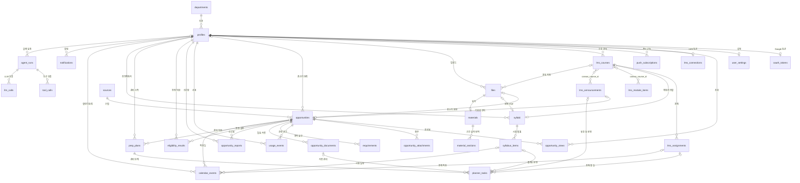
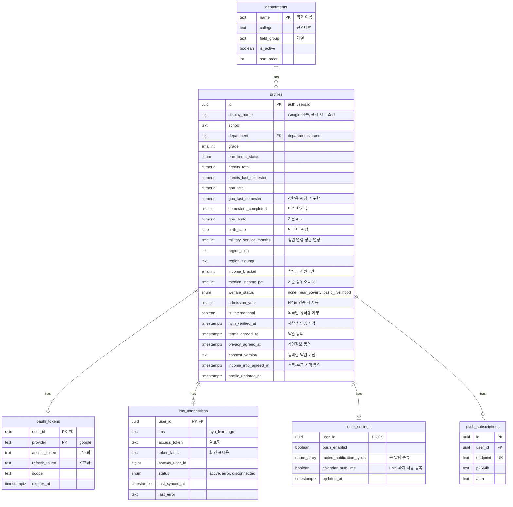
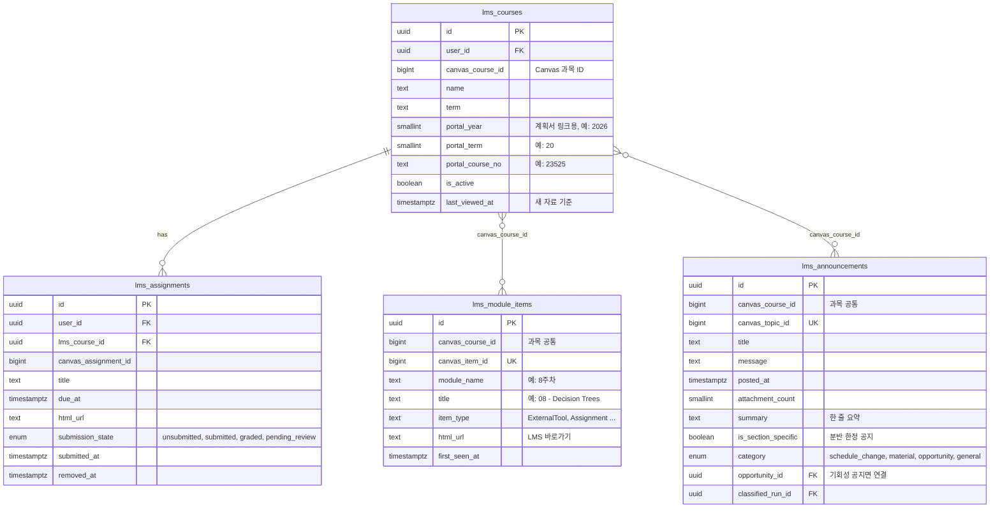
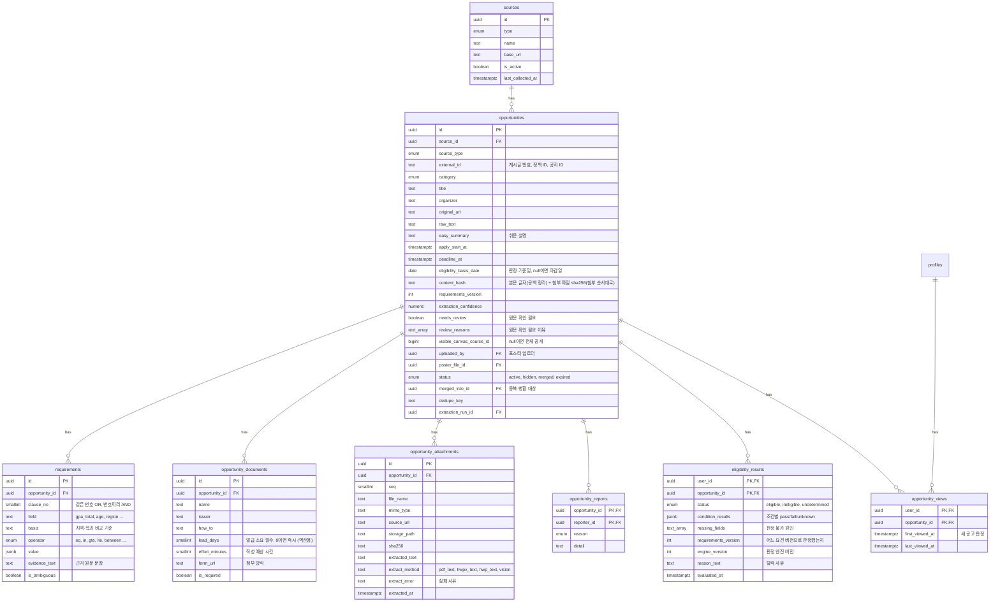
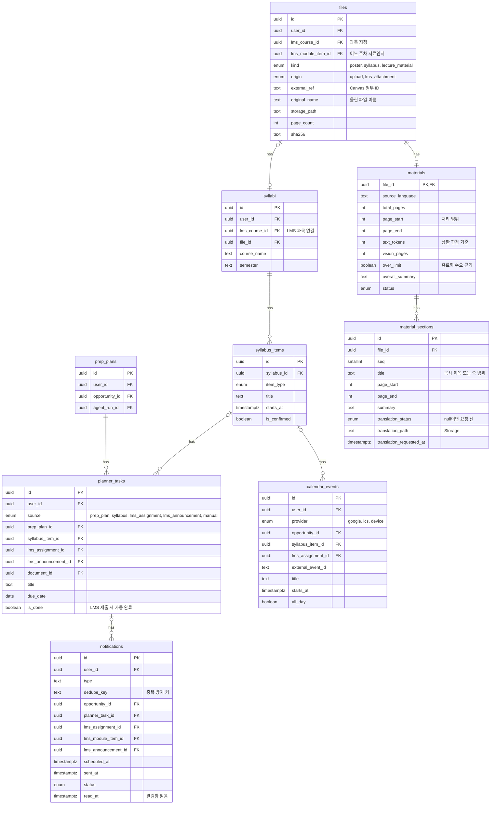
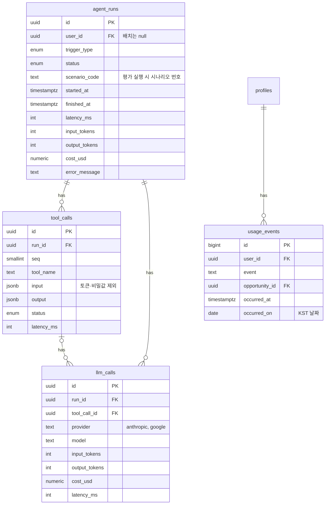

# ERD — 학내 정보 에이전트 MVP

> 📝 문서 상태: 초안 v0.9 · 2026-10-06 · 기준 문서: PRD v0.9, API 명세 v0.4 · DB: Supabase (PostgreSQL 15+)
>
> v0.9 변경: 요건 묶음(clause_no)·비교 기준(basis), 판정 기준일·변경 감지·요건 버전, 첨부·학과·사용 이벤트 테이블, 소득 선택 동의 제약, 알림 dedupe_key, 플래너·파일·캘린더 제약, enum 3개 → text + check, FK 인덱스, 전 테이블 RLS
>
> v0.9 보완 (2026-10-09): content_hash 정의, 추출 실패 처리, Vision 첨부, 학교 공지(A안) 설명
>
> v0.9 보강(10/9, S1-5): eligibility_results.engine_version, 판정 저장 방식
>
> v0.9 보강(10/10, S1-6): 요건 순서, 조회 기록, 마감 공고 공개 범위
>
> v0.9 보강(10/10, S1-6b): opportunities.review_reasons

---

## 목차

1. 설계 원칙
2. 전체 관계도
3. 도메인별 ERD
4. 테이블 목록
5. 핵심 설계 결정
6. Enum 정의
7. 스키마 기준 (마이그레이션 파일)
8. RLS 정책 요약
9. 확인 필요 사항
10. 집계 쿼리 (API 구현 참고)

부록: 변경 이력

---

## 먼저: v0.7 DDL에는 RLS가 없었다

v0.7 DDL(7장)에는 `enable row level security`와 정책 문이 하나도 없고, 8장에 요약표만 있다. RLS는 v0.8에서 새로 만든 테이블 2개에만 켜져 있다. Supabase는 기본 설정에서 public 테이블을 Data API로 내보낸다. 그래서 이 상태로 적용하면 브라우저에 들어 있는 공개 키(anon)로 프로필·토큰 테이블을 읽고 쓸 수 있다.

Supabase와 같은 권한을 흉내 낸 검증 DB로 확인했다. v0.8까지 적용한 뒤 anon 권한으로 조회하면 프로필 1건과 토큰 1건이 그대로 읽혔다. v0.9를 적용한 뒤에는 0건이었다. 지금은 데이터가 없어 피해가 없다. 다만 S1-1(로그인 → Google 토큰 저장)보다 반드시 먼저 v0.9를 적용해야 한다.

## 1. 설계 원칙

- **공고는 테이블 하나로 통합한다.** 학교 공지·청년 정책·공모전·포스터·LMS 과목 공지를 `opportunities` 하나에 저장하고 `source_type`으로 구분한다. 판정·플래너·캘린더 로직이 출처와 무관하게 하나로 돌아간다
- **요건은 행 단위로 쪼갠다.** 공고마다 요건이 다르므로 `requirements`에 "항목 · 연산자 · 값"을 한 행씩 저장한다. 판정은 이 행들과 프로필을 코드로 비교한다
- **프로필은 전부 nullable.** 온보딩에서 건너뛸 수 있으므로 비어 있으면 판정 결과가 "판정 불가"가 된다
- **LMS 데이터는 개인 것과 과목 공통을 나눈다.** 과제 제출 여부는 사람마다 다르므로 사용자별로, 모듈 항목과 과목 공지는 같은 과목 수강생에게 똑같으므로 과목 단위로 한 번만 저장·분류한다
- **로그는 1주차부터.** 에이전트 실행·도구 호출·LLM 호출을 3단 테이블로 남겨 성공률·응답시간·비용을 측정한다
- **사용자 데이터는 탈퇴 시 삭제, 공유 데이터는 남긴다.** 사용자에 딸린 행은 `on delete cascade`, 다른 사람도 보는 공고의 업로더 참조는 `on delete set null`

## 2. 전체 관계도



## 3. 도메인별 ERD

### 3-1. 사용자 · 연동



### 3-2. LMS (LearningX)



### 3-3. 공고 · 요건 · 판정



### 3-4. 실행 · 업로드 · 알림



### 3-5. 에이전트 로깅



## 4. 테이블 목록

| 도메인 | 테이블 | 역할 | 관련 기능 |
| --- | --- | --- | --- |
| 사용자 | profiles | 사용자 표시 이름과 판정용 프로필 (전부 선택 입력) | F-02, F-03, F-04 |
| 사용자 | oauth_tokens | Google 캘린더 access/refresh 토큰 | F-01, F-32 |
| 사용자 | push_subscriptions | 브라우저별 웹 푸시 구독 정보 | F-33 |
| 사용자 | departments | 학과 → 단과대 → 계열 매핑. 프로필 학과 목록과 학과 조건 판정에 쓴다 | F-02, F-21 |
| 사용자 | user_settings | 알림·캘린더 자동 등록 같은 사용자 설정 | F-06, F-33, F-35 |
| LMS | lms_connections | 사용자별 LearningX 개인 액세스 토큰(암호화)과 동기화 상태 | F-50 |
| LMS | lms_courses | 사용자별 수강 과목 (Canvas 과목 ID로 과목 공통 데이터와 연결, 포털 계획서 링크 생성) | F-14, F-51–F-54 |
| LMS | lms_assignments | 사용자별 과제·마감일·제출 상태 | F-51 |
| LMS | lms_module_items | 과목 공통 주차학습 항목, 새 항목 감지용 | F-52 |
| LMS | lms_announcements | 과목 공통 공지와 분류 결과 | F-53, F-54 |
| 공고 | sources | 수집 출처 설정 (게시판, 온통청년, 공모전 사이트, LMS) | F-10–F-12, F-53 |
| 공고 | opportunities | 모든 출처의 공고 통합 저장, 포스터 공유·병합·숨김, 과목 한정 노출 | F-10–F-13, F-16, F-17, F-53 |
| 공고 | opportunity_attachments | 공고 첨부파일과 추출 텍스트·방식·실패 사유 | F-10, F-20, F-25 |
| 공고 | requirements | 공고별 자격 조건 (묶음·항목·연산자·값·기준·근거 문장) | F-20, F-21, F-25 |
| 공고 | opportunity_documents | 공고별 필요 서류와 발급처·소요 일수 | F-30, F-31 |
| 공고 | opportunity_reports | 공유 공고 신고 (사용자당 1회) | F-17 |
| 공고 | opportunity_views | 사용자별 공고 첫 조회·최근 조회 시각. 새 공고 판정과 조회→준비 전환율 지표 | F-40 |
| 판정 | eligibility_results | 사용자 × 공고 판정 결과와 조건별 상세 | F-21, F-22, F-40 |
| 실행 | prep_plans | "준비하기"를 누른 기록 (사용자 × 공고 1개) | F-31 |
| 실행 | planner_tasks | 앱 내 플래너 항목 (준비 단계, 강의 일정, LMS 과제, 휴강 등) | F-31, F-43, F-51, F-53 |
| 실행 | calendar_events | 외부 캘린더 등록 기록, provider로 구분 | F-32, F-34, F-51 |
| 업로드 | files | 업로드·자동 수집 파일 메타데이터 | F-13–F-15, F-54 |
| 업로드 | syllabi / syllabus_items | 강의계획서(LMS 과목에 연결)와 추출된 시험·발표 일정 | F-14 |
| 업로드 | materials | 강의자료 문서 단위 정보: 분량(토큰·쪽)·처리 범위·전체 요약 | F-15, F-44 |
| 업로드 | material_sections | 강의자료 구간 단위: 구간 요약, 사용자가 고른 구간 번역 | F-15 |
| 알림 | notifications | 알림 예약·발송 기록(중복 발송 방지)과 앱 내 알림함 읽음 상태 | F-33, F-35 |
| 로깅 | usage_events | 화면·API에서 기록하는 사용 이벤트. 제품 지표 원천 | 8장 지표 |
| 로깅 | agent_runs / tool_calls / llm_calls | 에이전트 실행·도구·LLM 호출 로그 | F-42, 8장 지표 |

## 5. 핵심 설계 결정

### 요건 구조화와 판정

- 요건 행 하나가 조건 하나다. `clause_no`가 같은 행끼리 OR, 서로 다른 `clause_no`끼리 AND다(CNF). 조건이 하나뿐인 묶음은 평범한 AND 조건이다. 판정 규칙(3치 논리, 판정 기준일, 확실할 때만 불충족)은 PRD 5-3에 있다.
- `clause_no`에는 기본값을 두지 않는다. 기본값 0을 두면 모든 조건이 하나의 OR 묶음이 되어 판정이 무력해진다. 마이그레이션은 기존 행에 공고마다 1, 2, 3…을 따로 매겨 지금 뜻(모두 AND)을 지킨다.
- `field`는 프로필 항목과 대응한다. 값 목록은 check 제약으로 둔다(6장). 프로필에 없는 조건은 `other`로 저장하고 "모름"으로 처리한다.
- `value`는 연산자에 따라 모양이 다르다.

| 연산자 | value 예 |
| --- | --- |
| gte · lte | `3.0` |
| eq · neq | `4`, `"enrolled"`, `true` |
| in · not_in | `["경기도 안산시", "경기도 시흥시"]` |
| between | `{"min": 19, "max": 34, "military_extension": true}` |

- `basis`는 region과 department에만 쓰고, 두 항목에서는 반드시 넣는다. 다른 항목은 null이다.

| field | basis 값 | 판정 |
| --- | --- | --- |
| region | `resident_registration`(주민등록), `unspecified`(명시 없음) | 프로필 지역(주민등록 주소)과 비교한다 |
| region | `actual_residence`(실거주), `high_school`(출신 고교 소재지), `guardian`(보호자 주소) | 모름 (원문 확인 필요) |
| department | `department`, `college`, `field_group` | value에 그 단위의 이름을 넣고 departments 매핑으로 비교한다 |

- `is_ambiguous`: 근거 문장이 원문(본문 + 첨부 텍스트)에 없거나 해석이 갈리면 true이고, 그 조건은 "모름"이다. v0.7의 "모호한 조건이 하나라도 있으면 판정 불가"는 묶음 판정으로 바뀐다. 같은 묶음의 다른 조건이 충족하면 그 묶음은 충족이다.
- `condition_results`(jsonb) 모양은 다음과 같다.

```json
[{ "requirement_id": "uuid", "clause_no": 1, "outcome": "pass | fail | unknown",
   "unknown_reason": "missing_profile | ambiguous | unsupported_field | basis_mismatch | null",
   "user_value": 3.2 }]
```

- `missing_fields`에는 결과가 "모름"인 묶음에서 `missing_profile`인 조건의 항목만 넣는다. 이미 충족한 묶음의 빈 항목은 넣지 않는다.
- 판정 기준일은 `opportunities.eligibility_basis_date`를 쓴다. null이면 마감일의 KST 날짜, 마감일도 없으면 판정한 날이다.
- 다시 추출: 본문 + 첨부 추출 텍스트의 sha256(`content_hash`)이 바뀌면 그 공고의 요건을 지우고 다시 넣는다. `requirements_version`을 1 올리고 그 공고의 판정을 모두 다시 계산한다. 판정 결과의 `requirements_version`이 공고와 다르면 낡은 결과다. 추출에 실패하면(받은 제출 없음) 요건·서류를 지우고 extraction_run_id를 비운다. extraction_run_id가 null인 공고는 판정하지 않는다.
- 판정 저장(S1-5): 사용자가 피드를 읽을 때 그 목록에 나올 공고의 낡은 판정만 다시 계산한다. 낡은 판정은 결과가 없거나, requirements_version 또는 engine_version이 공고·코드와 다르거나, 판정 기준일이 판정한 날(기준일·마감일이 모두 없음)인데 날이 바뀐 것이다.
- engine_version은 판정한 엔진 버전(app/eligibility의 ENGINE_VERSION)이다. 판정 규칙·문구를 바꾸거나 판정 오류를 고치면 올린다.
- 프로필 저장과 소득·수급 동의 철회는 같은 요청에서 그 사용자의 활성 공고를 모두 다시 판정하고, 나머지 공고(마감·숨김·안 보임)의 판정은 지운다. 철회한 소득 값이 condition_results·reason_text에 남지 않는다. 판정은 profile_updated_at을 쓰지 않는다.
- 같은 사용자의 판정과 프로필 저장은 profiles 행을 for no key update로 잠가 한 번에 하나씩 한다.
- 요건 추출에 실패한 공고(extraction_run_id null)는 판정 행이 없다. 판정 엔진이 오류를 낸 공고는 status undetermined, condition_results [], reason_text "원문 확인 필요: 조건을 판정하지 못함"인 행을 두고 하루에 한 번 다시 시도한다.
- 요건 순서: 묶음(clause_no) 안에서는 추출이 낸 순서이고, clause_no, created_at 순으로 읽는다. 요건을 저장할 때 한 트랜잭션의 now()에 1마이크로초씩 더해 created_at을 넣는다.
- review_reasons: 요건 추출이 needs_review를 켠 이유 목록이다. 성공·실패 모두 추출할 때마다 새 값으로 바꾸고, 이유가 없으면 빈 배열이다. 학생에게 보이는 문구라 첨부는 번호 대신 파일 이름으로 쓴다.

### 첨부파일

- 크롤러가 게시글 첨부를 내려받아 Storage에 두고 행을 만든다. 추출 방식은 `extract_method`에, 실패 사유는 `extract_error`에 남긴다. 실패한 첨부가 있는 공고는 `needs_review`(원문 확인 필요 배지)다.
- 어떤 첨부를 읽을지는 요건 추출 에이전트가 고른다(PRD 6장). 읽지 않은 첨부는 `extract_method`가 null이다. Vision으로 읽은 첨부는 옮겨 적은 글자를 extracted_text에 두고 extract_method는 vision이다.

### 학교 공지 (A안)

- sources: 한양대 공지사항 행 하나(type school_notice, base_url https://www.hanyang.ac.kr/notice_all). last_collected_at은 가져오기를 마친 시각
- opportunities: 학교 공지는 external_id가 게시판 글 번호(entryId), original_url이 고유 주소(https://www.hanyang.ac.kr/notice/url/…), raw_text가 게시판 정보 몇 줄 + 본문 글자(모델이 본 그대로)다. category는 공지분류로 정한다
- opportunity_attachments: 학교 공지는 source_url이 학교 다운로드 주소다. 본문 이미지도 첨부 행으로 두고(source_url 없음) 첨부 번호를 이어서 쓴다. storage_path는 비운다(파일을 복제하지 않는다). 가져오지 못한 첨부는 extract_error를 남긴다
- status: 학교 공지의 hidden은 가져오기가 쓴다(서울캠퍼스로 바뀌면 숨기고 돌아오면 푼다). expired는 내용이 바뀌었고 마감이 지나지 않았을 때 가져오기가 푼다

### 학과

- 프로필 학과는 `departments.name`만 쓸 수 있다. 학과 이름이 바뀌면 `on update cascade`로 프로필도 따라간다. 폐지된 학과는 `is_active = false`로 목록에서만 숨긴다. 통폐합 이력은 MVP에서 다루지 않는다.
- 학과를 지우거나 이름을 바꾸는 마이그레이션은 profiles.department FK(on delete set null, on update cascade)로 프로필이 바뀌므로 같은 파일에서 delete from eligibility_results를 함께 실행한다. 판정은 다음 피드 요청에서 다시 계산된다.

### 소득·수급 동의

- `income_info_agreed_at`이 null이면 `income_bracket`·`median_income_pct`·`welfare_status`가 모두 null이어야 한다(DB 제약). 동의를 철회할 때는 동의 시각과 세 값을 한 번에 비운다.

### LMS 연동

- **토큰 보관**: 점검 결과 LearningX 개인 토큰은 학생 계정으로 발급되며, 만료·범위 제한 없이 계정 전체 권한을 가질 수 있다. `lms_connections.access_token`은 암호화 저장하고 백엔드만 복호화한다. 화면에는 `token_last4`만 보여준다. `tool_calls.input`에 토큰이 들어가지 않게 한다
- `oauth_tokens`·`lms_connections`의 토큰은 백엔드가 Fernet(AES-128-CBC + HMAC-SHA256, 인증 암호화)으로 암호화한다. 키는 DB 밖 환경변수에 둔다. 키 교체는 MultiFernet으로 한다(새 키로 암호화하고 옛 키로도 복호화). 그래서 `key_version` 컬럼은 두지 않는다. v0.7 주석 "Supabase Vault 등"은 마이그레이션 17번 주석으로 바로잡았다.
- **개인 vs 과목 공통**: 과제는 제출 상태가 사람마다 달라서 `lms_assignments`를 사용자별로 둔다. 주차학습 항목과 과목 공지는 수강생 모두에게 같으므로 `canvas_course_id` 기준으로 한 번만 저장하고, 공지 분류(LLM)도 과목당 한 번만 한다. 수강 여부는 `lms_courses`로 판단한다
- **새 자료 감지**: 동기화 때 `canvas_item_id`가 처음 보이면 `lms_module_items`에 넣고, 그 과목 수강생에게 `new_material` 알림을 만든다. 같은 제목의 항목이 여러 개인 과목이 있어서(영상·슬라이드 추정) 비교 기준은 제목이 아니라 ID다
- **제출 연동**: `submission_state`가 submitted·graded로 바뀌면 연결된 `planner_tasks.is_done = true`로 바꾸고, 아직 안 보낸 마감 임박 알림을 취소한다
- **공지 → 공고**: 기회성 공지는 `opportunities`에 `source_type = 'lms_announcement'`, `visible_canvas_course_id = 과목 ID`로 넣는다. 이 공고는 해당 과목 수강생에게만 보이고, 배치 판정도 수강생에게만 돌린다
- **강의계획서**: LMS 계획서는 포털 iframe이고 포털은 robots.txt로 자동 접근을 막아서 서버가 수집하지 않는다. 과목명 `202620HY23525_선형대수`를 파싱해 `portal_year = 2026`, `portal_term = 20`, `portal_course_no = '23525'`를 저장하고, 이 값으로 사용자 브라우저에서 열 포털 계획서 링크를 만든다. 사용자가 PDF로 저장해 올리면 `syllabi.lms_course_id`로 과목에 연결한다 (과목당 1개)
- **강의자료 저작권**: 공지 첨부를 자동 수집할 때도 사용자별로 `files`에 따로 저장한다(`origin = 'lms_attachment'`, `external_ref = Canvas 첨부 ID`). 같은 첨부를 두 번 받지 않도록 `(user_id, external_ref)` 유니크를 건다

### 공고 공개 범위

- 활성 공고 중 포스터는 올린 사람만 볼 수 있다. 과목 공지 공고는 그 과목 수강생(`is_active`)만, 나머지는 로그인 사용자 모두가 본다. 준비를 시작한 공고(`prep_plans`)는 마감·숨김 뒤에도 본인에게 보인다. 요건·서류·첨부는 공고를 볼 수 있으면 같이 본다.
- RLS 정책과 API 쿼리는 같은 규칙을 쓴다. 백엔드는 테이블 소유자로 연결해 RLS를 받지 않으므로, 피드·상세 쿼리에도 이 규칙을 직접 건다.
- 포스터 공유(P1)를 켤 때 이 규칙과 피드 API에 공유 여부를 더한다. 업로더 이름은 표시하지 않으므로 마스킹용 `security definer` 함수는 만들지 않는다. `dedupe_key`·`merged_into_id`(병합)와 `opportunity_reports`(신고)는 그대로 둔다.
- API는 공개 범위 안의 마감 공고(마감일이 지났거나 expired)도 보여 준다(피드 include_expired, 공고 상세). RLS 정책은 활성 공고와 준비한 공고만 허용하지만 프론트는 DB를 직접 읽지 않는다. 준비한 공고는 병합되거나 수강을 끝낸 과목의 공지여도 본인에게 보인다.

### 캘린더 확장성

- `calendar_events.provider`로 google / ics / device를 구분한다. 앱 전환 시 device만 추가하면 된다
- 한 행은 공고 마감일, 강의 일정, LMS 과제 중 **정확히 하나**를 가리킨다 (check 제약)
- 사용자 × provider × 대상 조합에 유니크 인덱스를 걸어 **중복 등록을 DB에서 막는다** (시나리오 8, 16)

### 캐싱과 비용

- 공고 요건 추출은 공고당 1회, 과목 공지 분류는 공지당 1회
- 강의자료 요약·번역은 `files.sha256`으로 **본인 파일끼리만** 재사용한다. 다른 사용자의 결과는 저작권 문제로 재사용하지 않는다
- 강의자료 분량 상한은 쪽수가 아니라 `materials.text_tokens`(추출 텍스트 토큰)로 판정한다. 요약은 구간별로 쪼개 전체를 처리하고, 번역은 `material_sections` 단위로 사용자가 요청한 구간만 한다. `over_limit`과 `translation_requested_at`은 유료화 수요를 보여주는 근거 데이터다
- `agent_runs`에 토큰·비용 합계를 두고 `llm_calls`에 호출별 상세를 둔다. 지표 집계는 `agent_runs`만 보면 된다

### 알림함 · 설정 · 조회 기록

- **알림함**: 알림 행 하나가 푸시 발송(`status`)과 알림함 표시(`read_at`)를 함께 담는다. `scheduled_at`이 지난 행만 알림함에 보이고, 푸시를 끈 사용자도 행은 만들되 발송 배치가 푸시만 건너뛴다. 설정에서 끈 종류는 행을 만들지 않는다.
- **프로필 정보 필요 알림**: 사용자당 같은 `dedupe_key` 1행이 공고당 1회를 보장한다. 하루 1건 제한은 발송 배치가 건다.
- **새 공고**: 등록 7일 이내, 판정 eligible, `opportunity_views`에 행이 없는 공고다. 상세 조회 API가 upsert하며 `first_viewed_at`은 유지한다.
- opportunity_views는 공고 상세를 열 때 upsert한다. first_viewed_at은 처음 연 시각 그대로이고 last_viewed_at은 늦은 쪽을 남긴다. 피드의 새 공고 표시와 홈 요약의 new_eligible은 행이 있는지만 본다.
- **서류 체크**: 상세의 서류 체크는 `planner_tasks`(prep_plan_id, document_id) 행의 `is_done`을 그대로 쓴다. 준비하기 전에는 행이 없어 체크할 수 없고, 부분 유니크 인덱스가 서류당 할 일 1개를 보장한다.
- **서류 소요**: `lead_days` 0은 즉시 발급이다. `effort_minutes`는 화면 표시용이라 역산에 쓰지 않는다.
- **플래너 마감 표시**: 공고 마감일은 `planner_tasks`에 넣지 않고, 조회 때 `prep_plans → opportunities.deadline_at`에서 읽어 함께 내려준다.
- **과목 새 자료**: `first_seen_at`이 `lms_courses.last_viewed_at`보다 뒤인 주차 항목 수다. 과목 행이 생길 때 기본값이 첫 동기화 시각이라 연결 전부터 있던 항목은 세지 않고, 과목 상세를 열면 갱신한다.
- **공지 요약**: `classify_announcement`가 분류하면서 한 줄 요약을 함께 만든다. 공지당 1회다.

### 알림 중복 방지

v0.8은 7개 컬럼 유니크가 "공고당 1회"를 보장한다고 적었다. 그런데 같은 제약 때문에 같은 공고의 D-3·D-1 알림을 둘 다 만들 수 없었다. 이제는 사용자당 같은 `dedupe_key`가 1행이다.

| 종류 | 키 | 비고 |
| --- | --- | --- |
| new_eligible | `new_eligible:opp:{opportunity_id}` | |
| deadline_soon (공고) | `deadline_soon:opp:{opportunity_id}:D-3`, `…:D-1` | 공고당 2행 |
| deadline_soon (LMS 과제) | `deadline_soon:asg:{lms_assignment_id}:D-3`, `…:D-1` | 제출하면 pending 행 삭제 |
| profile_needed | `profile_needed:opp:{opportunity_id}` | 공고당 1회 (하루 1건 제한은 발송 배치) |
| new_assignment | `new_assignment:asg:{lms_assignment_id}` | |
| new_material | `new_material:mod:{lms_module_item_id}` | |
| schedule_change | `schedule_change:ann:{lms_announcement_id}` | P1 |
| task_due | `task_due:task:{planner_task_id}` | |

- 마감이 바뀌면 같은 키의 pending 행에서 `scheduled_at`만 고친다. 과제를 제출했거나 준비를 취소하면 pending 행을 지운다.

### 플래너 제약

- source마다 연결 대상이 정확히 하나다(manual은 연결 대상이 없다). `document_id`는 준비 할 일에만 쓴다. LMS 과제와 계획서 일정은 사용자당 할 일 1개라서, 다시 동기화해도 중복이 생기지 않는다.

### 업로드 파일

- 같은 사용자가 같은 sha256·같은 kind로 올린 파일은 한 행이다. API는 이미 있으면 그 `file_id`를 돌려준다. LMS 첨부 자동 수집(`origin = lms_attachment`)은 기존 (user_id, external_ref) 유니크를 쓴다.

### 날짜·시간

- 일시는 timestamptz(UTC)로 저장한다. 날짜로 바꿀 때(`due_date`, 판정 기준일, D-day, `occurred_on`)는 항상 Asia/Seoul 기준이다. 23:59 KST 마감은 KST 날짜로 그날이다.

### 그 밖

- `updated_at`이 있는 테이블(opportunities, lms_assignments, user_settings)은 `set_updated_at()` 트리거로 자동 갱신한다. 확장(moddatetime)을 쓰지 않아 Supabase와 CI에서 똑같이 동작한다.
- 모든 FK에 인덱스를 둔다. Postgres는 FK에 인덱스를 자동으로 만들지 않아서, 탈퇴 cascade와 공고 삭제가 풀스캔이 된다. CI 스키마 점검이 빠진 인덱스를 잡는다.
- `usage_events`는 API만 기록한다. `app_open`은 사용자당 KST 하루 1건이다(부분 유니크와 `on conflict do nothing`).
- `.ics` 내려받기는 `calendar_events`에 기록하지 않는다(제약). 동기화 상태가 없고, 다시 내려받을 때 유니크 충돌이 난다.
- LMS 분반 한정 공지는 `is_section_specific = true`로 저장하고 MVP에서는 보여주지 않는다. 조건부 공개 모듈 항목(선행 조건이 있는 주차 자료)은 과목 공통으로 저장되므로 아직 열리지 않은 학생에게도 보일 수 있다. 이는 MVP의 한계로 둔다.

## 6. Enum 정의

| Enum | 값 |
| --- | --- |
| source_type | school_notice, youth_policy, contest, poster, lms_announcement |
| opportunity_category | scholarship, school_program, youth_policy, contest, activity, research, exam, etc |
| opportunity_status | active, hidden, merged, expired |
| req_field → text + check (`requirements.field`, `eligibility_results.missing_fields`) | department, grade, enrollment_status, semesters_completed, credits_total, credits_last_semester, gpa_total, gpa_last_semester, age, region, income_bracket, median_income_pct, welfare_status, **is_international**, other (`missing_fields`에는 other 없음) |
| welfare_status | none, near_poverty, basic_livelihood |
| req_operator | eq, neq, in, not_in, gte, lte, between |
| eligibility_status | eligible, ineligible, undetermined |
| enrollment_status | enrolled, on_leave, deferred_graduation, graduated |
| file_kind | poster, syllabus, lecture_material |
| file_origin | upload, lms_attachment |
| task_source | prep_plan, syllabus, lms_assignment, lms_announcement, manual |
| calendar_provider | google, ics, device |
| syllabus_item_type | midterm, final, presentation, assignment, etc |
| job_status | pending, running, succeeded, failed |
| run_trigger → text + check (`agent_runs.trigger_type`) | batch_crawl, poster_upload, prepare, syllabus_upload, material_upload, material_translate, lms_sync, notify, eval |
| notification_type → text + check (`notifications.type`, `user_settings.muted_notification_types`) | new_eligible, new_assignment, new_material, schedule_change, task_due, deadline_soon, profile_needed |
| report_reason | wrong_info, duplicate, expired, inappropriate |
| lms_connection_status | active, error, disconnected |
| lms_submission_state | unsubmitted, submitted, graded, pending_review |
| announcement_category | schedule_change, material, opportunity, general |

값을 더할 때는 새 마이그레이션에 두 줄을 쓴다: `alter table … drop constraint …_chk;` 다음에 `alter table … add constraint …_chk check (…);`. 나머지 enum은 그대로 둔다.

## 7. 스키마 기준 (마이그레이션 파일)

스키마 기준은 이 문서가 아니라 `supabase/migrations`의 SQL 파일이다. 이 장에는 DDL 본문을 두지 않는다.
컬럼·제약을 확인할 때는 아래 파일을 보고, 바꿀 때는 기존 파일을 고치지 않고 새 마이그레이션을 더한다.

적용 순서는 **v07 → v08 → v09 → seed**다.

| 순서 | 파일 | 내용 |
| --- | --- | --- |
| 1 | `supabase/migrations/20261006000000_erd_v07.sql` | v0.7 DDL 전체 (enum, 테이블, 인덱스) |
| 2 | `supabase/migrations/20261006000100_erd_v08.sql` | v0.8 마이그레이션 (알림함 읽음, user_settings, opportunity_views, 동의 기록 등) |
| 3 | `supabase/migrations/20261006000200_erd_v09.sql` | v0.9 마이그레이션 (요건 묶음·basis, 첨부·학과·사용 이벤트, enum 3개 → text + check, FK 인덱스, 전 테이블 RLS) |
| 4 | `supabase/migrations/…_seed_departments.sql` | 학과 목록(departments) seed. 목록이 비어 있으면 온보딩에서 학과를 저장할 수 없으므로 S1-2 전에 넣는다 |
| 5 | `supabase/migrations/20261009000000_eligibility_engine_version.sql` | eligibility_results.engine_version 추가 (S1-5) |
| 6 | `supabase/migrations/20261010000000_opportunity_review_reasons.sql` | opportunities.review_reasons(원문 확인 필요 이유, S1-6b) |

적용은 `supabase link` 뒤 `supabase db push`로 한다.

CI는 마이그레이션을 모두 적용한 뒤 스키마 점검을 돌린다.

| 파일 | 역할 |
| --- | --- |
| `supabase/ci/auth_stub.sql` | CI 전용 Supabase 흉내 (auth 스키마, `auth.uid()`, anon·authenticated 역할). 마이그레이션보다 먼저 돌린다 |
| `supabase/ci/schema_checks.sql` | RLS가 꺼진 테이블과 인덱스 없는 FK를 잡는다. 마이그레이션 적용 단계 바로 뒤에 `psql "$DATABASE_URL" -v ON_ERROR_STOP=1 -f supabase/ci/schema_checks.sql`로 돌린다 |

Storage는 SQL로 만들지 않는다. 대시보드에서 버킷을 비공개로 만들고, `storage.objects`에는 클라이언트용 정책을 두지 않는다.

## 8. RLS 정책 요약

| 테이블 | 읽기 (로그인 사용자) | 쓰기 |
| --- | --- | --- |
| profiles, push_subscriptions, lms_courses, lms_assignments, files, opportunity_reports, eligibility_results, syllabi, syllabus_items, prep_plans, planner_tasks, calendar_events, notifications, materials, material_sections, user_settings, opportunity_views | 본인 행만 | 백엔드만 |
| lms_module_items, lms_announcements | 그 과목 수강생만 (분반 한정 공지는 제외) | 백엔드만 |
| opportunities | 공개 범위 규칙(5장) | 백엔드만 |
| requirements, opportunity_documents, opportunity_attachments | 공고를 볼 수 있으면 | 백엔드만 |
| departments | 로그인 사용자 모두 | 백엔드만 |
| oauth_tokens, lms_connections, agent_runs, tool_calls, llm_calls, sources, usage_events | 아무도 직접 못 읽음 | 백엔드만 |

- 로그인하지 않은 요청(anon)은 어떤 행도 읽지 못한다. 클라이언트용 쓰기 정책은 하나도 없다.
- 처리 과정 표시(F-42)는 API가 단계명·상태·소요 시간만 골라서 준다. 실행 로그를 직접 읽는 정책은 두지 않는다.
- Storage: 버킷은 비공개이고, 경로는 `<user_id>/…`이다. `storage.objects`에 클라이언트 정책을 두지 않는다. 다운로드는 API가 만든 5분짜리 서명 URL로만 한다.

## 9. 확인 필요 사항

- [x] **생년월일로 확정** — 만 나이 경계값까지 정확히 판정하기 위해 `birth_date` 사용
- [x] **LMS 토큰 연동 가능** — 2026-09-28 점검: 과제·제출 여부·모듈 항목·공지·공지 첨부 조회 가능, 강의자료실·주차학습 파일은 외부 도구라 불가
- [x] **소득 기준** — 조사 결과 4종이 쓰임: 학자금 지원구간(교내·국가장학), 기초생활수급·차상위(가계곤란 장학), 기준 중위소득 %(청년정책), 개인 연소득 금액(청년 금융상품). 앞의 3개를 선택 입력으로 두고, 기준이 다르면 환산하지 않고 판정 불가. 연소득·재산은 MVP 미수집(`other`)
- [x] **성적 기준** — ERICA 교내장학은 직전학기 장학용 평점(F 포함)·직전학기 취득학점·정규 학기 이내가 핵심. `semesters_completed` 추가. 국가장학의 "B학점(백분위 80)"은 ERICA 백분위 환산식 확인 후 판정
- [x] **청년 연령** — 만 19–34세가 기본이나 병역 기간만큼 상한 연장, 지자체별로 다름(서울·경기 19–39세). `military_service_months` 추가, 연장 여부는 요건 `value`에 `{"min":19,"max":34,"military_extension":true}`처럼 기록
- [x] **수업 계획서 자동 수집 불가** — 2026-09-29 점검: 8개 과목 모두 포털 iframe, 포털은 robots.txt로 자동 접근 차단 → 포털 바로가기 + PDF 업로드로 결정
- [x] **한양대 API 개발자센터** — 공개 목록에는 사용자인증 API 2개(재학 여부·소속·입학년도 등)뿐, 수업계획서 API 없음 → HY-in 재학생 인증(P1)에 활용
- [x] **신고 숨김 기준** — 서로 다른 사용자 3명
- [x] **LMS 동기화 주기** — 30분 + 대시보드 접속 시 즉시
- [x] **강의자료 결과 저장** — 요약은 DB 텍스트, 번역본은 Storage 파일. 구간 단위로 저장(`material_sections`)

미결은 PRD 14장 한 곳에서 관리한다. 열린 3개(강의자료 상한, ERICA 백분위 환산식, HY-in 개발자 등록)는 그쪽으로 옮겼다.

## 10. 집계 쿼리 (API 구현 참고)

홈 요약 카드 숫자는 쿼리 한 번으로 낸다. 두 쿼리 모두 테스트 데이터에서 기대값과 일치했다.

```sql
-- 홈 요약 카드 (:uid = 사용자 ID, 마감 임박은 KST 날짜 기준 D-3~D-day)
select
  count(*) filter (where e.status = 'eligible')                                              as eligible,
  count(*) filter (where e.status = 'eligible' and o.created_at >= now() - interval '7 days'
                     and v.user_id is null)                                                  as new_eligible,
  count(*) filter (where e.status = 'undetermined')                                          as undetermined,
  count(*) filter (where e.status = 'undetermined' and cardinality(e.missing_fields) > 0)    as missing_info,
  count(*) filter (where e.status = 'undetermined'
                     and coalesce(cardinality(e.missing_fields), 0) = 0)                     as needs_review,
  count(*) filter (where e.status = 'ineligible')                                            as ineligible,
  count(*) filter (where e.status in ('eligible', 'undetermined')
                     and (o.deadline_at at time zone 'Asia/Seoul')::date
                       - (now() at time zone 'Asia/Seoul')::date between 0 and 3)            as deadline_soon
from eligibility_results e
join opportunities o on o.id = e.opportunity_id and o.status = 'active'
left join opportunity_views v on v.user_id = e.user_id and v.opportunity_id = e.opportunity_id
where e.user_id = :uid
  and (o.deadline_at is null or o.deadline_at >= now())
  and (o.visible_canvas_course_id is null or exists (
        select 1 from lms_courses c
        where c.user_id = e.user_id and c.canvas_course_id = o.visible_canvas_course_id));
```

API(GET /opportunities의 counts)는 이 기준에 v0.9 공개 범위(포스터는 올린 본인만, 과목 공지 공고는 is_active인 수강 과목만)를 더하고, 요건 추출에 실패한 공고를 확인 필요(needs_review)로 센다.

```sql
-- 과목 카드 새 자료 수
select c.id, count(m.id) as new_materials
from lms_courses c
left join lms_module_items m
  on m.canvas_course_id = c.canvas_course_id and m.first_seen_at > c.last_viewed_at
where c.user_id = :uid
group by c.id;
```

---

## 변경 이력

- v0.9 보완 (2026-10-09): content_hash 정의, 추출 실패 처리, Vision 첨부, 학교 공지(A안) 설명
- v0.9 (2026-10-06): 요건 묶음(clause_no)·비교 기준(basis), 판정 기준일·변경 감지·요건 버전, 첨부·학과·사용 이벤트 테이블, 소득 선택 동의 제약, 알림 dedupe_key, 플래너·파일·캘린더 제약, enum 3개 → text + check, FK 인덱스, 전 테이블 RLS
- v0.8: 알림함 읽음 상태와 profile_needed, user_settings·opportunity_views 신설, 동의 기록, 서류 작성 시간·양식 링크, 서류–할 일 1:1 유니크, 과목 마지막 열람·공지 요약, 파일 원래 이름
- v0.7: `material_outputs`를 `materials`(문서 단위: 분량·처리 범위·전체 요약) + `material_sections`(구간 단위: 구간 요약·구간 번역)로 교체, `run_trigger`에 `material_translate` 추가
- v0.6: `files.lms_module_item_id` 추가 (새 자료 알림에서 올린 파일을 해당 주차학습 항목에 연결)
- v0.5: 요건 조사 반영 — `profiles`에 이수 학기 수·수급 자격·병역 복무 개월·HY-in 인증 필드 추가, `req_field` 확장, 신고 숨김 기준(3명)·동기화 주기·번역/요약 저장 방식 확정
- v0.4: `lms_courses`에 포털 계획서 링크용 연도·학기·과목번호 추가, `syllabi`를 LMS 과목에 연결
- v0.3: LMS 연동을 개인 액세스 토큰 API로 전환 — `lms_courses`, `lms_module_items`, `lms_announcements` 추가, `lms_connections`·`lms_assignments` 재설계, 과목 공지에서 만든 공고의 수강생 한정 노출
