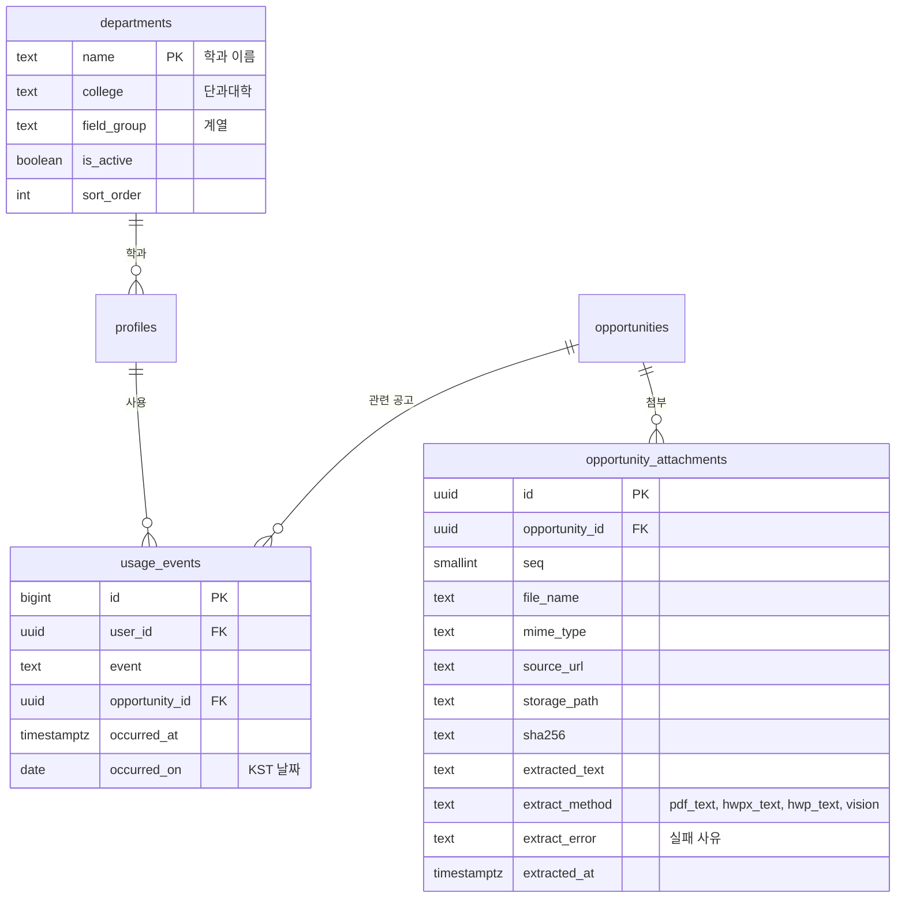

# ERD v0.9 변경분 — 멘토 피드백 반영

> 📝 기준: ERD v0.8 → v0.9 · 2026-10-06 · 기준 문서: PRD v0.9, API 명세 v0.4 · DB: Supabase (PostgreSQL 15+)
>
> 이번 변경으로 테이블 3개(`departments`, `opportunity_attachments`, `usage_events`)를 더하고, 기존 테이블 11개의 구조를 고친다. enum 3개는 text + check로 바꾸고, 모든 테이블에 RLS를 켠다. 마이그레이션은 v0.7 DDL 전체 → v0.8 → v0.9 순서로 PostgreSQL 16에서 확인했다. 자동 커밋, 단일 트랜잭션, CI와 같은 적용 방식이 모두 통과했다. 기존 행이 있는 DB에서도 데이터의 뜻이 바뀌지 않게 옮겨졌고, 기능 테스트에서 막혀야 할 16건이 모두 막혔다.
>
> 문서 상태 줄: `v0.9 변경: 요건 묶음(clause_no)·비교 기준(basis), 판정 기준일·변경 감지·요건 버전, 첨부·학과·사용 이벤트 테이블, 소득 선택 동의 제약, 알림 dedupe_key, 플래너·파일·캘린더 제약, enum 3개 → text + check, FK 인덱스, 전 테이블 RLS`

---

## 먼저: v0.7 DDL에는 RLS가 없었다

v0.7 DDL(7장)에는 `enable row level security`와 정책 문이 하나도 없고, 8장에 요약표만 있다. RLS는 v0.8에서 새로 만든 테이블 2개에만 켜져 있다. Supabase는 기본 설정에서 public 테이블을 Data API로 내보낸다. 그래서 이 상태로 적용하면 브라우저에 들어 있는 공개 키(anon)로 프로필·토큰 테이블을 읽고 쓸 수 있다.

Supabase와 같은 권한을 흉내 낸 검증 DB로 확인했다. v0.8까지 적용한 뒤 anon 권한으로 조회하면 프로필 1건과 토큰 1건이 그대로 읽혔다. v0.9를 적용한 뒤에는 0건이었다. 지금은 데이터가 없어 피해가 없다. 다만 S1-1(로그인 → Google 토큰 저장)보다 반드시 먼저 v0.9를 적용해야 한다.

## 변경 요약

| 대상 | 변경 | 멘토 의견 |
| --- | --- | --- |
| requirements | `clause_no`(같은 번호끼리 OR, 번호끼리 AND), `basis`(지역·학과 비교 기준), field를 text + check로, 인덱스 (opportunity_id, clause_no) | 판정 엔진 1·3·4 |
| eligibility_results | `requirements_version`, missing_fields를 text[] + check로, opportunity_id 인덱스 | ERD 상세 |
| opportunities | `eligibility_basis_date`, `content_hash`, `requirements_version` 추가, `difficulty` 삭제, updated_at 트리거 | 판정 엔진 2·9, ERD 상세 |
| opportunity_attachments | 신설: 첨부 정보, 추출 텍스트, 추출 방식, 실패 사유 | 판정 엔진 5 |
| departments | 신설: 학과 → 단과대 → 계열 | 판정 엔진 4 |
| profiles | department를 departments FK로, `is_international`, `income_info_agreed_at` 추가. 동의가 없으면 소득 3항목이 비어 있어야 한다는 제약 | 판정 엔진 4, ERD 상세, 개인정보 |
| notifications | 7개 컬럼 유니크를 없애고 `dedupe_key` + (user_id, dedupe_key) 유니크로, type을 text + check로 | ERD 상세 |
| planner_tasks | source와 연결 대상이 맞아야 한다는 check, 서류는 준비 할 일에만, 과제·계획서 일정당 할 일 1개 | ERD 상세 |
| lms_announcements | `is_section_specific` | ERD 상세 |
| files | (user_id, sha256, kind) 부분 유니크 (업로드만) | ERD 상세 |
| calendar_events | provider ≠ ics | ERD 상세 |
| agent_runs · user_settings | trigger_type, muted_notification_types를 text(배열) + check로 | ERD 상세 |
| usage_events | 신설: 제품 지표용 사용 이벤트 | 지표·테스트 |
| 공통 | `set_updated_at()` 트리거, FK 인덱스 40개, 모든 테이블 RLS와 읽기 정책, 컬럼 주석 | ERD 상세, 보안 |

## 레포에 넣는 법

- `supabase/migrations/20261006000200_erd_v09.sql`: 아래 7장 SQL을 그대로 넣는다. 이미 넣은 v0.7(`…000000`)·v0.8(`…000100`) 파일은 고치지 않는다.
- `supabase/ci/schema_checks.sql`: 아래 "CI 스키마 점검" SQL을 넣는다. CI의 마이그레이션 적용 단계 바로 뒤에 `psql "$DATABASE_URL" -v ON_ERROR_STOP=1 -f supabase/ci/schema_checks.sql` 한 줄을 더한다. 앞으로 RLS를 빼먹은 테이블이나 인덱스 없는 FK가 생기면 CI가 막는다.
- 같은 PR에서 API 뼈대의 DB 테스트 `test_profile_repository_roundtrip`을 고친다. 지금 저장하는 값(`department: 인공지능학과`, `welfare_status: none`)은 v0.9의 학과 FK와 소득 동의 제약에 걸린다. 테스트 시작 때 departments에 그 학과 행을 넣고, `welfare_status` 대신 `enrollment_status` 같은 소득 외 enum 항목으로 바꾸면 된다. 바꾼 값으로 DB에 저장되는 것까지 확인했다.
- 학과 목록은 별도 마이그레이션(`…_seed_departments.sql`)으로 넣는다. 목록이 비어 있으면 온보딩에서 학과를 저장할 수 없으니 S1-2 전에 넣는다.
- CI의 `supabase/ci/auth_stub.sql`은 그대로 써도 된다. 그 파일을 그대로 써서 확인했다.
- Storage는 SQL 없이 대시보드에서 버킷을 비공개로 만든다. `storage.objects`에는 클라이언트용 정책을 만들지 않는다.

---

## 7장 DDL — 마이그레이션 (v0.8 → v0.9)

v0.7 DDL과 v0.8 마이그레이션을 적용한 DB에 이어서 실행한다. 한 번에 실행해도 되고 단일 트랜잭션으로 실행해도 된다.

```sql
-- =========================================================
-- ERD v0.8 → v0.9 마이그레이션 (멘토 피드백 반영, 2026-10-06)
-- v0.7 DDL → v0.8 마이그레이션을 적용한 DB에 이어서 실행한다.
-- 데이터가 없다는 가정에 기대지 않도록, 기존 행이 있어도 뜻이 바뀌지 않게 옮긴다.
-- =========================================================

-- 0. 공통: updated_at 자동 갱신 함수 (확장 설치 없이 Supabase·CI 모두 동작)
create or replace function public.set_updated_at() returns trigger
language plpgsql set search_path = '' as $$
begin
  new.updated_at := now();
  return new;
end $$;

-- 1. 알림: 7개 컬럼 유니크 제거 (D-3·D-1 두 번 알림을 막고 있었음). 대신 dedupe_key (7번)
do $$
declare c text;
begin
  for c in select conname from pg_constraint
           where conrelid = 'notifications'::regclass and contype = 'u' loop
    execute format('alter table notifications drop constraint %I', c);
  end loop;
end $$;

-- 2. 자주 바뀌는 enum 3개 → text + check (값 추가는 check를 지우고 다시 거는 두 줄)
alter table requirements        alter column field          type text   using field::text;
alter table eligibility_results alter column missing_fields type text[] using missing_fields::text[];
alter table agent_runs          alter column trigger_type   type text   using trigger_type::text;
alter table notifications       alter column type           type text   using type::text;
alter table user_settings       alter column muted_notification_types drop default;
alter table user_settings       alter column muted_notification_types type text[] using muted_notification_types::text[];
alter table user_settings       alter column muted_notification_types set default '{}';
drop type req_field;
drop type run_trigger;
drop type notification_type;

alter table requirements add constraint requirements_field_chk check (field in (
  'department','grade','enrollment_status','semesters_completed','credits_total','credits_last_semester',
  'gpa_total','gpa_last_semester','age','region','income_bracket','median_income_pct','welfare_status',
  'is_international','other'));
alter table eligibility_results add constraint eligibility_results_missing_fields_chk check (missing_fields <@ array[
  'department','grade','enrollment_status','semesters_completed','credits_total','credits_last_semester',
  'gpa_total','gpa_last_semester','age','region','income_bracket','median_income_pct','welfare_status',
  'is_international']::text[]);
alter table agent_runs add constraint agent_runs_trigger_type_chk check (trigger_type in (
  'batch_crawl','poster_upload','prepare','syllabus_upload','material_upload','material_translate',
  'lms_sync','notify','eval'));
alter table notifications add constraint notifications_type_chk check (type in (
  'new_eligible','new_assignment','new_material','schedule_change','task_due','deadline_soon','profile_needed'));
alter table user_settings add constraint user_settings_muted_types_chk check (muted_notification_types <@ array[
  'new_eligible','new_assignment','new_material','schedule_change','task_due','deadline_soon','profile_needed']::text[]);

-- 3. 요건: 묶음 번호(같은 번호끼리 OR, 번호끼리 AND)와 비교 기준
alter table requirements add column clause_no smallint;
-- 기존 행은 조건마다 다른 번호를 줘서 지금 뜻(모두 AND)을 지킨다. 기본값 0을 두면 전부 OR가 되므로 두지 않는다
update requirements r set clause_no = s.rn
from (select id, row_number() over (partition by opportunity_id order by created_at, id) as rn
      from requirements) s
where r.id = s.id;
alter table requirements alter column clause_no set not null;
alter table requirements add constraint requirements_clause_no_chk check (clause_no >= 1);
drop index if exists requirements_opportunity_id_idx;
create index requirements_opportunity_clause_idx on requirements (opportunity_id, clause_no);

alter table requirements add column basis text;
update requirements set basis = 'unspecified' where field = 'region'     and basis is null;
update requirements set basis = 'department'  where field = 'department' and basis is null;
alter table requirements add constraint requirements_basis_chk check (
  case field
    when 'region'     then coalesce(basis in ('resident_registration','actual_residence','high_school','guardian','unspecified'), false)
    when 'department' then coalesce(basis in ('department','college','field_group'), false)
    else basis is null
  end);

-- 4. 학과 분류: 학과 → 단과대 → 계열. 목록은 별도 seed 마이그레이션으로 넣는다
create table departments (
  name         text primary key,                -- 프로필과 요건에 쓰는 학과 이름
  college      text not null,                   -- 단과대학
  field_group  text not null,                   -- 계열 (공학·자연·인문·사회·예체능 등)
  is_active    boolean not null default true,   -- 폐지·통합된 학과는 false (목록에서 숨김)
  sort_order   int not null default 0
);
-- 프로필 학과는 목록에 있는 이름만. 목록에 없는 기존 값은 비운다
update profiles set department = null
where department is not null and department not in (select name from departments);
alter table profiles add constraint profiles_department_fkey
  foreign key (department) references departments(name) on update cascade on delete set null;

-- 5. 프로필: 유학생 여부, 소득·수급 정보 선택 동의
alter table profiles
  add column is_international        boolean,       -- null이면 미입력
  add column income_info_agreed_at   timestamptz;   -- 소득·수급 정보 수집·이용 동의(선택). 철회하면 null
-- 동의 없이 남아 있는 소득·수급 값은 먼저 비운다
update profiles set income_bracket = null, median_income_pct = null, welfare_status = null
where income_info_agreed_at is null
  and (income_bracket is not null or median_income_pct is not null or welfare_status is not null);
alter table profiles add constraint profiles_income_consent_chk check (
  income_info_agreed_at is not null
  or (income_bracket is null and median_income_pct is null and welfare_status is null));

-- 6. 공고: 판정 기준일, 원문 변경 감지, 요건 버전, 난이도 삭제(정의 전까지 컬럼을 두지 않음)
alter table opportunities
  add column eligibility_basis_date  date,                     -- null이면 마감일(KST 날짜)
  add column content_hash            text,                     -- 본문 + 첨부 추출 텍스트의 sha256
  add column requirements_version    int not null default 1,   -- 다시 추출할 때마다 1 올림
  drop column difficulty;
alter table eligibility_results
  add column requirements_version    int not null default 1;   -- 어느 요건 버전으로 판정했는지

-- 7. 알림 중복 방지 키: "{type}:{대상}:{id}[:{시점}]" 예) deadline_soon:opp:<id>:D-3
alter table notifications add column dedupe_key text;
update notifications set dedupe_key = 'legacy:' || id where dedupe_key is null;
alter table notifications alter column dedupe_key set not null;
create unique index notifications_user_dedupe_uq on notifications (user_id, dedupe_key);

-- 8. 공고 첨부파일: 학교 공지는 본문이 "첨부 참조"인 경우가 많다
create table opportunity_attachments (
  id              uuid primary key default gen_random_uuid(),
  opportunity_id  uuid not null references opportunities(id) on delete cascade,
  seq             smallint not null default 1,
  file_name       text not null,
  mime_type       text,
  source_url      text,
  storage_path    text,
  sha256          text,
  extracted_text  text,
  extract_method  text check (extract_method in ('pdf_text','hwpx_text','hwp_text','vision')),
  extract_error   text,                         -- 추출 실패 사유. 실패한 첨부가 있으면 원문 확인 필요
  extracted_at    timestamptz,
  created_at      timestamptz not null default now(),
  unique (opportunity_id, source_url)
);

-- 9. 플래너: source와 연결 대상이 맞아야 하고, 같은 과제·계획서 일정은 사용자당 할 일 1개
alter table planner_tasks add constraint planner_tasks_source_chk check (
  case source
    when 'prep_plan'        then prep_plan_id        is not null and num_nonnulls(prep_plan_id, syllabus_item_id, lms_assignment_id, lms_announcement_id) = 1
    when 'syllabus'         then syllabus_item_id    is not null and num_nonnulls(prep_plan_id, syllabus_item_id, lms_assignment_id, lms_announcement_id) = 1
    when 'lms_assignment'   then lms_assignment_id   is not null and num_nonnulls(prep_plan_id, syllabus_item_id, lms_assignment_id, lms_announcement_id) = 1
    when 'lms_announcement' then lms_announcement_id is not null and num_nonnulls(prep_plan_id, syllabus_item_id, lms_assignment_id, lms_announcement_id) = 1
    when 'manual'           then num_nonnulls(prep_plan_id, syllabus_item_id, lms_assignment_id, lms_announcement_id) = 0
  end);
alter table planner_tasks add constraint planner_tasks_document_chk check (document_id is null or source = 'prep_plan');
create unique index planner_tasks_user_assignment_uq    on planner_tasks (user_id, lms_assignment_id) where lms_assignment_id is not null;
create unique index planner_tasks_user_syllabus_item_uq on planner_tasks (user_id, syllabus_item_id)  where syllabus_item_id  is not null;

-- 10. LMS 분반 한정 공지: 저장은 하되 MVP에서는 보여주지 않는다
alter table lms_announcements add column is_section_specific boolean not null default false;

-- 11. 업로드 파일: 같은 사용자가 같은 파일을 다시 올리면 기존 행을 쓴다
create unique index files_user_upload_sha_uq on files (user_id, sha256, kind) where origin = 'upload';

-- 12. 캘린더: .ics 내려받기는 기록하지 않는다 (동기화 상태가 없고 재다운로드 때 유니크 충돌)
alter table calendar_events add constraint calendar_events_no_ics_chk check (provider <> 'ics');

-- 13. 사용 이벤트: 제품 지표 원천 (기록은 API만)
create table usage_events (
  id              bigint generated always as identity primary key,
  user_id         uuid not null references profiles(id) on delete cascade,
  event           text not null check (event in (
                    'app_open','profile_prompt_shown','profile_prompt_submitted','lms_guide_opened','lms_connected')),
  opportunity_id  uuid references opportunities(id) on delete set null,
  occurred_at     timestamptz not null default now(),
  occurred_on     date not null default ((now() at time zone 'Asia/Seoul')::date)   -- KST 날짜
);
create unique index usage_events_app_open_daily_uq on usage_events (user_id, occurred_on) where event = 'app_open';
create index usage_events_event_time_idx on usage_events (event, occurred_at);

-- 14. updated_at 자동 갱신
create trigger opportunities_set_updated_at   before update on opportunities   for each row execute function public.set_updated_at();
create trigger lms_assignments_set_updated_at before update on lms_assignments for each row execute function public.set_updated_at();
create trigger user_settings_set_updated_at   before update on user_settings   for each row execute function public.set_updated_at();

-- 15. FK 인덱스: 탈퇴(cascade)·공고 삭제·조인이 풀스캔하지 않게 모든 FK에 인덱스
--     (syllabi.lms_course_id는 기존 부분 유니크 인덱스가 대신한다)
create index profiles_department_idx               on profiles (department);
create index push_subscriptions_user_id_idx        on push_subscriptions (user_id);
create index agent_runs_user_id_idx                on agent_runs (user_id);
create index llm_calls_tool_call_id_idx            on llm_calls (tool_call_id);
create index files_lms_course_id_idx               on files (lms_course_id);
create index files_lms_module_item_id_idx          on files (lms_module_item_id);
create index opportunities_extraction_run_id_idx   on opportunities (extraction_run_id);
create index opportunities_merged_into_id_idx      on opportunities (merged_into_id);
create index opportunities_poster_file_id_idx      on opportunities (poster_file_id);
create index opportunities_uploaded_by_idx         on opportunities (uploaded_by);
create index opportunity_documents_opportunity_idx on opportunity_documents (opportunity_id);
create index opportunity_reports_reporter_id_idx   on opportunity_reports (reporter_id);
create index eligibility_results_opportunity_idx   on eligibility_results (opportunity_id);
create index lms_assignments_lms_course_id_idx     on lms_assignments (lms_course_id);
create index lms_announcements_classified_run_idx  on lms_announcements (classified_run_id);
create index lms_announcements_opportunity_id_idx  on lms_announcements (opportunity_id);
create index syllabi_file_id_idx                   on syllabi (file_id);
create index syllabi_user_id_idx                   on syllabi (user_id);
create index syllabus_items_syllabus_id_idx        on syllabus_items (syllabus_id);
create index prep_plans_agent_run_id_idx           on prep_plans (agent_run_id);
create index prep_plans_opportunity_id_idx         on prep_plans (opportunity_id);
create index planner_tasks_document_id_idx         on planner_tasks (document_id);
create index planner_tasks_lms_announcement_idx    on planner_tasks (lms_announcement_id);
create index planner_tasks_lms_assignment_idx      on planner_tasks (lms_assignment_id);
create index planner_tasks_prep_plan_id_idx        on planner_tasks (prep_plan_id);
create index planner_tasks_syllabus_item_idx       on planner_tasks (syllabus_item_id);
create index calendar_events_user_id_idx           on calendar_events (user_id);
create index calendar_events_opportunity_id_idx    on calendar_events (opportunity_id);
create index calendar_events_syllabus_item_idx     on calendar_events (syllabus_item_id);
create index calendar_events_lms_assignment_idx    on calendar_events (lms_assignment_id);
create index materials_agent_run_id_idx            on materials (agent_run_id);
create index material_sections_translation_run_idx on material_sections (translation_run_id);
create index notifications_opportunity_id_idx      on notifications (opportunity_id);
create index notifications_planner_task_id_idx     on notifications (planner_task_id);
create index notifications_lms_assignment_idx      on notifications (lms_assignment_id);
create index notifications_lms_module_item_idx     on notifications (lms_module_item_id);
create index notifications_lms_announcement_idx    on notifications (lms_announcement_id);
create index opportunity_views_opportunity_id_idx  on opportunity_views (opportunity_id);
create index usage_events_user_id_idx              on usage_events (user_id);
create index usage_events_opportunity_id_idx       on usage_events (opportunity_id);

-- 16. RLS: public의 모든 테이블에 켠다. v0.7 DDL에는 RLS 문이 없어서 Supabase Data API(anon 키)로
--     전부 읽히고 쓰일 수 있었다. 프론트는 DB를 직접 읽지 않으므로(API 명세 1장) 정책은 "읽기"만 두고
--     쓰기 정책은 만들지 않는다. 쓰기는 백엔드(테이블 소유자 연결)만 한다.
do $$
declare t text;
begin
  for t in select tablename from pg_tables where schemaname = 'public' loop
    execute format('alter table %I enable row level security', t);
  end loop;
end $$;

-- 본인 행만 (토큰·로그·출처·사용 이벤트 테이블은 정책 없음 = 아무도 직접 못 읽음)
create policy profiles_select_own            on profiles            for select using (id = (select auth.uid()));
create policy push_subscriptions_select_own  on push_subscriptions  for select using (user_id = (select auth.uid()));
create policy lms_courses_select_own         on lms_courses         for select using (user_id = (select auth.uid()));
create policy lms_assignments_select_own     on lms_assignments     for select using (user_id = (select auth.uid()));
create policy files_select_own               on files               for select using (user_id = (select auth.uid()));
create policy opportunity_reports_select_own on opportunity_reports for select using (reporter_id = (select auth.uid()));
create policy eligibility_results_select_own on eligibility_results for select using (user_id = (select auth.uid()));
create policy syllabi_select_own             on syllabi             for select using (user_id = (select auth.uid()));
create policy prep_plans_select_own          on prep_plans          for select using (user_id = (select auth.uid()));
create policy planner_tasks_select_own       on planner_tasks       for select using (user_id = (select auth.uid()));
create policy calendar_events_select_own     on calendar_events     for select using (user_id = (select auth.uid()));
create policy notifications_select_own       on notifications       for select using (user_id = (select auth.uid()));
create policy syllabus_items_select_own      on syllabus_items      for select using (
  exists (select 1 from syllabi s where s.id = syllabus_items.syllabus_id and s.user_id = (select auth.uid())));
create policy materials_select_own           on materials           for select using (
  exists (select 1 from files f where f.id = materials.file_id and f.user_id = (select auth.uid())));
create policy material_sections_select_own   on material_sections   for select using (
  exists (select 1 from files f where f.id = material_sections.file_id and f.user_id = (select auth.uid())));

-- 수강 과목 공통 데이터: 그 과목을 듣는 사용자만, 분반 한정 공지는 MVP에서 제외
create policy lms_module_items_select_enrolled on lms_module_items for select using (
  exists (select 1 from lms_courses c
          where c.user_id = (select auth.uid()) and c.canvas_course_id = lms_module_items.canvas_course_id));
create policy lms_announcements_select_enrolled on lms_announcements for select using (
  not is_section_specific
  and exists (select 1 from lms_courses c
              where c.user_id = (select auth.uid()) and c.canvas_course_id = lms_announcements.canvas_course_id));

-- 공고: 활성 공고(포스터는 올린 본인만, 과목 공지 공고는 수강생만) + 준비를 시작한 공고는 마감·숨김 뒤에도 본인에게
create policy opportunities_select_visible on opportunities for select using (
  (
    status = 'active'
    and (select auth.uid()) is not null
    and (source_type <> 'poster' or uploaded_by = (select auth.uid()))
    and (visible_canvas_course_id is null or exists (
          select 1 from lms_courses c
          where c.user_id = (select auth.uid())
            and c.canvas_course_id = opportunities.visible_canvas_course_id
            and c.is_active))
  )
  or exists (select 1 from prep_plans p
             where p.user_id = (select auth.uid()) and p.opportunity_id = opportunities.id));
-- 요건·서류·첨부는 공고를 볼 수 있으면 같이 본다 (opportunities 정책을 그대로 따름)
create policy requirements_select_visible            on requirements            for select using (
  exists (select 1 from opportunities o where o.id = requirements.opportunity_id));
create policy opportunity_documents_select_visible   on opportunity_documents   for select using (
  exists (select 1 from opportunities o where o.id = opportunity_documents.opportunity_id));
create policy opportunity_attachments_select_visible on opportunity_attachments for select using (
  exists (select 1 from opportunities o where o.id = opportunity_attachments.opportunity_id));

-- 학과 목록: 로그인한 사용자 누구나
create policy departments_select_signed_in on departments for select using ((select auth.uid()) is not null);

-- 17. 주석
comment on column requirements.clause_no               is '같은 번호끼리 OR, 서로 다른 번호끼리 AND. 1부터';
comment on column requirements.basis                   is 'region: resident_registration·actual_residence·high_school·guardian·unspecified / department: department·college·field_group';
comment on column opportunities.eligibility_basis_date is '만 나이·학년·재학 상태를 따지는 기준일. null이면 마감일(KST)';
comment on column notifications.dedupe_key             is '{type}:{대상}:{id}[:{시점}]. 사용자당 같은 키 1행. 마감이 바뀌면 pending 행의 scheduled_at만 고친다';
comment on column oauth_tokens.access_token            is '백엔드가 Fernet으로 암호화한 값. 키는 DB 밖(환경변수)';
comment on column oauth_tokens.refresh_token           is '백엔드가 Fernet으로 암호화한 값. 키는 DB 밖(환경변수)';
comment on column lms_connections.access_token         is '백엔드가 Fernet으로 암호화한 값. 화면에는 token_last4만';
comment on column profiles.department                  is 'departments.name. 목록에 있는 학과만';
comment on column lms_courses.name                     is '예: 202620HY23525_선형대수 (포털 과목번호 23525와 같은 과목)';
```

## CI 스키마 점검 (`supabase/ci/schema_checks.sql`)

마이그레이션을 모두 적용한 뒤 돌린다. v0.9에서는 통과하고, v0.8 상태에서는 "RLS가 꺼진 테이블"로 실패하는 것을 확인했다.

```sql
-- 마이그레이션을 모두 적용한 뒤 CI에서 돌리는 스키마 점검. 걸리면 오류로 끝난다.
do $$
declare bad text;
begin
  -- 1. RLS가 꺼진 public 테이블
  select string_agg(relname, ', ') into bad
  from pg_class where relnamespace = 'public'::regnamespace and relkind = 'r' and not relrowsecurity;
  if bad is not null then raise exception 'RLS가 꺼진 테이블: %', bad; end if;

  -- 2. 인덱스가 없는 FK (인덱스 앞쪽 열이 FK 열과 같아야 함. "FK열 IS NOT NULL" 부분 인덱스는 인정)
  select string_agg(format('%s(%s)', c.conrelid::regclass, a.attname), ', ') into bad
  from pg_constraint c
  join pg_attribute a on a.attrelid = c.conrelid and a.attnum = c.conkey[1]
  where c.contype = 'f' and c.connamespace = 'public'::regnamespace
    and not exists (
      select 1 from pg_index i
      where i.indrelid = c.conrelid
        and (string_to_array(i.indkey::text, ' ')::int2[])[1:array_length(c.conkey, 1)] = c.conkey
        and (i.indpred is null
             or pg_get_expr(i.indpred, i.indrelid) = format('(%s IS NOT NULL)', quote_ident(a.attname))));
  if bad is not null then raise exception '인덱스가 없는 FK: %', bad; end if;
end $$;
```

---

## 2장 관계도 추가 (전체 관계도와 3-1·3-3 도메인)



기존 엔티티 블록은 다음처럼 바꾼다.

| 엔티티 | 바꿀 속성 줄 |
| --- | --- |
| requirements | `smallint clause_no "같은 번호 OR, 번호끼리 AND"`, `text basis "지역·학과 비교 기준"` 추가, `field` 타입을 text로 |
| opportunities | `date eligibility_basis_date`, `text content_hash`, `int requirements_version` 추가, `difficulty` 삭제 |
| eligibility_results | `int requirements_version` 추가, `missing_fields` 타입을 text[]로 |
| profiles | `department`에 FK 표시, `boolean is_international`, `timestamptz income_info_agreed_at` 추가 |
| notifications | `text dedupe_key "중복 방지 키"` 추가, `type` 타입을 text로 |
| lms_announcements | `boolean is_section_specific` 추가 |

## 4장 테이블 목록 (추가·수정 행)

| 도메인 | 테이블 | 역할 | 관련 기능 |
| --- | --- | --- | --- |
| 사용자 | departments (추가) | 학과 → 단과대 → 계열 매핑. 프로필 학과 목록과 학과 조건 판정에 쓴다 | F-02, F-21 |
| 공고 | opportunity_attachments (추가) | 공고 첨부파일과 추출 텍스트·방식·실패 사유 | F-10, F-20, F-25 |
| 공고 | requirements (수정) | 공고별 자격 조건 (묶음·항목·연산자·값·기준·근거 문장) | F-20, F-21, F-25 |
| 로깅 | usage_events (추가) | 화면·API에서 기록하는 사용 이벤트. 제품 지표 원천 | 8장 지표 |

## 5장 핵심 설계 결정

### 요건 구조화와 판정 (절 교체)

- 요건 행 하나가 조건 하나다. `clause_no`가 같은 행끼리 OR, 서로 다른 `clause_no`끼리 AND다(CNF). 조건이 하나뿐인 묶음은 평범한 AND 조건이다. 판정 규칙(3치 논리, 판정 기준일, 확실할 때만 불충족)은 PRD 5-3에 있다.
- `clause_no`에는 기본값을 두지 않는다. 기본값 0을 두면 모든 조건이 하나의 OR 묶음이 되어 판정이 무력해진다. 마이그레이션은 기존 행에 공고마다 1, 2, 3…을 따로 매겨 지금 뜻(모두 AND)을 지킨다.
- `field`는 프로필 항목과 대응한다. 값 목록은 check 제약으로 둔다(6장). 프로필에 없는 조건은 `other`로 저장하고 "모름"으로 처리한다.
- `value`는 연산자에 따라 모양이 다르다.

| 연산자 | value 예 |
| --- | --- |
| gte · lte | `3.0` |
| eq · neq | `4`, `"enrolled"`, `true` |
| in · not_in | `["경기도 안산시", "경기도 시흥시"]` |
| between | `{"min": 19, "max": 34, "military_extension": true}` |

- `basis`는 region과 department에만 쓰고, 두 항목에서는 반드시 넣는다. 다른 항목은 null이다.

| field | basis 값 | 판정 |
| --- | --- | --- |
| region | `resident_registration`(주민등록), `unspecified`(명시 없음) | 프로필 지역(주민등록 주소)과 비교한다 |
| region | `actual_residence`(실거주), `high_school`(출신 고교 소재지), `guardian`(보호자 주소) | 모름 (원문 확인 필요) |
| department | `department`, `college`, `field_group` | value에 그 단위의 이름을 넣고 departments 매핑으로 비교한다 |

- `is_ambiguous`: 근거 문장이 원문(본문 + 첨부 텍스트)에 없거나 해석이 갈리면 true이고, 그 조건은 "모름"이다. v0.7의 "모호한 조건이 하나라도 있으면 판정 불가"는 묶음 판정으로 바뀐다. 같은 묶음의 다른 조건이 충족하면 그 묶음은 충족이다.
- `condition_results`(jsonb) 모양은 다음과 같다.

```json
[{ "requirement_id": "uuid", "clause_no": 1, "outcome": "pass | fail | unknown",
   "unknown_reason": "missing_profile | ambiguous | unsupported_field | basis_mismatch | null",
   "user_value": 3.2 }]
```

- `missing_fields`에는 결과가 "모름"인 묶음에서 `missing_profile`인 조건의 항목만 넣는다. 이미 충족한 묶음의 빈 항목은 넣지 않는다.
- 판정 기준일은 `opportunities.eligibility_basis_date`를 쓴다. null이면 마감일의 KST 날짜, 마감일도 없으면 판정한 날이다.
- 다시 추출: 본문 + 첨부 추출 텍스트의 sha256(`content_hash`)이 바뀌면 그 공고의 요건을 지우고 다시 넣는다. `requirements_version`을 1 올리고 그 공고의 판정을 모두 다시 계산한다. 판정 결과의 `requirements_version`이 공고와 다르면 낡은 결과다.

### 첨부파일 (추가)

- 크롤러가 게시글 첨부를 내려받아 Storage에 두고 행을 만든다. 추출 방식은 `extract_method`에, 실패 사유는 `extract_error`에 남긴다. 실패한 첨부가 있는 공고는 `needs_review`(원문 확인 필요 배지)다.
- 어떤 첨부를 읽을지는 요건 추출 에이전트가 고른다(PRD 6장). 읽지 않은 첨부는 `extract_method`가 null이다.

### 학과 (추가)

- 프로필 학과는 `departments.name`만 쓸 수 있다. 학과 이름이 바뀌면 `on update cascade`로 프로필도 따라간다. 폐지된 학과는 `is_active = false`로 목록에서만 숨긴다. 통폐합 이력은 MVP에서 다루지 않는다.

### 소득·수급 동의 (추가)

- `income_info_agreed_at`이 null이면 `income_bracket`·`median_income_pct`·`welfare_status`가 모두 null이어야 한다(DB 제약). 동의를 철회할 때는 동의 시각과 세 값을 한 번에 비운다.

### 공고 공개 범위 (포스터 공유 절 교체)

- 활성 공고 중 포스터는 올린 사람만 볼 수 있다. 과목 공지 공고는 그 과목 수강생(`is_active`)만, 나머지는 로그인 사용자 모두가 본다. 준비를 시작한 공고(`prep_plans`)는 마감·숨김 뒤에도 본인에게 보인다. 요건·서류·첨부는 공고를 볼 수 있으면 같이 본다.
- RLS 정책과 API 쿼리는 같은 규칙을 쓴다. 백엔드는 테이블 소유자로 연결해 RLS를 받지 않으므로, 피드·상세 쿼리에도 이 규칙을 직접 건다.
- 포스터 공유(P1)를 켤 때 이 규칙과 피드 API에 공유 여부를 더한다. 업로더 이름은 표시하지 않으므로 마스킹용 `security definer` 함수는 만들지 않는다. `dedupe_key`·`merged_into_id`(병합)와 `opportunity_reports`(신고)는 그대로 둔다.

### 알림 중복 방지 (v0.8 "프로필 정보 필요 알림" 문장 교체)

v0.8은 7개 컬럼 유니크가 "공고당 1회"를 보장한다고 적었다. 그런데 같은 제약 때문에 같은 공고의 D-3·D-1 알림을 둘 다 만들 수 없었다. 이제는 사용자당 같은 `dedupe_key`가 1행이다.

| 종류 | 키 | 비고 |
| --- | --- | --- |
| new_eligible | `new_eligible:opp:{opportunity_id}` | |
| deadline_soon (공고) | `deadline_soon:opp:{opportunity_id}:D-3`, `…:D-1` | 공고당 2행 |
| deadline_soon (LMS 과제) | `deadline_soon:asg:{lms_assignment_id}:D-3`, `…:D-1` | 제출하면 pending 행 삭제 |
| profile_needed | `profile_needed:opp:{opportunity_id}` | 공고당 1회 (하루 1건 제한은 발송 배치) |
| new_assignment | `new_assignment:asg:{lms_assignment_id}` | |
| new_material | `new_material:mod:{lms_module_item_id}` | |
| schedule_change | `schedule_change:ann:{lms_announcement_id}` | P1 |
| task_due | `task_due:task:{planner_task_id}` | |

- 마감이 바뀌면 같은 키의 pending 행에서 `scheduled_at`만 고친다. 과제를 제출했거나 준비를 취소하면 pending 행을 지운다.

### 플래너 제약 (추가)

- source마다 연결 대상이 정확히 하나다(manual은 연결 대상이 없다). `document_id`는 준비 할 일에만 쓴다. LMS 과제와 계획서 일정은 사용자당 할 일 1개라서, 다시 동기화해도 중복이 생기지 않는다.

### 업로드 파일 (추가)

- 같은 사용자가 같은 sha256·같은 kind로 올린 파일은 한 행이다. API는 이미 있으면 그 `file_id`를 돌려준다. LMS 첨부 자동 수집(`origin = lms_attachment`)은 기존 (user_id, external_ref) 유니크를 쓴다.

### 날짜·시간 (추가)

- 일시는 timestamptz(UTC)로 저장한다. 날짜로 바꿀 때(`due_date`, 판정 기준일, D-day, `occurred_on`)는 항상 Asia/Seoul 기준이다. 23:59 KST 마감은 KST 날짜로 그날이다.

### 토큰 암호화 (LMS 연동 절의 "토큰 보관" 보강)

- `oauth_tokens`·`lms_connections`의 토큰은 백엔드가 Fernet(AES-128-CBC + HMAC-SHA256, 인증 암호화)으로 암호화한다. 키는 DB 밖 환경변수에 둔다. 키 교체는 MultiFernet으로 한다(새 키로 암호화하고 옛 키로도 복호화). 그래서 `key_version` 컬럼은 두지 않는다. v0.7 주석 "Supabase Vault 등"은 마이그레이션 17번 주석으로 바로잡았다.

### 그 밖 (추가)

- `updated_at`이 있는 테이블(opportunities, lms_assignments, user_settings)은 `set_updated_at()` 트리거로 자동 갱신한다. 확장(moddatetime)을 쓰지 않아 Supabase와 CI에서 똑같이 동작한다.
- 모든 FK에 인덱스를 둔다. Postgres는 FK에 인덱스를 자동으로 만들지 않아서, 탈퇴 cascade와 공고 삭제가 풀스캔이 된다. CI 스키마 점검이 빠진 인덱스를 잡는다.
- `usage_events`는 API만 기록한다. `app_open`은 사용자당 KST 하루 1건이다(부분 유니크와 `on conflict do nothing`).
- `.ics` 내려받기는 `calendar_events`에 기록하지 않는다(제약). 동기화 상태가 없고, 다시 내려받을 때 유니크 충돌이 난다.
- LMS 분반 한정 공지는 `is_section_specific = true`로 저장하고 MVP에서는 보여주지 않는다. 조건부 공개 모듈 항목(선행 조건이 있는 주차 자료)은 과목 공통으로 저장되므로 아직 열리지 않은 학생에게도 보일 수 있다. 이는 MVP의 한계로 둔다.

## 6장 Enum (수정)

| 바뀐 것 | 지금 | 값 |
| --- | --- | --- |
| req_field | text + check (`requirements.field`, `eligibility_results.missing_fields`) | department, grade, enrollment_status, semesters_completed, credits_total, credits_last_semester, gpa_total, gpa_last_semester, age, region, income_bracket, median_income_pct, welfare_status, **is_international**, other (`missing_fields`에는 other 없음) |
| run_trigger | text + check (`agent_runs.trigger_type`) | batch_crawl, poster_upload, prepare, syllabus_upload, material_upload, material_translate, lms_sync, notify, eval |
| notification_type | text + check (`notifications.type`, `user_settings.muted_notification_types`) | new_eligible, new_assignment, new_material, schedule_change, task_due, deadline_soon, profile_needed |

값을 더할 때는 새 마이그레이션에 두 줄을 쓴다: `alter table … drop constraint …_chk;` 다음에 `alter table … add constraint …_chk check (…);`. 나머지 enum은 그대로 둔다.

## 8장 RLS 정책 요약 (표 교체)

| 테이블 | 읽기 (로그인 사용자) | 쓰기 |
| --- | --- | --- |
| profiles, push_subscriptions, lms_courses, lms_assignments, files, opportunity_reports, eligibility_results, syllabi, syllabus_items, prep_plans, planner_tasks, calendar_events, notifications, materials, material_sections, user_settings, opportunity_views | 본인 행만 | 백엔드만 |
| lms_module_items, lms_announcements | 그 과목 수강생만 (분반 한정 공지는 제외) | 백엔드만 |
| opportunities | 공개 범위 규칙(5장) | 백엔드만 |
| requirements, opportunity_documents, opportunity_attachments | 공고를 볼 수 있으면 | 백엔드만 |
| departments | 로그인 사용자 모두 | 백엔드만 |
| oauth_tokens, lms_connections, agent_runs, tool_calls, llm_calls, sources, usage_events | 아무도 직접 못 읽음 | 백엔드만 |

- 로그인하지 않은 요청(anon)은 어떤 행도 읽지 못한다. 클라이언트용 쓰기 정책은 하나도 없다.
- 처리 과정 표시(F-42)는 API가 단계명·상태·소요 시간만 골라서 준다. 실행 로그를 직접 읽는 정책은 두지 않는다.
- Storage: 버킷은 비공개이고, 경로는 `<user_id>/…`이다. `storage.objects`에 클라이언트 정책을 두지 않는다. 다운로드는 API가 만든 5분짜리 서명 URL로만 한다.

## 9장 확인 필요 사항 (정리)

미결은 PRD 14장 한 곳에서 관리한다. 이 장에는 확인을 끝낸 [x] 항목만 남긴다. 열린 3개(강의자료 상한, 백분위 환산식, HY-in)는 PRD 14장으로 옮겼다.

## 머리말·주석 정리

- 머리말에는 최신 변경 한 줄만 두고, 나머지 변경 줄은 문서 끝 "변경 이력"으로 옮긴다.
- 기준 문서는 "PRD v0.9, API 명세 v0.4"로 바꾼다.
- `lms_courses.name` 예시를 `202620HY23525_선형대수`로 통일한다. 포털 과목번호 예시 23525와 같은 과목이다(마이그레이션 17번 주석에도 반영).

---

## 검증한 것

PostgreSQL 16.15에 Supabase 흉내(auth 스키마, `auth.uid()`, anon·authenticated 역할과 public 기본 권한)를 만든 뒤 확인했다.

| 점검 | 결과 |
| --- | --- |
| v0.7 DDL 전체 → v0.8 → v0.9, 자동 커밋·단일 트랜잭션 | 오류 없음 (v0.7 DDL 전체를 실제로 적용한 것도 이번이 처음) |
| CI 방식: `auth_stub.sql` → `migrations/*.sql` 파일 순서 | 오류 없음, 스키마 점검 통과 |
| 기존 행이 있는 v0.8 DB에 적용 | 요건 3행은 묶음 1·2·3으로(모두 AND 유지), 지역 조건 기준은 unspecified, 목록에 없는 학과와 동의 없는 소득 값은 비움, 끈 알림 종류는 유지, 기존 알림에는 legacy 키 |
| anon 조회 | v0.8: 프로필 1건·토큰 1건 읽힘 → v0.9: 0건 |
| 공개 범위 | A: 공개 장학, 숨김(준비함), 마감(준비함), 본인 포스터, 수강 과목 한정 공고 5건 / B: 공개 장학 1건. 요건도 같은 범위로 보임 |
| 막혀야 하는 16건 | 로그인 사용자의 직접 쓰기, 같은 알림 키, 목록 밖 알림 종류, 같은 과제 할 일 중복, source와 연결 대상 불일치 2건, 묶음 번호 없는 요건, 지역 조건에 기준 없음, 학년 조건에 기준, 목록 밖 요건 항목, 목록 밖 빠진 항목, 목록 밖 학과, 동의 없이 소득 저장, 값을 남긴 채 동의 철회, 같은 파일 다시 업로드, .ics 기록 |
| 정상 동작 | 같은 공고 D-3·D-1 두 행, 마감 변경 재예약, 학과 이름 변경 따라감, updated_at 자동 갱신, 같은 날 app_open 1건 |
| CI 스키마 점검 | v0.9 통과 / v0.8 상태에서는 RLS 꺼진 테이블로 실패 |
