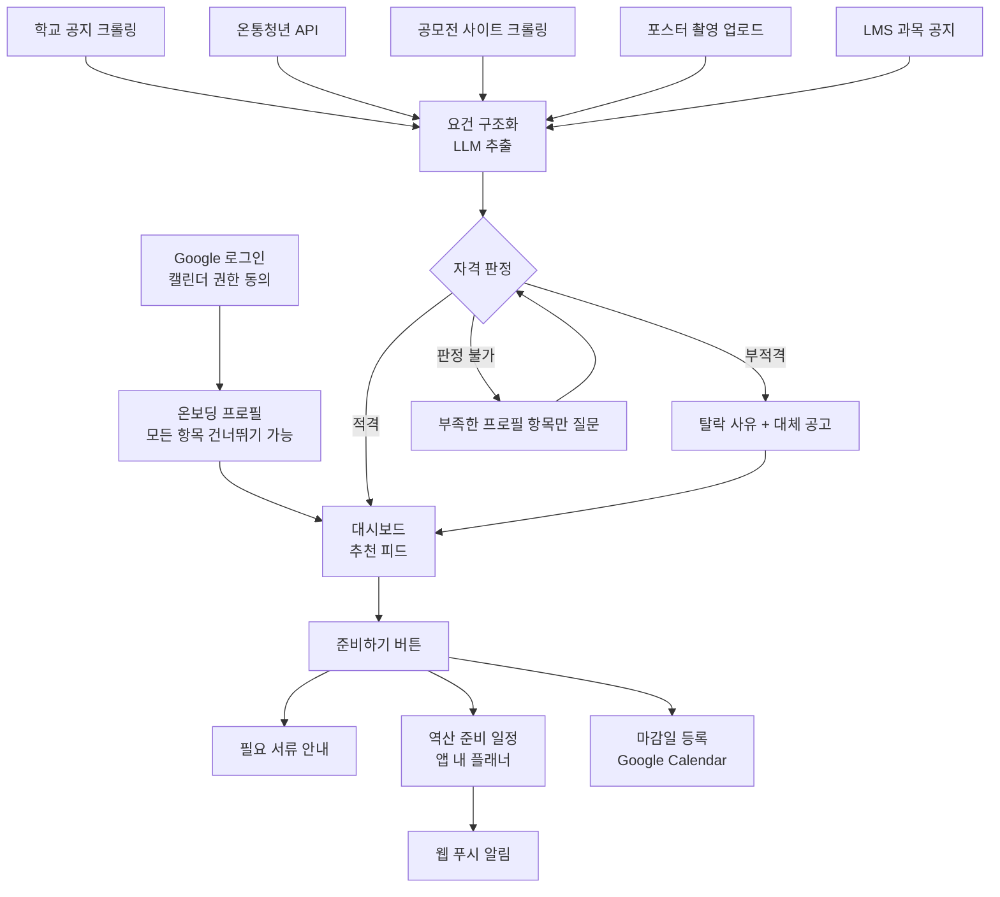
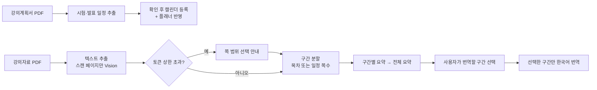
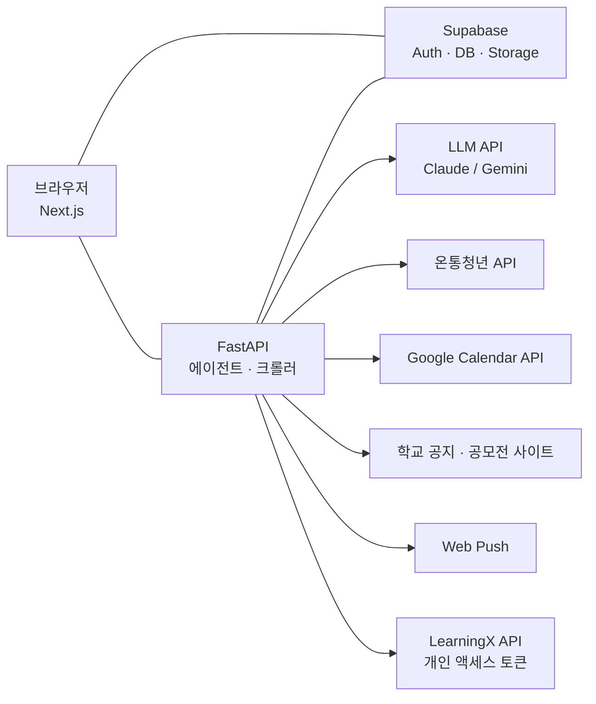

# PRD — 학내 정보 에이전트 MVP

> 🎯 **한 줄 정의** — 학교 공지·청년 정책·공모전·포스터를 읽고, **내 프로필 기준으로 자격을 판정**한 뒤, 필요 서류와 **마감일 역산 준비 일정**까지 만들어주는 대학생용 AI 에이전트

> 📝 문서 상태: 초안 v0.8 · 2026-10-05 · 개발 2명 기준 · MVP 범위 = 학생 버전 핵심 흐름(입력 → 판정 → 실행)
>
> v0.8 변경: 디자인 초안 대조 반영 — 화면 구성(4-3) 신설, 판정 상태 화면 라벨 4종, 설정(F-06)·앱 내 알림함(F-35) 추가, 홈 요약 카드와 새 공고·마감 임박 기준, 공고 상세 상태별 구성과 서류 체크–플래너 연동, 플래너 마감 표시, 포스터 PDF 허용, 지원 어려움 공고는 피드 하단 묶음
>
> v0.7 변경: 강의자료 처리 방식 변경 — 분량 상한을 페이지가 아닌 추출 텍스트 토큰 기준으로, 요약은 구간별로 쪼개 전체 처리(목차별 요약), 번역은 사용자가 고른 구간만
>
> v0.6 변경: 실제 장학·청년정책 요건 조사 반영(프로필에 이수 학기 수·수급 자격·병역 기간 추가, 소득 기준 불일치 시 판정 불가 원칙), HY-in 재학생 인증(P1), 신고 숨김 기준·LMS 동기화 주기·번역/요약 저장 방식 확정
>
> v0.5 변경: 강의계획서는 LMS 과목별 포털 계획서 바로가기 + PDF 업로드 자동 매칭으로 확정 (포털 자동 수집은 robots.txt 차단으로 제외)
>
> v0.4 변경: LMS 연동을 캘린더 피드에서 **개인 액세스 토큰 API**로 전환(실제 점검으로 확인). 과제·제출 여부 동기화, 주차학습 새 자료 감지, 과목 공지 분류, 공지 첨부 수집을 5-6장으로 분리
>
> v0.3 변경: LMS 과제 연동 추가, 나이 판정은 생년월일로 확정
>
> v0.2 변경: 포스터 공고 공유(업로더 마스킹 표시)·중복 병합·신고 숨김 추가, .ics 내려받기 추가, 앱 전환 시 기기 캘린더 확장 명시, 프로필 항목 세분화

---

## 목차

1. 배경과 문제
2. 목표와 비목표
3. 타깃 사용자
4. 핵심 사용자 흐름
5. 기능 요구사항
6. 에이전트 설계
7. 비기능 요구사항
8. 성공 지표와 테스트 시나리오
9. 기술 스택과 아키텍처
10. 개발 역할 분담 (2인)
11. 일정 (초안)
12. 리스크
13. 확장 범위 (사업계획서용)
14. 미결 사항

---

## 1. 배경과 문제

- 대학생이 받는 기회성 정보(장학금, 교내 프로그램, 청년 정책, 공모전·대외활동)는 학교 홈페이지, 학과 게시판, 온통청년, 공모전 사이트, 오프라인 포스터에 흩어져 있다
- 기존 서비스(유니뷰, 캘박, 링커리어, 온통청년 등)는 **모아서 보여주는 단계**에서 끝난다
- 실제로 손이 가는 건 그다음이다: "내가 해당되나?" → "뭘 준비해야 하나?" → "언제까지 뭘 해야 하나?"
- 이 서비스는 이 세 단계를 에이전트가 대신 수행한다

## 2. 목표와 비목표

### 목표

- 공고 1건이 들어오면 **요건 구조화 → 자격 판정 → 서류 안내 → 준비 일정 생성**이 사람 개입 없이 끝난다
- 부적격이면 **탈락 사유와 비슷한 난이도의 대체 공고**를 함께 보여준다
- 모든 에이전트 실행을 로깅해 **성공률 · 응답시간 · 호출비용**을 측정하고 개선 전후를 비교한다 (AOP 필수 요건)

### 비목표 (MVP에서 하지 않음)

- 기업 버전, 결제·크레딧, 친구에게 공고 공유, 활동 이력 축적, 예상 퀴즈 생성 → 13장 확장 범위
- 비밀번호를 받는 LMS 로그인 자동화 (보안 · 학교 규정 · SSO 리스크) — LMS 연동은 사용자가 직접 발급한 개인 액세스 토큰으로만 한다(5-6장)
- 포털 수업계획서 자동 수집 — LMS 계획서는 포털 iframe이고, 포털은 robots.txt로 자동 접근을 막고 있다. 과목별 바로가기만 만들어주고 사용자가 PDF로 저장해 올린다(F-14)
- 주차학습 자료 자동 다운로드 — LearningX 외부 도구라 토큰으로 접근할 수 없고, LMS에서 직접 열어야 학습 완료가 인정된다. 새 자료 감지와 바로가기까지만 제공한다
- 모델 학습 (LLM API + Tool Calling만 사용)

## 3. 타깃 사용자

| 항목 | 내용 |
| --- | --- |
| 주 사용자 | 한양대 ERICA 재학생 (MVP 크롤링 대상 학교) |
| 핵심 페인 | 공지를 봐도 내가 해당되는지 모르겠고, 서류 준비 시점을 놓친다 |
| 사용 시점 | 학기 초(강의계획서), 장학·정책 공고 시즌, 공모전 포스터를 봤을 때 |
| 성공한 사용자 모습 | 대시보드에서 "지원 가능" 공고를 확인하고, 버튼 한 번으로 서류 안내·준비 일정·마감일 등록까지 끝낸다 |

## 4. 핵심 사용자 흐름

### 4-1. 공고 → 판정 → 실행

### 4-2. 강의계획서 · 강의자료

### 4-3. 화면 구성

화면마다 담는 기능을 고정해 디자인과 개발이 같은 단위로 일한다.

| 화면 | 들어오는 곳 | 담는 기능 | 우선 |
| --- | --- | --- | --- |
| 로그인·온보딩 | 첫 접속 | F-01, F-02 | P0 |
| 홈 | 사이드바 홈 | F-40, F-24(P1) | P0 |
| 공고 상세 | 홈 카드, 알림 | F-41, F-03, F-22, F-23(P1), F-25, F-17, F-30–F-32, F-42 | P0 |
| 플래너 | 사이드바 플래너 | F-43, F-31, F-32, F-34(P1) | P0 |
| 학업 | 사이드바 학업 | F-50 연결 상태, F-51·F-52 요약(과목 카드, 새로 들어온 학업 정보), F-53(P1) | P0 |
| 과목 상세 | 학업의 과목 카드 | 과제 탭(F-51), 자료 탭(F-52, F-15), 공지 탭(F-53·F-54, P1), 계획서 탭(F-14) | P0 |
| 포스터 등록 | 사이드바 포스터 등록 | F-13, F-16(P1) | P0 |
| 알림함 | 헤더 알림 버튼 | F-35 | P0 |
| 설정 | 사이드바 하단 | F-06, F-50, F-04(P1), F-05(P1) | P0 |
| 문서함 | 사이드바(구현 전까지 숨김) | F-44 | P1 |

## 5. 기능 요구사항

> 📅 **캘린더 구조** — 웹에서는 휴대폰 기본 캘린더에 직접 접근할 수 없어 API가 열린 Google Calendar를 기본으로 쓴다(AOP 외부 도구 요건도 충족). 등록 기록은 provider(google / ics / device)로 구분해 저장해서, 앱으로 전환할 때 기기 캘린더를 테이블 변경 없이 추가한다.

> 🏷️ **P0** 최종 데모에서 반드시 동작 · **P1** 일정 여유 시 MVP 포함, W8에 포함 여부 재판단 · **P2** 확장(사업계획서에만 기재)

### 5-1. 인증 · 온보딩 · 프로필

| ID | 기능 | 설명 | 우선 | 완료 조건 |
| --- | --- | --- | --- | --- |
| F-01 | Google 로그인 | Supabase Auth Google OAuth. 캘린더 이벤트 쓰기 권한을 로그인 시 함께 요청 | P0 | 로그인 후 캘린더 API 호출 성공, 토큰 만료 후 자동 갱신 |
| F-02 | 온보딩 프로필 | 시작 전에 이용약관과 개인정보 수집·이용 동의를 받고, 동의 시각과 약관 버전을 기록한다. 학과, 학년, 재학 상태, **이수 학기 수**, 이수학점(누적·직전학기), 평점(누적·**직전학기 장학용 평점, F 포함**), 생년월일(만 나이 판정용), **병역 복무 개월 수**(청년 연령 상한 연장용), 거주지역, 소득(학자금 지원구간·기준 중위소득 %·**기초생활수급/차상위 여부**)을 순서대로 묻되 **모든 항목 건너뛰기 가능**. 민감 항목은 수집 목적 안내 문구 표시 | P0 | 전부 건너뛰어도 대시보드 진입 가능, 동의 없이는 다음 단계로 넘어가지 않음 |
| F-03 | 판정 시 즉석 입력 | 판정에 필요한 항목이 비어 있으면 **그 항목만** 입력 요청, 입력 즉시 재판정 | P0 | 입력 후 해당 공고 판정 결과가 바로 갱신됨 |
| F-04 | 프로필 수정 | 설정 화면에서 수정, 수정 시 기존 판정 재계산 | P1 | 수정 후 피드 판정 상태 변경 확인 |
| F-05 | HY-in 재학생 인증 | 한양대 API 개발자센터 OAuth로 재학 여부·소속 학과·입학년도를 받아 재학생 인증 + 프로필 자동 입력. 학번·성명은 저장하지 않음. 개발자 등록·승인 필요 | P1 | 인증 배지 표시, 학과·재학 상태 자동 입력 |
| F-06 | 설정 | 프로필 수정(F-04), Google 캘린더 연결 상태와 재연결, LMS 토큰 연결·해제(F-50), HY-in 인증(F-05), 탈퇴. 알림 설정(푸시 켜기·끄기, 종류별 끄기)과 LMS 과제 자동 캘린더 등록 켜기·끄기(기본 켜짐)는 P1 | P0 | 설정에서 연동 해제와 탈퇴가 끝까지 동작, 바꾼 설정이 다음 동기화·알림 발송에 반영 |

### 5-2. 입력 (수집)

| ID | 기능 | 설명 | 우선 | 완료 조건 |
| --- | --- | --- | --- | --- |
| F-10 | 학교 공지 크롤링 | ERICA 학사·장학·학과 공지 게시판을 주기적으로 수집, 새 글만 증분 수집 | P0 | 스케줄 실행 시 신규 글만 저장, 중복 없음 |
| F-11 | 청년 정책 수집 | 온통청년 오픈 API로 정책 목록·상세 수집 | P0 | 정책이 공고 테이블에 같은 형식으로 저장 |
| F-12 | 공모전·대외활동 크롤링 | 공모전 사이트 1–2곳에서 메타데이터(제목, 주최, 마감일, 요건, 원문 링크) 수집. robots.txt·이용약관 확인 후 대상 확정 | P0 | 막히면 포스터 업로드로 대체 가능한 구조 |
| F-13 | 포스터 업로드 | JPG·PNG·WEBP·HEIC 이미지나 2쪽 이하 PDF를 올리고, 모바일에서는 카메라로 바로 찍는다. 멀티모달 LLM이 제목·주최·카테고리·신청 기간·요건·필요 서류를 추출하고, 확인 화면에서 원본과 나란히 보며 수정한다(신뢰도 낮은 항목 강조). 등록 전에 "다른 학생 피드에도 공개되고 이름은 김\*지처럼 가려진다"고 안내한다. 저장된 공고는 다른 사용자 피드에 마스킹된 업로더와 함께 노출된다. 분석 중에는 처리 과정(F-42), 실패하면 다시 찍기 안내, 중복이면 기존 공고로 이동(F-16) | P0 | 확인 화면에서 수정 가능, 다른 계정 피드에 마스킹된 업로더와 함께 표시, 2쪽 PDF 포스터 추출 성공 |
| F-16 | 중복 공고 병합 | 제목·주최·마감일을 정규화한 키로 같은 공모전을 감지해 기존 공고에 병합 | P1 | 같은 포스터 2회 업로드 시 피드에 1건만 표시 |
| F-17 | 공고 신고·자동 숨김 | 공유 공고에 신고 버튼(잘못된 정보·중복·마감·부적절). **서로 다른 사용자 3명**이 신고하면 자동 숨김, 운영자가 복구 가능 | P0 | 3번째 신고 시 피드에서 사라짐 |
| F-14 | 강의계획서 가져오기 | LMS 연결 시 과목마다 "계획서 가져오기" 버튼 → 사용자 브라우저에서 해당 과목 포털 계획서를 바로 열기(LMS 과목 코드로 링크 생성) → 인쇄 → PDF 저장 후 업로드 → **과목 자동 연결** + 중간·기말·발표·과제 일정 추출 → 확인 후 캘린더·플래너 반영. LMS 미연결 시 일반 PDF 업로드 | P0 | 버튼 한 번에 올바른 과목 계획서가 열리고, 업로드한 PDF가 해당 과목에 연결됨 |
| F-15 | 강의자료 요약·번역 | PDF 업로드 → 텍스트 추출(글자 없는 스캔 페이지만 Vision) → 목차 또는 일정 쪽수로 **구간 분할** → **구간별 요약 + 전체 요약**(목차별 요약)을 자동 생성 → 사용자가 **번역할 구간을 골라** 요청하면 그 구간만 한국어 번역. 분량 상한은 페이지가 아니라 **추출 텍스트 토큰** 기준이며, 넘으면 쪽 범위를 골라 처리. 상한 초과·구간 번역 요청은 유료화 수요 근거로 기록. 새 자료 알림(F-52)에서 넘어오면 과목 자동 지정. 요약은 DB 텍스트, 번역본은 Storage 파일 | P0 | 100쪽 넘는 자료도 전체 요약·목차별 요약 생성, 선택 구간만 번역, 같은 파일 재업로드 시 캐시 사용 |

### 5-3. 판정

> ⚖️ **판정은 LLM이 아니라 코드가 한다.** LLM은 공고 원문에서 요건을 "항목 · 연산자 · 값" 조건 목록으로 뽑는 데까지만 쓰고, 프로필과의 비교는 코드로 한다. 비용이 줄고, 오판정 시 어느 조건에서 틀렸는지 추적할 수 있다.
>
> 결과는 3상태: **적격** (모든 조건 충족) / **부적격** (하나 이상 불충족) / **판정 불가** (프로필 항목이 비었거나 요건이 모호함)

판정은 3상태 그대로 두고, 화면에는 원인별로 라벨 4가지를 쓴다.

| 판정 상태 | 원인 | 화면 라벨 | 주 행동 |
| --- | --- | --- | --- |
| eligible | 모든 조건 충족 | 지원 가능 | 준비 일정 만들기 |
| undetermined | 판정에 필요한 프로필 항목이 비어 있음 | 정보 필요 | 빠진 항목만 입력(F-03) |
| undetermined | 요건 모호(is_ambiguous), 프로필로 판정할 수 없는 조건(field = other) | 원문 확인 필요 | 원문 보기 |
| ineligible | 조건 하나 이상 불충족 | 지원 어려움 | 탈락 사유, 대체 공고 |

두 원인이 겹치면 행동할 수 있는 정보 필요를 먼저 보여주고, 입력 후 재판정 결과에 따라 라벨을 바꾼다. 홈 요약 카드의 확인 필요는 정보 필요와 원문 확인 필요를 합친 수다. 추출 신뢰도만 낮은 공고(needs_review)는 판정 라벨을 그대로 두고 원문 확인 필요 배지를 함께 붙인다(F-25).

> 📋 **실제 요건 조사 (2026-09-29)** — ERICA 교내장학은 대부분 **직전학기 장학용 평점(F 포함)**, **직전학기 취득학점**, **정규 학기 이내(이수 학기 수)**를 본다. 소득은 교내·국가장학이 **학자금 지원구간**, 가계곤란 장학은 **기초생활수급·차상위 증명서**, 청년정책은 **기준 중위소득 %**와 개인 연소득 금액을 쓴다. 청년 연령은 보통 만 19–34세지만 **병역 복무 기간만큼 상한이 연장**되고 지자체마다 범위가 다르다(서울·경기 19–39세).
>
> **판정 원칙** — 공고가 요구하는 소득 기준과 사용자가 입력한 기준이 다르면(예: 공고는 중위소득 %, 사용자는 학자금 구간만 입력) 서로 환산하지 않고 **판정 불가**로 두고 해당 항목 입력을 요청한다. 두 기준은 산정 방식이 달라 환산하면 오판정이 생긴다. 개인 연소득·재산·무주택 여부는 MVP에서 수집하지 않고 `other` 조건으로 처리한다.

| ID | 기능 | 설명 | 우선 | 완료 조건 |
| --- | --- | --- | --- | --- |
| F-20 | 요건 구조화 | 공고 원문에서 자격 요건을 조건 목록으로 추출 (예: 평점 · 이상 · 3.0 / 거주지역 · 포함 · 경기도 안산시). 근거가 된 원문 문장 함께 저장 | P0 | 정답셋 대비 추출 정확도 측정 가능 |
| F-21 | 자격 판정 | 조건 목록과 프로필을 비교해 3상태 산출, 조건별 결과도 저장 | P0 | 시나리오 1–5 판정 일치 |
| F-22 | 탈락 사유 설명 | 불충족 조건을 쉬운 문장으로 설명 (예: "평점 3.0 이상 필요, 현재 2.8") | P0 | 부적격 공고 상세에 사유 표시 |
| F-23 | 대체 공고 추천 | 부적격 시 같은 카테고리·비슷한 난이도의 적격 공고 최대 3개 연결 | P1 | 부적격 상세 하단에 대체 공고 노출 |
| F-24 | 추천 사유 | 피드의 공고마다 "왜 추천했는지" 한 줄 표시 | P1 | 피드 카드에 사유 표시 |
| F-25 | 신뢰도 표시 | 추출 신뢰도가 낮거나 요건이 모호하면 "원문 확인 필요" 배지 + 원문 링크 | P0 | 시나리오 12 통과 |

### 5-4. 실행

| ID | 기능 | 설명 | 우선 | 완료 조건 |
| --- | --- | --- | --- | --- |
| F-30 | 필요 서류 안내 | 서류 목록 + 발급처·발급 방법·예상 소요 기간 요약 | P0 | 공고 상세에 서류별 안내 표시 |
| F-31 | 역산 준비 일정 | 마감일과 서류별 소요 기간으로 준비 단계를 역산해 앱 내 플래너에 만든다. 서류마다 할 일 1개와 신청 제출 할 일 1개를 만든다. 생성 결과(서류·일정)를 확인 화면으로 보여주고 캘린더 등록 여부를 고르게 한다. 이미 준비한 공고는 진행률과 플래너 바로가기를, 지원 어려움 공고는 "그래도 준비하기" 확인을 거친다. 사용자 수정·완료 체크 가능 | P0 | 준비하기 클릭 시 플래너에 단계별 일정 생성, 서류 수와 서류 할 일 수가 같음 |
| F-32 | 마감일 캘린더 등록 | 공고 마감일, 강의계획서 시험 일정, LMS 과제 마감일**만** Google Calendar에 등록, 알림은 캘린더 기본 알림 사용 | P0 | 캘린더에서 확인, 재클릭 시 중복 등록 없음 |
| F-33 | 웹 푸시 알림 | 새 적격 공고, 새 LMS 과제·자료, 휴강 등 일정 변경, 준비 일정 당일, 마감 임박(D-3·D-1), 프로필 정보 필요 알림. 같은 알림이 알림함(F-35)에도 쌓인다 | P0 | 데스크톱·안드로이드 브라우저에서 수신 |
| F-34 | .ics 내려받기 | Google 캘린더를 쓰지 않는 사용자용. 마감일·시험 일정을 .ics 파일로 내려받아 iPhone·삼성·Outlook 캘린더에 추가 | P1 | .ics 파일을 기본 캘린더 앱에서 열어 등록 가능 |
| F-35 | 앱 내 알림함 | 헤더에 안 읽은 알림 수를 보여주고, 누르면 오른쪽 패널에 최근 알림을 연다. 알림을 누르면 해당 화면으로 이동하며 읽음 처리되고, "모든 알림 확인하기"로 전체 목록을 본다. iOS 홈 화면 미추가나 알림 권한 거부처럼 푸시를 못 받는 환경의 대체 수단 | P0 | 푸시를 끈 계정에도 알림이 쌓이고 읽음 상태가 유지됨 |

프로필 정보 필요 알림은 판정 불가 원인이 프로필 공백뿐이고, 불충족 조건이 없으며, 마감까지 3일 넘게 남은 공고에만 보낸다. 공고당 1회, 사용자당 하루 최대 1건이다. 설정에서 끈 종류는 알림을 만들지 않고, 푸시를 끈 사용자에게는 알림함에만 쌓는다.

### 5-5. 대시보드

| ID | 기능 | 설명 | 우선 | 완료 조건 |
| --- | --- | --- | --- | --- |
| F-40 | 추천 피드 | 상단 요약 카드 3개(지원 가능과 새 공고 수, 확인 필요와 정보 입력·원문 확인 내역, 마감 임박)를 누르면 해당 상태로 거른다. 카테고리 칩은 장학금·교내 프로그램·청년정책·공모전·대외활동·기타. 정렬은 마감 임박순(기본, 마감일 없는 공고는 맨 뒤에 "상시")과 최신순. 지원 가능·확인 필요 공고를 먼저 보여주고, 지원 어려움 공고는 맨 아래 "지원 어려움 N개" 묶음으로 접어 둔다. 카드에는 주최(포스터는 마스킹된 업로더, 과목 공지 공고는 과목명), 화면 라벨, D-day, 쉬운 요약, 상태 사유 한 줄 | P0 | 실데이터로 필터·정렬 동작, 요약 카드 숫자와 목록이 일치, 지원 어려움 공고는 하단 묶음에만 표시 |
| F-41 | 공고 상세 | 상단 상태 카드(화면 라벨, 사유, D-day, 신청 기간)와 라벨별 주 행동 버튼(준비 일정 만들기, 정보 입력, 원문 보기, 대체 공고 보기). 조건별 판정표는 조건 문구·내 값·충족 여부를 보여주고, 행을 펼치면 근거 원문 문장이 나온다. 서류 안내는 발급처, 발급 소요(즉시 또는 N일), 작성 예상 시간, 첨부 양식 링크. 서류 체크는 준비하기 전에는 비활성이고, 준비 후에는 해당 플래너 할 일의 완료와 같은 값이다. 원문 보기(포스터 공고는 원본 이미지), 포스터 공고의 마스킹된 업로더와 신고 버튼 | P0 | 라벨 4종 화면이 실데이터로 표시, 서류 체크가 플래너에 바로 반영, 상세에서 준비하기 실행 가능 |
| F-42 | 처리 과정 표시 | 에이전트가 호출한 도구와 단계(추출 → 판정 → 일정 생성)를 접이식으로 보여준다. 추출 단계는 공고마다 공용이라, 배치로 모은 공고나 남이 올린 포스터도 도구 라벨·상태·소요 시간만 정제해 상세에 보여준다(입출력·토큰·비용 제외). 내 준비하기·포스터 업로드 실행은 진행 중에 실시간으로 보여준다. 데모에서 에이전트 동작을 보여주는 장치 | P0 | 실행 로그가 화면에 표시, 크롤링 공고 상세에서도 추출 단계가 표시 |
| F-43 | 플래너 | 월간 캘린더, 오늘 할 일, 다가오는 일정. 체크할 수 있는 할 일(준비 단계, 강의계획서 일정, LMS 과제, 직접 추가)과 체크 없는 표시 항목(준비 중인 공고 마감일)을 함께 보여주고, 칩은 카테고리나 과목명으로 구분한다. "+ 일정 추가"로 직접 추가하고, 직접 추가한 항목만 수정·삭제한다. LMS 과제는 직접 체크할 수 있고, 동기화는 미제출에서 제출로 바뀔 때만 자동 완료한다. 모바일 주간 목록은 P1 | P0 | 체크 상태 저장, 마감 표시 항목이 캘린더 칸에 표시, 직접 추가·수정·삭제 동작 |
| F-44 | 내 문서함 | 업로드한 강의계획서·강의자료와 번역·요약 결과 조회 | P1 | 업로드 이력 조회 가능 |

홈 요약 카드 기준은 다음과 같다.

- 새 공고: 최근 7일 안에 등록된 지원 가능 공고 중 상세를 열지 않은 것
- 마감 임박: 지원 가능·확인 필요 공고 중 마감까지 3일 이내(D-3~D-day). 지원 어려움과 마감 지난 공고는 세지 않는다
- 확인 필요: 정보 필요와 원문 확인 필요의 합

### 5-6. LMS 연동 (LearningX 개인 액세스 토큰)

> 🔍 **2026-09-28 실제 점검 결과** — 학생 계정으로 토큰 발급·인증 성공. 8개 과목 전체에서 과제와 제출 여부, 모듈(주차학습) 항목 제목, 과목 공지와 첨부파일 조회 가능. 공지 첨부 다운로드 성공. 반면 강의자료실·주차학습은 LearningX 외부 도구라 파일 자체는 토큰으로 접근 불가. 수업 계획서는 8개 과목 모두 포털 페이지를 띄우는 iframe이라 토큰으로 내용을 읽을 수 없음 (포털은 robots.txt로 자동 접근 차단).

| ID | 기능 | 설명 | 우선 | 완료 조건 |
| --- | --- | --- | --- | --- |
| F-50 | LMS 토큰 연결 | 캡처가 들어간 발급 가이드 화면 → 사용자가 토큰 붙여넣기 → 즉시 검증 후 암호화 저장. 연결 해제 시 즉시 삭제하고 LearningX에서도 폐기하도록 안내 | P0 | 잘못된 토큰은 저장 전에 거부, 해제 후 DB에 토큰 없음 |
| F-51 | 과제·제출 동기화 | 과목별 과제와 제출 여부를 **30분마다 + 대시보드 접속 시 즉시** 동기화. 새 과제는 캘린더·플래너 등록 + 알림, 마감 변경 시 기존 일정 수정, **제출 완료 시 플래너 자동 완료·알림 중단** | P0 | 시나리오 15–17 통과 |
| F-52 | 주차학습 새 자료 감지 | 동기화 때(F-51과 같은 주기) 모듈 항목 ID를 이전 결과와 비교해 새 항목을 감지 → "기계학습 8주차 '08 - …' 등록" 알림 + LMS 바로가기. 사용자가 LMS에서 직접 열어 학습 완료를 인정받고, 받은 파일을 올리면 과목 자동 지정 | P0 | 새 항목이 다음 동기화 때 1회만 알림 |
| F-53 | 과목 공지 분류 | 새 과목 공지를 에이전트가 분류: **일정 변경**(휴강·장소 변경 → 플래너 반영), **자료 배포**(→ F-54), **기회성 공지**(연구 참여 모집·아이디어톤·자격시험 접수 → 공고로 등록해 판정 파이프라인 태움), 일반 | P1 | 시나리오 18–19 통과 |
| F-54 | 공지 첨부 자동 수집 | 과목 공지 첨부파일을 본인 문서함에 자동 저장, 번역·요약 연결 | P1 | 같은 첨부는 한 번만 저장 |

> 📚 LMS 과목 공지에서 만든 공고는 **해당 과목 수강생에게만** 보인다. 강의자료·첨부파일은 교수 저작물이므로 사용자 간에 공유하지 않는다.

## 6. 에이전트 설계

### 원칙

- 대시보드형이라 사용자가 직접 채팅하지 않는다. **버튼 클릭이나 배치 작업이 에이전트 실행의 트리거**다
- 판정·날짜 계산처럼 정답이 있는 일은 코드로, 비정형 텍스트 해석은 LLM으로 한다
- 모든 실행은 실행 단위(run)로 묶고, 도구 호출·모델·토큰·지연시간을 로깅한다. 이 로그가 성공률·응답시간·비용 측정의 원천 데이터다
- 같은 공고의 요건 추출은 1회만 하고 모든 사용자가 공유한다. 사용자별 판정은 코드라 비용이 거의 없다

### 트리거별 작업

| 트리거 | 에이전트 작업 | 호출 도구 |
| --- | --- | --- |
| 정기 배치 | 새 공고 수집 → 요건 구조화 → 전체 사용자 판정 | crawl_notices, fetch_youth_policies, crawl_contests, extract_requirements, check_eligibility |
| 포스터 업로드 | 이미지 → 공고 생성 → 판정 | extract_from_image, extract_requirements, check_eligibility |
| 준비하기 버튼 | 서류 안내 → 역산 일정 → 마감일 등록 | get_document_guide, build_prep_plan, create_calendar_event |
| 강의계획서 업로드 | 일정 추출 → 확인 → 등록 | parse_syllabus, create_calendar_event |
| LMS 동기화 (정기) | 과제·제출 여부 갱신 → 새 주차학습 항목 감지 → 새 공지 분류 → 캘린더·플래너·알림 반영 | fetch_lms_assignments, fetch_lms_modules, fetch_lms_announcements, classify_announcement, create_calendar_event |
| 강의자료 업로드 | 텍스트 추출 → 구간 분할 → 구간별 요약 → 전체 요약 | extract_pdf_text, split_sections, summarize_section, summarize_document |
| 구간 번역 요청 | 사용자가 고른 구간만 번역 | translate_section |
| 알림 스케줄러 | 알림 대상 선정 → 발송 | send_web_push |

### 도구 목록

| 도구 | 종류 | 설명 |
| --- | --- | --- |
| crawl_notices | 외부 · 웹 | ERICA 공지 게시판 수집 |
| fetch_youth_policies | **외부 API** · 온통청년 | 청년 정책 목록·상세 |
| crawl_contests | 외부 · 웹 | 공모전·대외활동 메타데이터 수집 |
| fetch_lms_assignments | **외부 API** · LearningX(Canvas) | 과목별 과제·마감일·제출 여부 |
| fetch_lms_modules | **외부 API** · LearningX(Canvas) | 주차별 모듈 항목 제목·유형·링크 |
| fetch_lms_announcements | **외부 API** · LearningX(Canvas) | 과목 공지 본문·첨부파일 |
| classify_announcement | LLM | 공지를 일정 변경 / 자료 배포 / 기회성 / 일반으로 분류하고 일정·요건 추출 |
| extract_from_image | LLM · Vision | 포스터 텍스트·마감일·요건 추출 |
| extract_requirements | LLM | 원문 → 조건 목록 + 필요 서류 + 마감일 (구조화 출력) |
| check_eligibility | 내부 코드 | 조건 목록 × 프로필 → 3상태 + 조건별 결과 |
| get_document_guide | LLM + 내부 서류 사전 | 서류별 발급처·방법·소요 기간 |
| build_prep_plan | 내부 코드 | 마감일 기준 역산 일정 생성 |
| create_calendar_event | **외부 API** · Google Calendar | 마감일·시험 일정 등록, 중복 방지 |
| parse_syllabus | LLM | 강의계획서 일정 추출 |
| extract_pdf_text | 내부 코드 (+ Vision) | 페이지별 텍스트 추출, 글자 없는 스캔 페이지만 Vision, 토큰 수 계산 |
| split_sections | 내부 코드 + LLM | 목차·제목 감지로 구간 분할, 감지 실패 시 일정 쪽수로 분할 |
| summarize_section / summarize_document | LLM | 구간별 요약 → 구간 요약을 합쳐 전체 요약 |
| translate_section | LLM | 선택한 구간 한국어 번역 |
| send_web_push | 내부 | 웹 푸시 발송 |

### LLM 선택

- Claude · Gemini의 저가 모델 중에서 선택한다. 공통 래퍼로 감싸 작업별로 모델을 바꿔 끼울 수 있게 한다
- W1에 같은 공고 20건으로 두 모델의 추출 정확도·비용·응답시간을 비교해 작업별 기본 모델을 정한다

## 7. 비기능 요구사항

| 영역 | 요구사항 |
| --- | --- |
| 응답시간 | 포스터 1건 처리, 준비하기 1건 처리 시간을 측정. 목표치는 W6 1차 측정 후 확정. 처리 중에는 처리 과정 표시로 대기 체감 감소 |
| 비용 | 모든 LLM 호출의 모델·입출력 토큰·추정 비용 기록. 공고 1건당, 사용자 1명당 월 비용 산출 |
| 개인정보 | LMS 토큰·OAuth 토큰은 암호화 저장, 파일 다운로드 리다이렉트에서 인증 헤더 제거, 연결 해제 시 즉시 삭제. 민감 항목(소득분위 등)은 선택 입력 + 수집 목적 안내, 판정 외 용도 사용 금지, 탈퇴 시 즉시 삭제. Supabase RLS로 본인 데이터만 접근 |
| 신뢰도 | 모든 공고에 원문 링크 표시. 모호한 요건은 적격으로 추정하지 않고 판정 불가 처리 |
| 크롤링 | robots.txt 준수, 요청 간격 유지, 메타데이터와 원문 링크 위주 저장 (원문 전체 복제 지양) |
| 사용량 한도 | 업로드 파일 크기 상한, 강의자료는 추출 텍스트 토큰·Vision 페이지 상한, 사용자당 일일 업로드 횟수 제한, 같은 파일은 해시로 캐싱 |

## 8. 성공 지표와 테스트 시나리오

### 지표

| 지표 | 정의 | 측정 방법 |
| --- | --- | --- |
| 요건 추출 정확도 | 정답셋 공고 20건 대비 조건 항목 일치율 | 사람이 라벨링한 정답과 자동 비교 |
| 마감일 추출 정확도 | 마감일 완전 일치 비율 | 정답셋 비교 |
| 판정 정확도 | 가상 프로필 × 공고 조합의 3상태 일치율 | 가상 프로필 5종 × 공고 20건 |
| E2E 성공률 | 시나리오 중 기대 결과까지 도달한 비율 | 시나리오 자동 실행 스크립트 |
| 응답시간 | 시나리오별 중앙값 · p95 | 실행 로그 |
| 호출비용 | 시나리오 1회당 LLM 비용 | 실행 로그의 토큰 × 단가 |

### 테스트 시나리오 (초안 20개)

| # | 시나리오 | 기대 결과 |
| --- | --- | --- |
| 1 | ERICA 장학 공지, 평점 요건 충족 프로필 | 적격 → 서류 안내 → 역산 일정 생성 |
| 2 | 같은 공지, 평점 미달 프로필 | 부적격 + 탈락 사유 + 대체 공고 |
| 3 | 같은 공지, 평점 미입력 프로필 | 판정 불가 → 평점 입력 요청 → 재판정 |
| 4 | 온통청년 정책, 거주지역 불일치 | 부적격 + 지역 사유 표시 |
| 5 | 온통청년 정책, 연령 경계값 | 만 나이 기준으로 정확히 판정 |
| 6 | 공모전 포스터 사진 업로드 | 제목·마감일·요건 추출, 확인 화면 표시 |
| 7 | 흐릿하거나 기울어진 포스터 | 저신뢰도 배지, 사용자 수정 가능 |
| 8 | 준비하기 → 캘린더 등록 → 재클릭 | 마감일 이벤트 1개만 존재 |
| 9 | LMS 과목에서 "계획서 가져오기" → PDF 업로드 | 올바른 과목 포털 계획서가 열리고, 업로드 PDF가 해당 과목에 연결된 뒤 중간·기말·발표 일정 추출·등록 |
| 10 | 영어 강의자료 PDF 100쪽 이상 | 전체 요약 + 목차별 요약 생성, 고른 구간만 한국어 번역 |
| 11 | 마감 3일 전 공고 | 웹 푸시 수신 |
| 12 | 요건이 모호한 공고 ("성적 우수자") | 판정 불가 + 원문 확인 필요 배지 |
| 13 | A 계정이 올린 포스터를 B 계정에서 확인 | B 피드에 공고 표시, 업로더는 마스킹된 이름 |
| 14 | 공유 공고에 신고가 기준 횟수만큼 누적 | 모든 사용자 피드에서 숨김 |
| 15 | LMS에 새 과제 등록 | 다음 동기화 때 캘린더·플래너에 1건 등록 + 알림 |
| 16 | LMS 과제 마감일 변경 | 기존 캘린더 이벤트가 수정되고 새 이벤트는 생기지 않음 |
| 17 | LMS에서 과제 제출 | 플래너 항목 자동 완료, 마감 임박 알림 발송 안 됨 |
| 18 | 과목 공지 "휴강 안내" | 일정 변경으로 분류, 플래너에 휴강 반영 + 알림 |
| 19 | 과목 공지 "연구실 연구 참여 학생 모집" | 기회성 공지로 분류, 해당 과목 수강생 피드에 공고로 등록 후 판정 |
| 20 | 토큰 상한을 넘는 강의자료 업로드 | 처리 전에 쪽 범위 선택 안내, 고른 범위만 요약 |

## 9. 기술 스택과 아키텍처

| 영역 | 선택 | 이유 |
| --- | --- | --- |
| 프론트 | Next.js | 대시보드·플래너 UI, 서비스 워커로 웹 푸시, 배포 간편 |
| 백엔드 | FastAPI (Python) | 에이전트 루프, 크롤러, PDF 파싱, LLM SDK 모두 Python 생태계가 유리 |
| DB · 인증 · 스토리지 | Supabase | Postgres + Google OAuth + 파일 저장, RLS로 개인정보 접근 제어, 필요 시 pgvector |
| 스케줄러 | FastAPI 내 스케줄러 또는 Supabase 크론 | 크롤링·알림 배치. W1 결정 |
| 크롤링 | requests + BeautifulSoup, 필요 시 Playwright | JS 렌더링 페이지만 Playwright |
| PDF 처리 | 텍스트 추출 라이브러리 + 스캔본만 Vision | LLM 비용 절감 |
| ICS 처리 | Python icalendar 라이브러리 등 | .ics 내려받기 파일 생성 |
| LLM | Claude / Gemini 저가 모델 | 공통 래퍼로 교체 가능 |

## 10. 개발 역할 분담 (2인)

| 담당 | 범위 |
| --- | --- |
| **Dev 1 · 에이전트 / 백엔드** | LLM 래퍼·로깅, 에이전트 실행 루프, 크롤러, 온통청년 연동, 요건 추출·판정 엔진, 서류 안내·역산 로직, 문서 번역·요약 |
| **Dev 2 · 프론트 / 연동** | Next.js 대시보드·상세·플래너·업로드 UI, Supabase Auth·RLS, Google Calendar 연동, 웹 푸시, 처리 과정 표시 |
| **공통** | ERD·API 명세 합의, 정답셋 라벨링, 시나리오 자동 실행 스크립트 |

> 🤝 W1에 **공고·판정 결과 JSON 형식과 API 명세를 먼저 고정**하면 둘이 병렬로 갈 수 있다. 프론트는 목데이터로 먼저 화면을 만들고 W4부터 실데이터로 교체한다.

## 11. 일정 (초안)

| 주차 | 기간 | Dev 1 | Dev 2 | 완료 조건 |
| --- | --- | --- | --- | --- |
| W1 | 9/28–10/4 | LLM 래퍼 + 로깅, 온통청년 키 발급·샘플 호출, ERICA 크롤링 가능 여부 확인, LMS 토큰 연동 점검 완료(9/28), 한양대 API 개발자센터에 수업계획서 API가 있는지 확인, 모델 비교 | 레포·Supabase 세팅, Google 로그인 + 캘린더 권한·토큰 갱신 테스트 | 외부 연동 샘플 호출 성공, ERD 확정 |
| W2–3 | 10/5–10/18 | 공지·정책 수집 파이프라인, 요건 추출 프롬프트 | 온보딩·프로필, 대시보드 골격(목데이터) | 실제 공고가 구조화되어 DB에 저장 |
| W4–5 | 10/19–11/1 | 판정 엔진(3상태), 탈락 사유 | 피드·상세 실데이터 연결, 포스터 업로드 UI | 로그인 → 피드 → 상세 E2E. 중간고사 기간 감안해 여유 배치 |
| W6–7 | 11/2–11/15 | Vision 추출, 서류 안내, 역산 로직, 강의계획서 파싱, LMS 과제·모듈 동기화, 토큰 연결 | 플래너, 캘린더 등록, 처리 과정 표시 | 준비하기 E2E, 시나리오 1–9 1차 실행 |
| W8 | 11/16–11/22 | 공모전 크롤러, 강의자료 번역·요약, 중복 병합 | 웹 푸시, 대체 추천 UI, 신고·.ics | 시나리오 14개 전체 1차 실행, P1 포함 여부 결정 |
| W9–10 | 11/23–12/6 | 측정 → 개선 (프롬프트·모델·캐싱) | UX 개선, 버그 수정 | 개선 전후 비교표 |
| W11 | 12/7– | README, 데모 리허설 | 데모 영상 | 산출물 완비 |

## 12. 리스크

| 리스크 | 영향 | 대응 |
| --- | --- | --- |
| 공지 페이지 구조 변경 · JS 렌더링 | 수집 중단 | 게시판별 파서 분리, 수집 실패 로그, Playwright 대체 |
| 공모전 사이트 약관 · robots 제한 | 공모전 데이터 부족 | 메타데이터 + 원문 링크만 저장, 막히면 포스터 업로드 중심으로 전환 |
| Google 캘린더 권한 | 앱 검증 전에는 사용 가능 계정 제한, 토큰 만료 | 데모는 테스트 사용자 등록으로 운영, 토큰 갱신 로직 W1 검증 |
| iOS 웹 푸시 | 홈 화면 추가 전에는 수신 불가 | 데모는 데스크톱·안드로이드, 마감일은 캘린더 알림이 백업 |
| LLM 요건 추출 오류 | 오판정 | 근거 문장 저장, 모호하면 판정 불가, 포스터는 사용자 확인 단계 |
| 강의자료 번역 비용 | 대용량 문서에서 비용 급증 | 번역은 사용자가 고른 구간만, 토큰 상한, 파일 해시 캐싱, 텍스트 추출 우선(Vision은 스캔 페이지만) |
| LMS 토큰 권한 과다 · 유출 | 만료·범위 제한 없는 토큰이라 유출 시 LMS 계정 전체 노출 | 암호화 저장, 백엔드만 복호화, 로그·리다이렉트에 토큰 미포함, 연결 해제 시 즉시 삭제 |
| 학교가 토큰 발급을 막을 가능성 | LMS 연동 중단 | 학교 정책 변경 모니터링, 과제는 수동 입력·캡처 업로드로 대체 |
| 토큰 발급 과정에서 사용자 이탈 | LMS 기능 사용률 저하 | 캡처 가이드, 연결은 선택 사항으로 두고 필요 시점(첫 과제·자료 알림 제안)에 유도 |
| 공유 포스터의 잘못된 정보 확산 | 다른 사용자 오판정 | 업로더 확인 단계 후 공개, 신고 누적 시 자동 숨김, 원문 확인 필요 배지 |
| 2인 개발 부하 | 일정 지연 | W8에 P1 기능을 확장 범위로 넘길지 판단 |

## 13. 확장 범위 (사업계획서용)

- **기업 버전** — 지원사업·R&D 공고, 기업 프로필 기준 판정, 마감 관리·리포트, 월정액 구독
- **주최측 과금** — 적격 지원자당 과금, 우선 노출
- **공고 공유** — 자격이 맞는 친구에게 공유 → 광고비 없는 신규 유입
- **프리미엄 크레딧** — 상한을 넘는 대용량 문서 전체 처리, 문서 전체 번역, 표·그래프 해석, 예상 퀴즈 (기출 데이터 확보 방안 필요)
- **활동 이력 축적** — 공모전·대회 참여 기록 → 포트폴리오 재료
- **학생회 제휴 → 대학 B2B** — 참여 데이터 대시보드
- **브라우저 확장 프로그램** — 로그인된 브라우저 안에서 주차학습 자료까지 자동 수집
- **모바일 앱 전환** — 기기 기본 캘린더(iCloud·삼성·Google 무관)에 직접 등록, 앱 푸시로 iOS 웹 푸시 제약 해소

## 14. 미결 사항

- [ ] 서비스 이름 — 디자인 초안의 UNIPIVOT으로 확정할지
- [ ] 크롤링 대상 게시판 목록 (학사 · 장학 · 학과 중 어디까지)
- [ ] 공모전 크롤링 대상 사이트 (약관 확인 후)
- [ ] LLM 작업별 기본 모델 (W1 비교 후)
- [ ] 강의자료 토큰 상한·Vision 페이지 상한 (W1 모델 비교 때 실제 강의자료로 측정해 결정)
- [ ] 최종 데모 날짜 → 일정표 조정
- [ ] 개발 2명 역할 확정
- [ ] ERICA 성적 백분위 환산식 (국가장학 "B학점(백분위 80)" 같은 조건을 평점으로 판정하려면 필요)
- [ ] HY-in API 개발자 등록 조건·승인 기간 (F-05)
- [ ] LMS 토큰 발급 가이드 캡처 제작
- [ ] F-53 과목 공지 분류를 P0로 올릴지 (데모 임팩트 큼)
- [ ] 새 공고 7일·마감 임박 D-3 기준 — W9–10 측정 때 실사용 데이터로 조정할지
