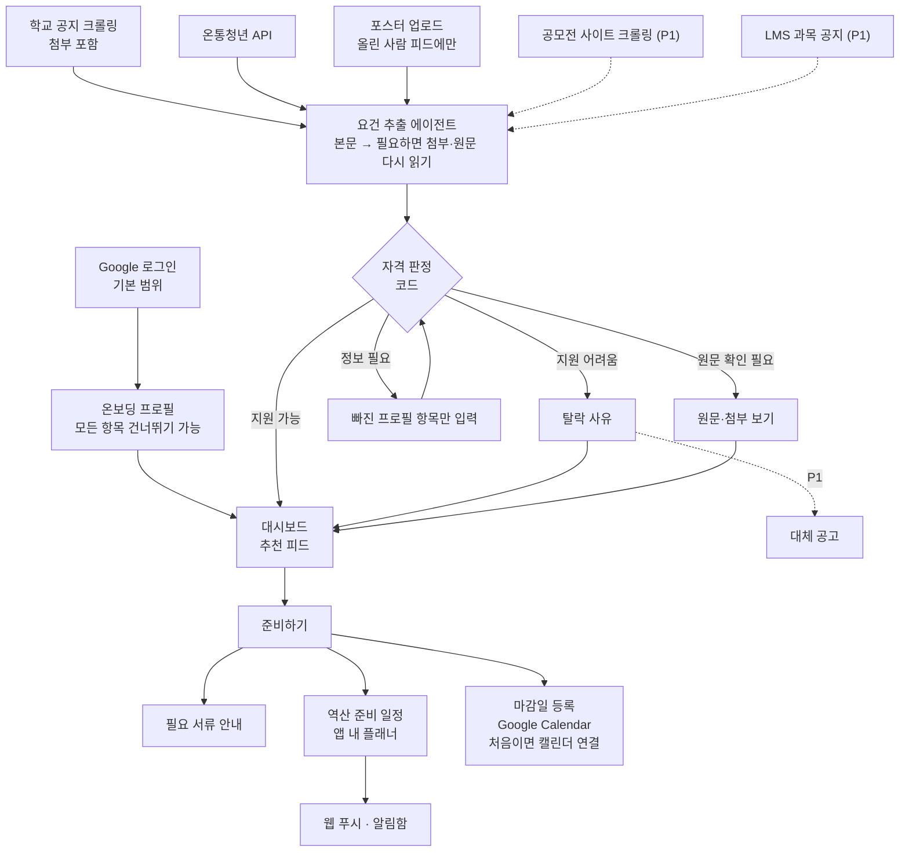
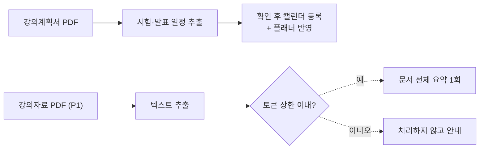

# PRD v0.9 변경분 — 멘토 피드백 반영

> 📝 기준: PRD v0.8 → v0.9 · 2026-10-06 · 근거: 기업 멘토(AOP) 검토 의견 (PRD v0.7·ERD v0.7 대상, 2026-10-06)
>
> 변경분만 담았다. 항목마다 어느 장·행을 바꾸는지 적었으니 레포에서 v0.7 원본·v0.8 변경분과 함께 합쳐 `PRD_v0.9.md`를 만든다. 멘토는 다음 버전을 "v0.8"이라고 불렀지만 v0.8은 디자인 초안 반영본이라 이번 반영본은 v0.9다.
>
> 함께 보는 파일: `ERD_v0.9_변경분.md` · `API_v0.4_변경분.md`

---

## 결정 사항

| 항목 | 내용 | 멘토 의견 |
| --- | --- | --- |
| P0 범위 | F-12 공모전 크롤링은 P1. F-15 강의자료는 P1 축소판. F-13은 업로드·판정만 P0이고 다른 학생 피드 공유는 P1(F-16·F-17과 함께). F-05 HY-in은 P2. P0가 27개에서 24개로 줄어든다 | 범위·일정 |
| 캘린더 권한 | 로그인은 기본 범위로만 한다. 캘린더 권한은 처음 캘린더에 등록할 때 요청한다(증분 승인) | 보안 · Google |
| 포스터 공개 범위 | P0에서는 올린 사람 피드에만 보인다. 공유를 켤 때(P1)도 업로더 이름 없이 "학생 제보"로 표시한다 | 범위 · 개인정보 |
| 요건 표현 | 묶음(clause) 구조를 쓴다. 같은 묶음 안은 "또는", 묶음끼리는 "그리고"이고, 판정은 3치 논리로 한다 | 판정 엔진 1 |
| 판정 원칙 | 판정 기준일, 지역 기준, 학과 매핑을 둔다. "지원 어려움"은 확실할 때만 내고, 아니면 판정 불가로 보낸다 | 판정 엔진 2–4, 7 |
| 요건 추출 에이전트 | 먼저 본문으로 추출한다. 필요하면 모델이 첨부·원문 읽기 도구를 골라 다시 추출한다. AOP 요건인 Tool Calling을 이 지점에서 쓴다 | 판정 엔진 5·6, 에이전트성 |
| 프로필과 LLM | 프로필 값은 LLM 프롬프트와 도구 입력 로그에 넣지 않는다 | 개인정보 |
| 소득·수급 정보 | 별도 선택 동의를 받아야 저장한다. 동의를 철회하면 바로 지운다 | 개인정보 |
| LMS 토큰 | 실사용자를 연결하기 전에 학교에 확인한다. 백엔드는 GET 요청과 허용한 경로만 호출한다 | 보안 · LMS |
| 지표 | 제품 지표 5개를 더한다. 판정 정확도는 3×3 혼동행렬로 보고, 적격 공고를 부적격으로 판정한 경우 0건을 목표로 한다. 정답셋은 출처별로 나눠 구성한다 | 지표·테스트 |
| 일정·역할 | 온통청년 수집과 시나리오 실행기는 Dev 2가 맡는다. W6 완료 조건에 베이스라인 고정 저장을 넣는다 | 범위·일정 |
| DB 보안 | 모든 테이블에 RLS를 켠다. v0.7 DDL에서 빠져 있었다(ERD v0.9) | 검토 중 발견 |

---

## 머리말 — 문서 상태 줄 교체

맨 위 상태 줄을 아래로 바꾼다. v0.8 이하 변경 줄은 모두 문서 끝 "변경 이력"으로 옮긴다.

> 📝 문서 상태: 초안 v0.9 · 2026-10-06 · 개발 2명 기준 · MVP 범위 = 학생 버전 핵심 흐름(입력 → 판정 → 실행)
>
> v0.9 변경: 멘토 피드백 반영 — P0 27→24개, 캘린더 증분 승인, 요건 묶음(AND/OR)과 3치 판정, 판정 기준일·지역 기준·학과 매핑, 요건 추출 에이전트(첨부·도구 선택), 프로필 LLM 미전송·소득 선택 동의, LMS GET 제한, 제품 지표·혼동행렬, W6 베이스라인

---

## 2장 목표와 비목표

목표의 두 번째 줄을 바꾼다. 대체 공고는 P1이고, 난이도는 아직 정의하지 않았다.

- 부적격이면 **탈락 사유**를 함께 보여준다(대체 공고는 P1)

목표 표 아래에 정의를 한 줄 더한다.

> AOP 필수 요건: 기업 제안 과제(AOP "나만의 AI 에이전트 만들기")가 요구하는 조건이다. LLM API와 Tool Calling으로 만든 에이전트 MVP(모델 학습 없음), 외부 도구 연동 2개 이상, 웹에서 처음부터 끝까지 동작, 테스트 시나리오 10개 이상으로 성공률·응답시간·비용 측정.

비목표에 한 줄 더한다.

- 강의자료 구간 요약·구간 번역, 스캔 강의자료 Vision 처리 → 13장 확장 범위 (F-15는 P1 축소판만 둔다)

---

## 4-1. 공고 → 판정 → 실행 (흐름도 교체)

P1 경로는 점선으로 표시한다.

## 4-2. 강의계획서 · 강의자료 (흐름도 교체)

## 4-3. 화면 구성 (표 교체)

| 화면 | 들어오는 곳 | 담는 기능 | 우선 |
| --- | --- | --- | --- |
| 로그인·온보딩 | 첫 접속 | F-01(기본 범위), F-02(필수·선택 동의, 프로필) | P0 |
| 홈 | 사이드바 홈 | F-40, F-24(P1) | P0 |
| 공고 상세 | 홈 카드, 알림 | F-41, F-03, F-22, F-25, F-30–F-32, F-42, F-23(P1), F-17(P1) | P0 |
| 플래너 | 사이드바 플래너 | F-43, F-31, F-32, F-34(P1) | P0 |
| 학업 | 사이드바 학업 | F-50 연결 상태, F-51·F-52 요약, F-53(P1) | P0 |
| 과목 상세 | 학업의 과목 카드 | 과제 탭(F-51), 자료 탭(F-52, F-15는 P1), 공지 탭(F-53·F-54, P1), 계획서 탭(F-14) | P0 |
| 포스터 등록 | 사이드바 포스터 등록 | F-13(본인 피드), F-16(P1) | P0 |
| 알림함 | 헤더 알림 버튼 | F-35 | P0 |
| 설정 | 사이드바 하단 | F-06, F-50, 캘린더 연결(F-01), F-04(P1) | P0 |
| 문서함 | 사이드바(구현 전까지 숨김) | F-44 | P1 |

---

## 5장 우선순위 정리 (5장 머리에 추가)

| 우선 | 기능 |
| --- | --- |
| P0 (24개) | F-01 · F-02 · F-03 · F-06 / F-10 · F-11 · F-13 · F-14 / F-20 · F-21 · F-22 · F-25 / F-30 · F-31 · F-32 · F-33 · F-35 / F-40 · F-41 · F-42 · F-43 / F-50 · F-51 · F-52 |
| P1 | F-04 · F-12 · F-15(축소판) · F-16 · F-17 · F-23 · F-24 · F-34 · F-44 · F-53 · F-54, 포스터 공유 |
| P2 | F-05 |

멘토가 계산한 22개에 v0.8에서 추가한 F-06(설정)·F-35(알림함)가 더해져 24개다. F-06에는 연동 해제·탈퇴·동의 철회가 들어 있어 개인정보 처리상 빠질 수 없다. F-35는 iOS처럼 푸시를 받지 못하는 환경에서 알림을 대신 전달한다.

## 5-1. 인증 · 온보딩 · 프로필 (F-01·F-02·F-06 행 교체, F-05 우선 변경)

| ID | 기능 | 설명 | 우선 | 완료 조건 |
| --- | --- | --- | --- | --- |
| F-01 | Google 로그인 (행 교체) | Supabase Auth Google OAuth로 로그인하고, 이때는 기본 범위(이메일·프로필)만 받는다. 캘린더 쓰기 권한(calendar.events, offline)은 처음 캘린더에 등록할 때 따로 요청한다(증분 승인). 요청 시점은 준비하기 결과 화면에서 "캘린더에도 등록"을 고를 때, 설정에서 캘린더를 연결할 때, LMS 과제 자동 등록을 켤 때다. 받은 refresh token은 백엔드가 암호화해 저장하고, 만료되거나 취소되면 재연결을 안내한다 | P0 | 로그인만으로는 캘린더 권한을 묻지 않음, 연결 후 캘린더 이벤트 생성 성공, access token 만료 뒤 refresh로 다시 호출 성공 |
| F-02 | 온보딩 프로필 (행 교체) | 시작 전에 동의 3가지를 받는다. 이용약관(필수), 개인정보 수집·이용(필수), 소득·수급 정보 수집·이용(선택)이다. 선택 동의를 해야 소득 단계 입력란이 열린다. 동의 시각과 약관 버전을 기록한다. 프로필 항목은 학과(목록에서 선택), 학년, 재학 상태, 이수 학기 수, 이수학점(누적·직전학기), 평점(누적·직전학기 장학용, F 포함), 평점 만점, 생년월일, 병역 복무 개월 수, 거주지역(주민등록 주소 기준), 외국인 유학생 여부, 소득(학자금 지원구간·기준 중위소득 %·기초생활수급/차상위 여부)이다. 모든 항목은 건너뛸 수 있다 | P0 | 필수 동의 없이는 다음 단계로 못 감, 선택 동의 없이는 소득 항목을 저장하지 않음, 전부 건너뛰어도 대시보드 진입 |
| F-05 | HY-in 재학생 인증 | 설명은 v0.7 그대로 둔다. 개발자 등록·승인 기간을 몰라 외부 의존이 생기므로 사업계획서의 확장 범위로 옮긴다 | P2 | — |
| F-06 | 설정 (행 교체) | 프로필 수정(F-04), Google 캘린더 연결·재연결·해제, LMS 토큰 연결·해제(F-50), 소득·수급 정보 동의 철회(철회하면 해당 값 즉시 삭제), 탈퇴를 담는다. 알림 설정(푸시 켜기·끄기, 종류별 끄기)과 LMS 과제 자동 캘린더 등록 켜기·끄기는 P1이다. HY-in 인증은 P2라 숨긴다 | P0 | 연동 해제·동의 철회·탈퇴가 끝까지 동작, 바꾼 설정이 다음 동기화·알림 발송에 반영 |

## 5-2. 입력 (F-10·F-13·F-15 행 교체, F-12·F-17 우선 변경)

| ID | 기능 | 설명 | 우선 | 완료 조건 |
| --- | --- | --- | --- | --- |
| F-10 | 학교 공지 크롤링 (행 교체) | ERICA 학사·장학·학과 공지 게시판을 주기적으로 수집하고 새 글만 가져온다. 게시글 첨부파일(PDF·HWP·HWPX·이미지)도 내려받아 저장한다. 본문과 첨부 텍스트의 해시를 비교해 수정된 글을 찾고, 수정된 글은 요건을 다시 추출한다 | P0 | 새 글·수정된 글만 처리, 중복 없음, 첨부 정보 저장 |
| F-12 | 공모전·대외활동 크롤링 | 설명은 v0.7 그대로 둔다. 약관 확인이 끝나지 않았고, MVP 데이터는 학교 공지·온통청년·포스터로 충분하다 | P1 | — |
| F-13 | 포스터 업로드 (행 교체) | JPG·PNG·WEBP·HEIC 이미지나 2쪽 이하 PDF를 올리고, 모바일에서는 카메라로 바로 찍는다. 멀티모달 LLM이 제목·주최·카테고리·신청 기간·요건·필요 서류를 추출하고, 사용자는 확인 화면에서 원본과 나란히 보며 수정한다(신뢰도 낮은 항목은 강조). 저장한 공고는 **올린 사람 피드에만** 보인다. 다른 학생에게 공유하는 기능은 P1이고, 공유할 때도 업로더 이름 대신 "학생 제보"로 표시한다. 분석 중에는 처리 과정(F-42)을 보여주고, 실패하면 다시 찍기를 안내한다 | P0 | 확인 화면에서 수정 가능, 본인 피드에 표시되고 다른 계정에는 보이지 않음, 2쪽 PDF 포스터 추출 성공 |
| F-15 | 강의자료 요약 (행 교체, 축소판) | 텍스트가 있는 PDF를 올리면, 추출 텍스트가 토큰 상한 이내일 때 문서 전체를 1회 요약한다. 상한을 넘으면 처리하지 않고 안내한다. 구간 분할, 구간 번역, 스캔 페이지 Vision은 하지 않는다(13장 확장 범위). 강의자료를 외부 LLM API로 보낸다는 것을 업로드 화면과 약관에 고지한다 | P1 | 상한 이내 문서의 요약 생성, 같은 파일을 다시 올리면 캐시 사용 |
| F-16 | 중복 공고 병합 | 설명은 그대로 둔다. 공유를 켤 때 함께 만든다 | P1 | — |
| F-17 | 공고 신고·자동 숨김 | 설명은 그대로 둔다(서로 다른 사용자 3명). 공유를 켤 때 함께 만든다 | P1 | — |

## 5-3. 판정 (머리 상자 교체, 판정 규칙 신설, F-20·F-21·F-23·F-25 행 교체)

5-3 첫 상자를 아래로 바꾼다. 실제 요건 조사 상자와 v0.8 라벨 대응표는 그대로 둔다.

> ⚖️ **판정은 LLM이 아니라 코드가 한다.** LLM은 공고 원문(본문과 첨부)에서 요건을 "묶음 · 항목 · 연산자 · 값 · 기준" 목록으로 뽑는 데까지만 쓴다. 프로필과의 비교는 코드로 한다. **프로필 값은 LLM에 보내지 않는다.**
>
> 결과는 3상태다: **적격**(모든 묶음 충족) / **부적격**(충족하지 못한 묶음이 확실히 있음) / **판정 불가**(그 밖). 화면 라벨 4종은 v0.8 대응표를 따른다.

### 판정 규칙 (신설, 라벨 대응표 아래)

**1. 요건은 묶음으로 표현한다.** 조건 하나가 요건 행 하나다. 같은 묶음 번호의 조건끼리는 "또는", 서로 다른 묶음끼리는 "그리고"로 읽는다. 예외 조건도 이 구조로 담을 수 있다.

| 원문 | 묶음 1 | 묶음 2 |
| --- | --- | --- |
| 직전학기 평점 3.0 이상 또는 지원구간 8구간 이하 | 직전학기 평점 ≥ 3.0 또는 지원구간 ≤ 8 | — |
| 직전학기 12학점 이상 (단, 4학년은 9학점) | 학년 = 4 또는 직전학기 학점 ≥ 12 | 학년 ≠ 4 또는 직전학기 학점 ≥ 9 |

**2. 판정은 3치 논리로 한다.** 조건 결과는 충족(pass), 불충족(fail), 모름(unknown) 중 하나다.

- 묶음: 충족한 조건이 하나라도 있으면 충족, 모두 불충족이면 불충족, 그 밖은 모름
- 공고: 불충족 묶음이 하나라도 있으면 부적격, 모든 묶음이 충족이면 적격, 그 밖은 판정 불가

| 공고 | 프로필 | 결과 | 라벨 |
| --- | --- | --- | --- |
| 평점 3.0 이상 또는 8구간 이하 | 평점 미입력, 6구간 | 묶음 충족 | 지원 가능 |
| 〃 | 평점 2.8, 구간 미입력 | 묶음 모름 | 정보 필요(지원구간) |
| 〃 | 평점 2.8, 9구간 | 묶음 불충족 | 지원 어려움 |
| 12학점 이상 (단, 4학년 9학점) | 4학년, 10학점 | 두 묶음 충족 | 지원 가능 |
| 〃 | 3학년, 10학점 | 묶음 1 불충족 | 지원 어려움 |
| 〃 | 학년 미입력, 13학점 | 두 묶음 충족 | 지원 가능 |
| 〃 | 학년 미입력, 10학점 | 묶음 1 모름, 묶음 2 충족 | 정보 필요(학년) |

**3. 조건이 "모름"이 되는 경우는 다음과 같다.**

- 필요한 프로필 값이 비어 있다. 이 경우만 "정보 필요"로 이어진다
- 요건이 모호하다(is_ambiguous)
- 프로필로 판정할 수 없는 조건이다(`other`)
- 기준이 다르다. 지역 기준이 실거주·출신 고교·보호자 주소인 경우, 소득 기준의 종류가 다른 경우, 평점 만점이 다른 경우가 여기에 든다
- 판정 기준일을 정할 수 없다

**4. 부적격은 확실할 때만 낸다.** 실제로 지원할 수 있는 학생을 "지원 어려움"으로 판정하면, 학생은 기회를 놓친 사실조차 모른다. 이 오류가 가장 비싸다. 그래서 불충족은 프로필 값이 있고, 조건이 모호하지 않고, 기준·단위가 같을 때만 낸다. 경계값은 공고 문구대로 계산한다(이상·이하는 경계를 포함한다).

**5. 판정 기준일.** 만 나이·학년·재학 상태는 "언제 기준인가"에 따라 결과가 바뀐다. 공고에 기준일이 있으면 그 날짜를 쓴다. 없으면 신청 마감일(KST 날짜)을 쓰고, 마감일도 없으면 판정한 날을 쓴다. 청년 연령 상한은 병역 복무 개월 수만큼 늘린다(요건 값에 연장 여부를 기록).

**6. 지역 기준.** 프로필의 거주지역은 주민등록 주소다.

- 요건 기준이 주민등록이면 프로필 지역과 비교한다
- 기준이 명시되지 않았으면 주민등록으로 보고 비교한다. 청년정책 대부분이 주민등록 기준이고, 이렇게 하지 않으면 다른 지역 정책이 전부 "원문 확인 필요"로 쌓인다
- 실거주, 출신 고교 소재지, 보호자 주소 기준이면 "모름"으로 두고 원문을 확인하게 한다

**7. 학과.** 학과는 학과 → 단과대 → 계열 매핑으로 비교한다. "공학계열", "○○대학 소속" 같은 조건도 판정할 수 있다. 프로필 학과는 목록에서만 고른다. 학과 통폐합 이력은 MVP에서 다루지 않는다.

**8. 소득.** 공고의 소득 기준과 사용자가 입력한 기준이 다르면 서로 환산하지 않는다(기존 원칙). 다만 여러 소득 기준이 "또는"으로 묶여 있으면, 입력한 기준 하나만 맞아도 그 묶음은 충족한다.

**9. 빠진 항목(missing_fields).** 결과가 "모름"인 묶음에서 프로필 값이 비어 있어 모름이 된 조건의 항목만 묻는다. 이미 충족한 묶음에 있는 빈 항목은 묻지 않는다.

| ID | 기능 | 설명 | 우선 | 완료 조건 |
| --- | --- | --- | --- | --- |
| F-20 | 요건 추출 에이전트 (행 교체) | 공고 본문과 첨부에서 요건을 묶음·항목·연산자·값·기준·근거 문장으로 뽑는다. 판정 기준일, 필요 서류, 마감일도 함께 뽑는다. 본문에 "첨부 참조"만 있거나 근거가 부족하면 모델이 첨부·원문 읽기 도구를 골라 읽고 다시 추출한다(6장). 근거 문장이 원문에 실제로 있는지 코드로 확인하고, 없으면 모호한 조건으로 둔다. 구조화 결과는 스키마로 검증하고, 검증에 실패하면 1회 재시도한 뒤 원문 확인 필요로 둔다 | P0 | 정답셋 대비 추출 정확도 측정 가능, 근거 없는 요건이 저장되지 않음, 첨부에만 요건이 있는 공고 추출 성공 |
| F-21 | 자격 판정 (행 교체) | 위 판정 규칙대로 3상태, 묶음·조건별 결과, 빠진 항목, 판정 기준일, 요건 버전을 저장한다. 요건을 다시 추출하면 그 공고의 판정을 모두 다시 계산한다 | P0 | 판정 시나리오(S01–S08) 일치, 혼동행렬에서 적격→부적격 0건 |
| F-23 | 대체 공고 추천 (행 교체) | 부적격일 때 같은 카테고리의 지원 가능 공고 최대 3개를 연결한다. "비슷한 난이도" 기준은 정의한 뒤에 넣는다(14장 미결) | P1 | 부적격 상세 하단에 대체 공고 노출 |
| F-25 | 신뢰도 표시 (행 교체) | 추출 신뢰도가 낮거나, 요건이 모호하거나, 첨부 추출에 실패한 공고에 "원문 확인 필요" 배지와 원문·첨부 링크를 붙인다 | P0 | 모호한 요건 시나리오(S08) 통과, 첨부 추출 실패 공고에 배지 표시 |

## 5-4. 실행 (F-32 행 교체, F-33·F-34 문장 추가)

| ID | 기능 | 설명 | 우선 | 완료 조건 |
| --- | --- | --- | --- | --- |
| F-32 | 마감일 캘린더 등록 (행 교체) | 공고 마감일, 강의계획서 시험 일정, LMS 과제 마감일**만** Google Calendar에 등록하고, 알림은 캘린더 기본 알림을 쓴다. 처음 등록할 때 캘린더 연결(F-01 증분 승인)을 거친다. 연결하지 않으면 플래너에만 만든다 | P0 | 연결 후 캘린더에서 확인, 다시 눌러도 중복 등록 없음, 연결 안 한 사용자도 준비 일정은 생성 |

- F-33 설명 끝에 더한다: 같은 알림은 한 번만 만든다. 공고 마감 임박은 D-3과 D-1에 한 번씩이다. 마감이 바뀌면 이미 예약한 알림의 시각만 고친다.
- F-34 설명 끝에 더한다: 내려받기는 캘린더 등록 기록으로 남기지 않는다.

## 5-5. 대시보드 (F-40·F-41·F-42 문장 바꾸기)

| ID | 바꿀 문장 (v0.8) | 새 문장 |
| --- | --- | --- |
| F-40 | 카드에는 주최(포스터는 마스킹된 업로더, 과목 공지 공고는 과목명) | 카드에는 주최(포스터는 "내가 올린 포스터", 과목 공지 공고는 과목명) |
| F-41 | 조건별 판정표는 조건 문구·내 값·충족 여부를 보여주고, 행을 펼치면 근거 원문 문장이 나온다 | 조건별 판정표는 묶음 단위로 보여준다. 조건이 2개 이상인 묶음은 "다음 중 하나" 상자로 묶고 묶음 결과를 함께 표시한다. 행마다 조건 문구·내 값·충족 여부를 보여주고, 행을 펼치면 근거 원문 문장이 나온다. 판정 기준일도 표시한다 |
| F-41 | 원문 보기(포스터 공고는 원본 이미지), 포스터 공고의 마스킹된 업로더와 신고 버튼 | 원문 보기(포스터 공고는 원본 이미지, 학교 공지는 첨부파일 목록 포함). 준비를 시작한 공고는 마감·숨김 뒤에도 상세와 서류 안내를 계속 볼 수 있다. 업로더 표시와 신고 버튼은 공유와 함께 P1이다 |
| F-42 | 에이전트가 호출한 도구와 단계(추출 → 판정 → 일정 생성)를 접이식으로 보여준다 | 에이전트가 호출한 도구와 단계(추출 → 판정 → 일정 생성)를 접이식으로 보여준다. 요건 추출 에이전트가 직접 고른 도구(예: 첨부 "2026-2 장학 안내.hwp" 읽기)는 고른 이유 한 줄과 함께 따로 표시한다 |

## 5-6. LMS 연동 (F-50 행 교체, F-53 설명 추가, 안내 상자 교체)

| ID | 기능 | 설명 | 우선 | 완료 조건 |
| --- | --- | --- | --- | --- |
| F-50 | LMS 토큰 연결 (행 교체) | 캡처가 들어간 발급 가이드 화면에서 사용자가 토큰을 붙여넣으면 즉시 검증한 뒤 암호화해 저장한다. 가이드에서는 만료일을 학기 종료일로 넣도록 안내한다(LearningX 화면에 만료일 칸이 있는 경우). 백엔드 LMS 클라이언트는 GET 요청과 허용한 경로만 호출한다. 연결 해제 시 토큰을 즉시 삭제하고 LearningX에서도 폐기하도록 안내한다. 실사용자 연결은 학교 확인 회신을 받은 뒤에 연다 | P0 | 잘못된 토큰은 저장 전에 거부, 해제 후 DB에 토큰 없음, 허용 경로 밖 호출과 GET 외 호출은 코드에서 막힘 |

- F-53 설명 끝에 더한다: P0로 올리지 않는다. 실제 LMS 공지는 학생이 만들 수 없어서 시연을 재현하기 어렵다. 데모에서 쓰게 되면 "기회성 공지 → 공고" 경로만 녹화한 응답으로 보여준다.
- 5-6 끝 안내 상자를 바꾼다: LMS 과목 공지에서 만든 공고는 해당 과목 수강생에게만 보인다. 분반 한정 공지는 MVP에서 보여주지 않는다. 강의자료·첨부파일은 교수 저작물이므로 사용자 간에 공유하지 않는다.

---

## 6장 에이전트 설계

### 원칙 (2줄 추가)

- 프로필 값은 LLM 프롬프트와 도구 입력 로그(`tool_calls.input`)에 넣지 않는다. 판정을 코드가 하므로 보낼 이유가 없고, 외부 전송 범위를 공고 원문으로 한정할 수 있다
- 모델이 다음 도구를 스스로 고르는 곳은 요건 추출 에이전트 한 곳이다(AOP Tool Calling 요건). 나머지 작업은 정해진 순서로 돈다. 품질과 재현성을 위해서다

### 요건 추출 에이전트 (신설)

학교 공지는 본문에 "첨부 참조"만 있고 요건이 HWP·PDF·이미지 첨부에 있는 경우가 많다. 그래서 요건 추출을 정해진 한 번의 호출이 아니라, 모델이 필요한 자료를 골라 읽는 짧은 루프로 만든다.

| 단계 | 내용 |
| --- | --- |
| 입력 | 공고 본문, 첨부 목록(파일 이름·형식·크기). 프로필 값은 넣지 않는다 |
| 도구 | `read_attachment_text`(PDF·HWPX·HWP 텍스트 추출), `read_attachment_image`(이미지·스캔본 Vision), `fetch_original`(원문 페이지 다시 읽기), `submit_requirements`(구조화 결과 제출) |
| 루프 | 모델은 본문만 보고 바로 제출하거나, 도구를 골라 읽은 뒤 제출한다. 도구 호출은 공고당 최대 4번이다 |
| 검증 | `submit_requirements`는 코드가 받아 스키마로 검증하고, 근거 문장이 읽은 원문에 있는지 대조한다. 실패하면 이유를 돌려주고 1회 재시도한다. 끝까지 근거가 없는 조건은 모호한 조건으로 저장한다 |
| 종료 | 제출에 성공했거나, 도구 상한이나 토큰 상한에 닿았을 때 끝낸다. 상한에 닿으면 원문 확인 필요로 둔다 |
| 기록 | 모든 도구 호출을 `tool_calls`에 남기고, 고른 이유 한 줄을 처리 과정(F-42)에 보여준다 |
| 공유·갱신 | 같은 공고는 1회 추출해 모든 사용자가 공유한다. 본문·첨부 해시가 바뀌면 다시 추출하고, 요건 버전을 올린 뒤 그 공고를 다시 판정한다 |

### 트리거별 작업 (행 교체)

| 트리거 | 에이전트 작업 | 호출 도구 |
| --- | --- | --- |
| 정기 배치 | 새 글·수정된 글 수집(첨부 포함) → 요건 추출 에이전트 → 전체 사용자 판정 | crawl_notices, fetch_youth_policies, 요건 추출 에이전트 도구, check_eligibility (crawl_contests는 P1) |
| 강의자료 업로드 (P1) | 텍스트 추출 → 전체 요약 1회 | extract_pdf_text, summarize_document |
| 구간 번역 요청 | 행 삭제 (확장 범위) | — |

### 도구 목록 (행 추가·변경)

| 도구 | 종류 | 설명 |
| --- | --- | --- |
| read_attachment_text | 내부 코드 | 첨부 PDF·HWPX·HWP 텍스트 추출. 실패하면 실패 사유를 남긴다 |
| read_attachment_image | LLM · Vision | 이미지 첨부와 글자 없는 스캔 PDF 읽기 |
| fetch_original | 외부 · 웹 | 원문 페이지 다시 읽기 (robots.txt 준수) |
| submit_requirements | 내부 코드 | 구조화 결과의 스키마 검증과 근거 대조 후 저장 |
| crawl_contests | 외부 · 웹 | P1 |
| fetch_lms_* | 외부 API · LearningX | GET 요청과 허용 경로만 |
| split_sections · summarize_section · translate_section | — | 확장 범위로 옮김. P1 축소판은 extract_pdf_text와 summarize_document만 쓴다 |

---

## 7장 비기능 요구사항 (행 교체·추가)

| 영역 | 요구사항 |
| --- | --- |
| 개인정보 (행 교체) | 프로필 값은 LLM에 보내지 않는다. 소득·수급 정보는 별도 선택 동의를 받은 경우에만 저장하고, 철회하면 즉시 지운다(DB 제약으로 강제). 민감 항목은 판정 외 용도로 쓰지 않고 탈퇴하면 즉시 삭제한다. 실사용자 모집 전에 개인정보 처리방침 페이지(수집 목적·보유 기간)를 둔다 |
| 토큰 보안 (신설) | Google·LMS 토큰은 백엔드에서 Fernet(인증 암호화)으로 암호화하고, 키는 DB 밖 환경변수에 둔다. 키 교체는 MultiFernet으로 한다(새 키로 암호화하고 옛 키로도 복호화). 로그와 에러 추적에서 Authorization 헤더와 토큰 모양 문자열을 가린다. LMS 클라이언트는 GET 요청과 허용 경로만 호출한다. 유출 대응 절차(전 사용자 토큰 삭제, LearningX 폐기 안내)를 1쪽으로 써 둔다 |
| DB 접근 (신설) | 모든 테이블에 RLS를 켠다. 로그인 사용자는 본인 행과 볼 수 있는 공고만 읽고, 쓰기는 백엔드만 한다 |
| 파일 (신설) | Storage 버킷은 비공개로 두고 경로는 `<user_id>/…`로 한다. 다운로드는 수명 5분짜리 서명 URL로 준다 |
| 외부 LLM (신설) | 공고 원문, 포스터, 강의자료(P1)를 외부 LLM API로 보낸다는 것을 약관에 고지한다. 쓰는 API의 입력 학습 미사용 조건을 확인해 근거 링크를 남긴다(요금 등급마다 조건이 다를 수 있다) |
| 시간 (신설) | 날짜로 바꿀 때는 항상 Asia/Seoul 기준이다. 날짜에 따라 결과가 바뀌는 코드는 현재 시각을 주입받는다 |
| 비용 (행 교체) | 모든 LLM 호출의 모델·입출력 토큰·추정 비용을 기록한다. 모델 단가는 코드 상수와 적용 날짜로 관리해, 단가가 바뀌어도 개선 전후 비교를 같은 기준으로 한다 |

---

## 8장 성공 지표와 테스트 시나리오

### 지표 (판정 정확도 행 교체, 제품 지표 표 추가)

| 지표 | 정의 | 측정 방법 |
| --- | --- | --- |
| 판정 정확도 (행 교체) | 가상 프로필 × 공고 조합의 정답·예측 3×3 혼동행렬. 핵심 목표는 "실제 적격 → 부적격" 0건이고, "실제 부적격 → 적격"은 따로 추적한다 | 정답셋 자동 비교 |

제품 지표 (신설). 목표치는 W6 베이스라인을 잰 뒤 정한다.

| 지표 | 정의 | 확인하려는 것 | 원천 데이터 |
| --- | --- | --- | --- |
| 판정 불가 비율 | (사용자 × 활성 공고) 중 판정 불가 비중과 원인 항목 상위 3개 | 선택 입력 프로필로 핵심 가치가 보이는가. 온보딩 질문 순서를 정하는 근거 | eligibility_results.missing_fields |
| 즉석 입력 응답률 | 정보 입력창 노출 → 입력 완료 | 필요한 순간에 물으면 답하는가 | 사용 이벤트 |
| 준비하기 전환율 | 적격 공고 상세 조회 → 준비하기 | 판정 다음 단계(실행)의 가치 | opportunity_views, prep_plans |
| LMS 연결 완료율 | 토큰 가이드 진입 → 검증 성공 | 토큰 발급 과정의 이탈 규모 | 사용 이벤트 |
| 주간 재방문율 | 가입 다음 주에 1회 이상 접속 | 장학 시즌 밖에서도 쓰는가 | 사용 이벤트(앱 열기, 하루 1건) |

**베이스라인 (신설)**: W6 끝에 그때까지 만든 P0 시나리오(S01–S14)를 1회 실행하고, 성공률·p50/p95·비용을 고정 저장한다. W9–10 개선은 이 값과 비교한다.

### 정답셋 (신설)

- 공고 20건을 출처별로 나눈다: 학교 장학 10건, 청년정책 5건, 포스터 5건
- 그중 "또는"·예외 조건이 있는 공고를 5건 이상, 요건이 첨부에만 있는 공고를 3건 이상 넣는다
- 가상 프로필 5종에는 경계값 프로필을 넣는다(평점 정확히 3.00, 판정 기준일에 만 34세 마지막 날 등)

### 테스트 환경 (신설)

- LMS: 실제 Canvas 응답을 개인정보를 지워 JSON으로 녹화하고, 가짜 LMS 클라이언트가 재생한다. 마감 변경·제출은 같은 과제의 "전/후" 두 벌로 만든다
- 시계: 날짜에 따라 결과가 바뀌는 로직은 현재 시각을 주입받아, 자동 실행이 매번 같은 결과를 낸다
- Google Calendar: 테스트 전용 계정을 쓰고, 시나리오가 끝나면 만든 이벤트를 지운다
- 비용: 모델 단가 상수와 적용 날짜로 계산한다

### 테스트 시나리오 (표 교체)

P0 18개, P1 5개다. v0.8 번호는 대조용으로 남긴다.

| # | 우선 | 시나리오 | 기대 결과 | v0.8 |
| --- | --- | --- | --- | --- |
| S01 | P0 | ERICA 장학 공지, 평점 요건 충족 프로필 | 지원 가능 → 서류 안내 → 역산 일정 생성 | 1 |
| S02 | P0 | 같은 공지, 평점 미달 프로필 | 지원 어려움 + 탈락 사유 | 2 |
| S03 | P0 | 같은 공지, 평점 미입력 프로필 | 정보 필요 → 평점 입력 → 재판정 | 3 |
| S04 | P0 | "평점 3.0 이상 또는 8구간 이하" 공고, 평점 미입력·6구간 | 지원 가능 (3치 판정) | 신규 |
| S05 | P0 | "12학점 이상(단, 4학년 9학점)" 공고, 4학년 10학점 / 3학년 10학점 | 지원 가능 / 지원 어려움 | 신규 |
| S06 | P0 | 온통청년 정책, 거주지역 불일치 | 지원 어려움 + 지역 사유 | 4 |
| S07 | P0 | 온통청년 정책, 판정 기준일에 만 34세 마지막 날 | 기준일 기준으로 정확히 판정 | 5 |
| S08 | P0 | 요건이 모호한 공고("성적 우수자") | 원문 확인 필요 배지 | 12 |
| S09 | P0 | 요건이 첨부(HWP·PDF)에만 있는 공고 | 에이전트가 첨부를 골라 읽고 요건 추출, 처리 과정에 표시 | 신규 |
| S10 | P0 | 공지 수정(마감 연장) | 다시 추출 → 판정·알림 예약 갱신 | 신규 |
| S11 | P0 | 공모전 포스터 사진 업로드 | 추출·확인 화면 → 본인 피드에만 표시 | 6 |
| S12 | P0 | 흐릿하거나 기울어진 포스터 | 저신뢰도 배지, 수정 가능 | 7 |
| S13 | P0 | 준비하기 → (처음이면 캘린더 연결) → 등록 → 다시 누르기 | 마감일 이벤트 1개만 존재 | 8 |
| S14 | P0 | 마감 D-3·D-1 공고 | 웹 푸시와 알림함에 한 번씩, 같은 알림 중복 없음 | 11 |
| S15 | P0 | LMS 과목에서 "계획서 가져오기" → PDF 업로드 | 올바른 과목에 연결, 시험·발표 일정 추출·등록 | 9 |
| S16 | P0 | LMS 새 과제 (녹화 응답) | 다음 동기화 때 캘린더·플래너에 1건 등록 + 알림 | 15 |
| S17 | P0 | LMS 과제 마감 변경 (전/후 녹화) | 기존 캘린더 이벤트 수정, 새 이벤트 없음 | 16 |
| S18 | P0 | LMS 과제 제출 (전/후 녹화) | 플래너 자동 완료, 마감 임박 알림 취소 | 17 |
| S19 | P1 | 강의자료 PDF 업로드 | 상한 이내면 전체 요약, 넘으면 안내 | 10, 20 |
| S20 | P1 | A가 올린 포스터를 공유 | B 피드에 "학생 제보"로 표시 | 13 |
| S21 | P1 | 공유 공고에 서로 다른 사용자 3명이 신고 | 모든 피드에서 숨김 | 14 |
| S22 | P1 | 과목 공지 "휴강 안내" | 일정 변경 분류 → 플래너 반영 + 알림 | 18 |
| S23 | P1 | 과목 공지 "연구 참여 학생 모집" | 기회성 공지 → 수강생 피드에 공고 → 판정 | 19 |

---

## 9장 기술 스택 (행 교체)

| 영역 | 선택 | 이유 |
| --- | --- | --- |
| 문서 처리 | PDF·HWPX·HWP 텍스트 추출, 이미지와 글자 없는 스캔본만 Vision | LLM 비용 절감. 구형 HWP 변환 방법은 장학 공지 30건 샘플로 확인해 정한다 |

## 10장 개발 역할 분담 (표 교체)

| 담당 | 범위 |
| --- | --- |
| **Dev 1 · 에이전트** | LLM 래퍼·로깅, 요건 추출 에이전트(첨부 포함), 판정 엔진, 서류 안내·역산, 포스터 Vision 추출, 강의계획서 파싱, (P1) 공지 분류·강의자료 요약 |
| **Dev 2 · API·연동** | 실데이터 API와 화면 연결, Supabase Auth·RLS, Google 캘린더(증분 승인), 온통청년 수집, LMS 클라이언트·동기화, 웹 푸시·알림 배치, 시나리오 실행기와 픽스처(LMS 녹화, 시계 주입), 지표 집계 |
| **공통** | ERD·API 합의, 정답셋 라벨링(비개발 팀원 주도), 학과 매핑 목록, 처리방침·유출 대응 문서, 학교 문의 |

LLM이 필요 없는 연동은 Dev 2가 맡는다. Dev 1은 정확도 지표가 나오는 추출·판정 구간에 집중한다.

## 11장 일정 (표 교체)

| 주차 | 기간 | 완성할 흐름 | Dev 1 (에이전트) | Dev 2 (API·연동) | 완료 조건 |
| --- | --- | --- | --- | --- | --- |
| W1 | 9/28–10/4 | 준비 | LLM 래퍼·로깅, 온통청년 키 발급, LMS 토큰 점검(9/28 완료), 수업계획서 API 없음 확인(완료) | 레포·Supabase 준비 | 완료 |
| W2–3 | 10/5–10/18 | 로그인 → 온보딩 → 홈 피드 | 장학 공지 30건 첨부 집계(10/9), 공지 게시판 1곳 수집과 첨부, 요건 추출 에이전트, 판정 엔진 | ERD v0.9 적용, 로그인 연결(기본 범위), `/me`·동의·프로필·피드 API, 온통청년 수집 | 실제 공고가 묶음 요건으로 저장되고 라벨 4종이 실데이터로 표시 |
| W4–5 | 10/19–11/1 | 상세 → 준비하기 → 플래너·캘린더 | 서류 안내, 역산 일정 | 상세·준비·플래너 API, 캘린더 증분 승인과 등록, 실행 폴링, 시나리오 실행기·시계 주입 | 준비하기 E2E, refresh 교환 확인. 중간고사 기간이라 여유 배치 |
| W6 | 11/2–11/8 | 포스터 등록 (본인 피드) | 포스터 Vision 추출 | 업로드·추출·확정 API, 베이스라인 실행 | S01–S14 1회 실행 결과(성공률·p50/p95·비용) 고정 저장 |
| W7 | 11/9–11/15 | LMS | (P1) 공지 분류 여부 결정 | LMS 클라이언트, 토큰 연결, 30분 동기화, 과목 상세, 알림, 녹화 픽스처 | S16–S18 통과, 학교 회신 확인 |
| W8 | 11/16–11/22 | 계획서 · 푸시 · P1 판단 | 계획서 파싱, (P1) 강의자료 축소 요약 | 웹 푸시, P1 화면 | P0 시나리오 18개 전체 1차 실행, P1 포함 여부 결정 |
| W9–10 | 11/23–12/6 | 측정 → 개선 | 프롬프트·모델·캐싱 개선 | 지표 화면, 버그 수정 | 베이스라인 대비 개선 전후 비교표 |
| W11 | 12/7– | 데모 | README, 데모 리허설 | 데모 영상(데모 전용 계정·마스킹), 캘린더 재연결 리허설 | 산출물 완비 |

## 12장 리스크 (행 교체·추가·삭제)

| 리스크 | 영향 | 대응 |
| --- | --- | --- |
| Google 캘린더 권한 (행 교체) | 테스트 상태에서는 refresh token이 7일 뒤 만료되고, 테스트 사용자는 100명까지다 | 데모 기간에는 게시 상태를 프로덕션(미검증)으로 바꾸는 것을 검토한다(경고 화면이 뜨고 100명 한도는 같음). 데모 전날 재연결 리허설을 한다. 증분 승인이라 가입 단계에서는 캘린더 권한과 경고를 묻지 않는다. 실서비스 공개에는 Google 앱 검증이 필요하므로 사업계획서 일정에 넣는다 |
| 학교가 토큰 발급·등록을 막을 가능성 (행 교체) | LMS 연동 중단 | 사후 대응이 아니라 사전 확인 항목으로 바꾼다. 실사용자 모집 전에 학교(정보통신·교수학습 지원 부서)에 문의하고 회신을 문서로 남긴다. 회신 전에는 팀원 계정만 연결한다. 허용되지 않으면 LMS는 녹화 응답으로 시연하고 확장 범위로 옮긴다 |
| LMS 토큰 권한 과다·유출 (행 교체) | 유출되면 LMS 계정 전체가 노출된다 | 암호화 저장, 백엔드만 복호화, GET과 허용 경로만 호출, 로그 마스킹, 만료일 안내, 유출 대응 절차 |
| 판정 오류 (행 교체, 기존 "LLM 요건 추출 오류") | 오판정. 특히 적격을 부적격으로 판정하는 경우 | 묶음 표현, 근거 문장 대조, 확실할 때만 부적격, 혼동행렬 측정, 포스터는 사용자 확인 |
| 첨부 형식 다양 (신설) | 요건 추출 실패 | 30건 집계로 형식별 우선순위를 정한다. 추출에 실패하면 원문 확인 필요로 두고 Vision으로 대체한다 |
| 공유 포스터의 잘못된 정보 확산 | 행 삭제 (공유가 P1이라 MVP 리스크에서 빠짐) | — |
| 2인 개발 부하 (행 교체) | 일정 지연 | P0를 24개로 줄였다. LLM이 필요 없는 연동은 Dev 2가 맡는다. W8에 P1 포함 여부를 판단한다 |

## 13장 확장 범위 (추가)

- **강의자료 심층 처리** — 구간별 요약, 선택 구간 번역, 스캔본 Vision (프리미엄 기능 후보)
- **HY-in 재학생 인증** (F-05) — 개발자 등록·승인 후
- **Google 앱 검증** — 실서비스 공개 전에 필요하고 수 주가 걸린다. 사업계획서 일정에 넣는다

## 14장 미결 사항 (전체 교체)

미결은 이 장 한 곳에서 관리한다. ERD 9장의 열린 항목도 여기로 옮겼다.

- [ ] 서비스 이름 — UNIPIVOT으로 확정할지
- [ ] 새 공고 7일·마감 임박 D-3 기준 — W9–10 측정 때 조정할지
- [ ] 크롤링 대상 게시판 목록 (학사·장학·학과 중 어디까지)
- [ ] LLM 작업별 기본 모델
- [ ] 장학 공지 첨부 형식 비율과 형식별 처리 순서 — 30건 집계 후 (10/9)
- [ ] LMS 토큰 제3자 등록 허용 여부 — 학교 회신 (10/9 문의)
- [ ] LMS 토큰 발급 가이드 캡처 — 만료일 칸이 있는지 확인 포함
- [ ] 학과 매핑 목록 (학과·단과대·계열) — S1-2 전
- [ ] 약관 전문, 개인정보 처리방침, 선택 동의 문구 — 법무 검토
- [ ] Google 게시 상태 — 데모 기간에 프로덕션(미검증)으로 바꿀지
- [ ] 요건 추출 에이전트 상한 — 공고당 도구 호출 수·토큰 (W2–3 실제 공지로 결정)
- [ ] 판정 세부 규칙 — 병역 연장 상한, 평점 만점이 다를 때 (S1-3에서 확정)
- [ ] ERICA 성적 백분위 환산식 (국가장학 "B학점(백분위 80)" 판정용)
- [ ] 대체 공고(F-23) "비슷한 난이도" 정의
- [ ] 강의자료 토큰 상한 (P1 축소판)
- [ ] 공모전 크롤링 대상 사이트 (P1, 약관 확인 후)
- [x] 최종 데모 날짜 → W11(12/7~)로 일정표 반영
- [x] 개발 2명 역할 → 10장 확정
- [x] F-53을 P0로 올릴지 → 올리지 않음
- [x] 수업계획서 API 유무 → 없음 (W1 확인)

---

## 변경 이력 (신설, 문서 끝)

머리말에 있던 변경 줄을 모두 이 절로 옮기고, 최신 줄을 맨 위에 둔다.

- v0.9 (2026-10-06): 멘토 피드백 반영 — 위 머리말 내용
- v0.8 (2026-10-05): 디자인 초안 대조 반영 — 화면 구성, 판정 라벨 4종, 설정·알림함, 홈 요약 카드 기준 등
- v0.7 이하: v0.7 머리말의 변경 줄을 그대로 옮긴다

## 다음 멘토링에 낼 것

PRD v0.9·ERD v0.9·API 명세 v0.4 합본 세 개를 함께 낸다. 멘토가 요청한 판정 결과 JSON 형식은 API 명세 5장 공고 상세 응답에 있다.
