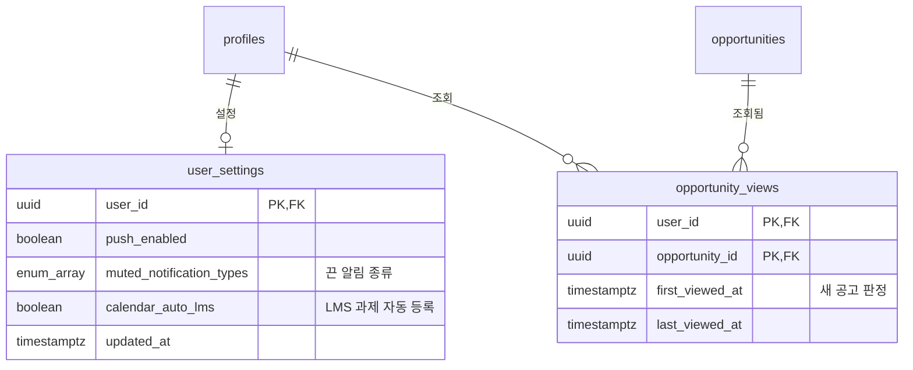

# ERD v0.8 변경분 — 디자인 초안 대조 반영

> 📝 기준: ERD v0.7 → v0.8 · 2026-10-05 · 기준 문서: PRD v0.8, API 명세 v0.3
>
> 테이블 2개(`user_settings`, `opportunity_views`)를 더하고 기존 테이블 7개와 Enum 1개를 고친다. 마이그레이션은 v0.7의 관련 테이블을 재구성한 PostgreSQL 16에서 자동 커밋·단일 트랜잭션 두 방식 모두 오류 없이 실행되고, 제약과 집계 쿼리가 테스트 데이터에서 기대값대로 동작하는 것까지 확인했다.
>
> 문서 상태 줄에 추가: `v0.8 변경: 알림함 읽음 상태와 profile_needed, user_settings·opportunity_views 신설, 동의 기록, 서류 작성 시간·양식 링크, 서류–할 일 1:1 유니크, 과목 마지막 열람·공지 요약, 파일 원래 이름`

---

## 변경 요약

| 대상 | 변경 | 근거 |
| --- | --- | --- |
| notification_type | `profile_needed` 추가 | 알림 "프로필 정보가 필요해요" |
| notifications | `read_at`, 사용자별 인덱스 2개 | 헤더 안 읽은 알림 수, 알림 패널 |
| user_settings | 신설: 푸시 켜기, 끈 알림 종류, LMS 과제 자동 캘린더 등록 | 설정 화면(F-06) |
| profiles | `terms_agreed_at`, `privacy_agreed_at`, `consent_version` | 온보딩 동의 기록(F-02) |
| opportunity_views | 신설: 사용자×공고 첫 조회·최근 조회 시각 | 홈 "새 공고 N개", 조회→준비 전환율 |
| opportunity_documents | `effort_minutes`, `form_url` | 서류 "약 30분", "공고 첨부파일" |
| planner_tasks | (prep_plan_id, document_id) 부분 유니크 인덱스 | 상세 서류 체크 = 플래너 할 일 |
| lms_courses | `last_viewed_at`(기본값 now()) | 과목 카드 "새 자료 N" |
| lms_announcements | `summary` | 학업 피드의 공지 한 줄 |
| files | `original_name` | 과목 상세 자료 탭·문서함의 파일 이름 |

---

## 7장 DDL — 마이그레이션 (v0.7 → v0.8)

v0.7 DDL을 실행한 DB에 이어서 실행한다. v0.8 DDL 본문을 새로 쓸 때는 이 컬럼들을 각 `create table`에 합친다.

```sql
-- =========================================================
-- ERD v0.7 → v0.8 마이그레이션 (디자인 초안 대조 반영, 2026-10-05)
-- v0.7 DDL을 실행한 DB에 이어서 실행한다
-- =========================================================

-- 1. 알림: 프로필 정보 필요 종류 + 앱 내 알림함 읽음 상태 (F-33, F-35)
alter type notification_type add value if not exists 'profile_needed';

alter table notifications add column read_at timestamptz;          -- null이면 안 읽음
create index notifications_user_recent_idx on notifications (user_id, scheduled_at desc);
create index notifications_user_unread_idx on notifications (user_id) where read_at is null;

-- 2. 사용자 설정 (F-06)
create table user_settings (
  user_id                   uuid primary key references profiles(id) on delete cascade,
  push_enabled              boolean not null default true,
  muted_notification_types  notification_type[] not null default '{}',  -- 끈 종류는 알림을 만들지 않음
  calendar_auto_lms         boolean not null default true,              -- LMS 과제 마감 자동 캘린더 등록
  updated_at                timestamptz not null default now()
);

-- 3. 약관·개인정보 동의 기록 (F-02)
alter table profiles
  add column terms_agreed_at    timestamptz,
  add column privacy_agreed_at  timestamptz,
  add column consent_version    text;                                  -- 동의한 약관 버전

-- 4. 공고 조회 기록: 새 공고 판정, 조회→준비 전환율 (F-40)
create table opportunity_views (
  user_id          uuid references profiles(id) on delete cascade,
  opportunity_id   uuid references opportunities(id) on delete cascade,
  first_viewed_at  timestamptz not null default now(),
  last_viewed_at   timestamptz not null default now(),
  primary key (user_id, opportunity_id)
);

-- 5. 필요 서류: 작성 예상 시간, 첨부 양식 링크 (F-30, F-41)
alter table opportunity_documents
  add column effort_minutes  smallint check (effort_minutes >= 0),    -- 표시용, 역산에는 쓰지 않음
  add column form_url        text;                                    -- 원문에 첨부된 신청 양식 링크
comment on column opportunity_documents.lead_days is '발급까지 걸리는 일수. 0이면 즉시 발급 (역산용)';

-- 6. 플래너: 서류 1개 = 준비 할 일 1개 (상세의 서류 체크와 같은 값, F-31, F-41)
create unique index planner_tasks_plan_document_uq
  on planner_tasks (prep_plan_id, document_id)
  where document_id is not null;

-- 7. LMS: 과목별 마지막 열람(새 자료 기준), 공지 한 줄 요약 (F-52, F-53)
alter table lms_courses add column last_viewed_at timestamptz default now();  -- 과목 행이 생긴 첫 동기화 시각부터 셈
alter table lms_announcements add column summary text;                         -- classify_announcement가 함께 생성

-- 8. 파일 원래 이름 (과목 상세 자료 탭, 문서함)
alter table files add column original_name text;

-- 9. RLS: 새 테이블은 본인 행만 읽기 (쓰기는 백엔드). Supabase REST 노출을 막기 위해 반드시 켠다
alter table user_settings     enable row level security;
alter table opportunity_views enable row level security;
create policy user_settings_select_own     on user_settings     for select using (auth.uid() = user_id);
create policy opportunity_views_select_own on opportunity_views for select using (auth.uid() = user_id);
```

`ALTER TYPE … ADD VALUE`는 같은 트랜잭션에서 새 값을 쓰면 오류가 나지만, 이 스크립트는 새 값을 쓰지 않아 한 번에 실행해도 된다.

---

## 2장 전체 관계도 · 3-1 사용자 도메인 (추가)



기존 엔티티 블록에는 다음 속성 줄을 더한다.

| 엔티티 | 더할 속성 줄 |
| --- | --- |
| profiles | `timestamptz terms_agreed_at`, `timestamptz privacy_agreed_at`, `text consent_version` |
| notifications | `timestamptz read_at "알림함 읽음"` |
| opportunity_documents | `smallint effort_minutes "작성 예상 시간"`, `text form_url "첨부 양식"` |
| lms_courses | `timestamptz last_viewed_at "새 자료 기준"` |
| lms_announcements | `text summary "한 줄 요약"` |
| files | `text original_name` |

---

## 4장 테이블 목록 (추가·수정 행)

| 도메인 | 테이블 | 역할 | 관련 기능 |
| --- | --- | --- | --- |
| 사용자 | user_settings (추가) | 알림·캘린더 자동 등록 같은 사용자 설정 | F-06, F-33, F-35 |
| 공고 | opportunity_views (추가) | 사용자별 공고 첫 조회·최근 조회 시각. 새 공고 판정과 조회→준비 전환율 지표 | F-40 |
| 알림 | notifications (수정) | 알림 예약·발송 기록(중복 발송 방지)과 앱 내 알림함 읽음 상태 | F-33, F-35 |

## 6장 Enum (수정 행)

| Enum | 값 |
| --- | --- |
| notification_type | new_eligible, new_assignment, new_material, schedule_change, task_due, deadline_soon, profile_needed |

## 8장 RLS 정책 요약 (추가 행)

| 테이블 | 읽기 | 쓰기 |
| --- | --- | --- |
| user_settings | 본인만 | 백엔드만(설정 API) |
| opportunity_views | 본인만 | 백엔드만(상세 조회 API가 기록) |

`notifications`의 읽음 처리는 API가 하므로 기존 행(쓰기는 백엔드만)을 그대로 둔다.

---

## 5장 핵심 설계 결정 (추가)

- **알림함**: 알림 행 하나가 푸시 발송(`status`)과 알림함 표시(`read_at`)를 함께 담는다. `scheduled_at`이 지난 행만 알림함에 보이고, 푸시를 끈 사용자도 행은 만들되 발송 배치가 푸시만 건너뛴다. 설정에서 끈 종류는 행을 만들지 않는다.
- **프로필 정보 필요 알림**: 기존 유니크 제약(user_id, type, opportunity_id …)이 공고당 1회를 보장한다. 하루 1건 제한은 발송 배치가 건다.
- **새 공고**: 등록 7일 이내, 판정 eligible, `opportunity_views`에 행이 없는 공고다. 상세 조회 API가 upsert하며 `first_viewed_at`은 유지한다.
- **서류 체크**: 상세의 서류 체크는 `planner_tasks`(prep_plan_id, document_id) 행의 `is_done`을 그대로 쓴다. 준비하기 전에는 행이 없어 체크할 수 없고, 부분 유니크 인덱스가 서류당 할 일 1개를 보장한다.
- **서류 소요**: `lead_days` 0은 즉시 발급이다. `effort_minutes`는 화면 표시용이라 역산에 쓰지 않는다.
- **플래너 마감 표시**: 공고 마감일은 `planner_tasks`에 넣지 않고, 조회 때 `prep_plans → opportunities.deadline_at`에서 읽어 함께 내려준다.
- **과목 새 자료**: `first_seen_at`이 `lms_courses.last_viewed_at`보다 뒤인 주차 항목 수다. 과목 행이 생길 때 기본값이 첫 동기화 시각이라 연결 전부터 있던 항목은 세지 않고, 과목 상세를 열면 갱신한다.
- **공지 요약**: `classify_announcement`가 분류하면서 한 줄 요약을 함께 만든다. 공지당 1회다.

---

## 집계 쿼리 (API 구현 참고)

홈 요약 카드 숫자는 쿼리 한 번으로 낸다. 두 쿼리 모두 테스트 데이터에서 기대값과 일치했다.

```sql
-- 홈 요약 카드 (:uid = 사용자 ID, 마감 임박은 KST 날짜 기준 D-3~D-day)
select
  count(*) filter (where e.status = 'eligible')                                              as eligible,
  count(*) filter (where e.status = 'eligible' and o.created_at >= now() - interval '7 days'
                     and v.user_id is null)                                                  as new_eligible,
  count(*) filter (where e.status = 'undetermined')                                          as undetermined,
  count(*) filter (where e.status = 'undetermined' and cardinality(e.missing_fields) > 0)    as missing_info,
  count(*) filter (where e.status = 'undetermined'
                     and coalesce(cardinality(e.missing_fields), 0) = 0)                     as needs_review,
  count(*) filter (where e.status = 'ineligible')                                            as ineligible,
  count(*) filter (where e.status in ('eligible', 'undetermined')
                     and (o.deadline_at at time zone 'Asia/Seoul')::date
                       - (now() at time zone 'Asia/Seoul')::date between 0 and 3)            as deadline_soon
from eligibility_results e
join opportunities o on o.id = e.opportunity_id and o.status = 'active'
left join opportunity_views v on v.user_id = e.user_id and v.opportunity_id = e.opportunity_id
where e.user_id = :uid
  and (o.deadline_at is null or o.deadline_at >= now())
  and (o.visible_canvas_course_id is null or exists (
        select 1 from lms_courses c
        where c.user_id = e.user_id and c.canvas_course_id = o.visible_canvas_course_id));

-- 과목 카드 새 자료 수
select c.id, count(m.id) as new_materials
from lms_courses c
left join lms_module_items m
  on m.canvas_course_id = c.canvas_course_id and m.first_seen_at > c.last_viewed_at
where c.user_id = :uid
group by c.id;
```
