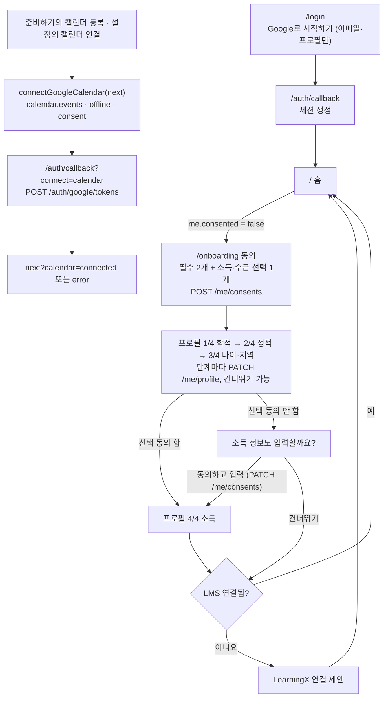

# 온보딩 구현 — 로그인·약관 동의·프로필 4단계·LMS 연결 제안

> 📝 기준: PRD v0.9 F-01·F-02·F-03·F-06 · API 명세 v0.4 4장 · ERD v0.9 · 2026-10-07
>
> 함께 보는 파일: `Nextjs_이식_가이드.md`(이식이 먼저) · `API_뼈대_구현.md`(이 화면이 부르는 API) · `Make_0-11_검토.md`

10/6판을 v0.9에 맞춰 다시 만든 판이다. 로그인은 이메일·프로필만 받고, 캘린더 권한은 처음 등록할 때 따로 받는다(증분 승인). 동의 단계에 소득·수급 선택 동의가 생겼고, 선택 동의를 하지 않은 사람에게는 소득 단계 앞에서 한 번 더 묻는다. 학과는 학과 목록에서 고르고, 유학생 여부가 더해져 프로필은 17개 항목이다. Supabase 로그인은 실제로 부르고(목 모드에서는 건너뜀), 동의·프로필·학과 목록은 목데이터로 동작한다. 실제 API로 바꾸는 일은 S1-1·S1-2에서 한다.

## 10/6판에서 바뀐 것

| 무엇 | 10/6판 | 이번 판 | 근거 |
| --- | --- | --- | --- |
| 로그인 | 캘린더 권한·offline을 함께 요청하고 콜백에서 토큰 저장 | 기본 범위(이메일·프로필)만. 콜백은 세션만 만든다 | API 4장 증분 승인 |
| 캘린더 연결 | — | `connectGoogleCalendar(next)`로 따로 요청. 콜백이 `connect=calendar`일 때만 토큰을 백엔드에 저장하고 `next?calendar=connected`(또는 `error`)로 돌아간다 | API 4장 |
| 동의 단계 | 필수 2개 | 필수 2개 + 소득·수급 선택 1개, "모두 동의 (선택 포함)" | PRD F-02, API 4장 |
| 소득 단계 | 누구나 입력 | 선택 동의한 사람만. 안 했으면 단계 앞에서 한 번 더 묻고, 건너뛸 수 있다 | API 4장 403 `income_info` |
| 학과 | 글자 입력 | `GET /meta/departments` 목록에서 고른다. 목록을 못 불러와도 온보딩은 진행된다 | ERD `departments` |
| 유학생 여부 | — | 학적 단계에 예·아니요 | ERD `profiles.is_international` |
| 문구 | 재학 상태, 이수 학기 수, 취득학점 | 학적 상태, 마친 학기 수(지금 학기 제외), 이수학점, 주민등록 주소 기준 | 판정엔진_규칙 |
| 설정 폼 | 16개 항목 | `departments`·`incomeConsented` props를 받는다. 소득 칸은 동의했을 때만 보이고, 미동의면 소득 값을 비워서 보낸다 | API 4장 |
| 돌아갈 경로 | — | `safeNextPath`로 우리 사이트 안의 경로만 받는다 | 외부 주소로 보내기 방지 |

## 레포에 넣는 법

프론트 이식 요청문(킥오프 Day 2)이 이 문서의 파일도 함께 넣는다. 이식 전이면 요청문의 온보딩 부분을 이렇게 바꿔서 쓴다.

```text
docs/Nextjs_이식_가이드.md를 순서대로 따라 web/에 Next.js 프로젝트를 만들어줘.
Make 코드는 ../make-export에 있어. 3단계 뒤에 docs/Make_0-11_검토.md의 diff를 적용하고,
docs/온보딩_구현.md의 코드 파일을 추가한 뒤 "목업 연결"의 할 일(설정 화면 포함)을 해줘.
마지막에 npm run typecheck와 npm run build가 통과하는지 확인해줘.
화면 컴포넌트(src/screens, src/components)는 diff와 이 문서에 적힌 것 말고는 고치지 마.
```

10/6판으로 이미 이식했으면 이렇게 덮어쓴다.

```text
docs/온보딩_구현.md가 v0.9판으로 바뀌었어. "## 코드"의 파일로 web/의 같은 경로 파일을 바꾸고, 없는 파일은 추가해줘.
그다음 "목업 연결"의 할 일 중 아직 안 된 것을 하고(설정 화면 포함), npm run typecheck와 npm run build를 돌려서 결과를 알려줘.
화면 컴포넌트는 이 문서에 적힌 것 말고는 고치지 마.
```

- [ ] `npm run typecheck`, `npm run build` 통과
- [ ] `NEXT_PUBLIC_USE_MOCKS=true npm run dev` → 상태 미리보기 "첫 접속" → `/onboarding`. 필수 두 항목에 체크하기 전에는 "동의하고 계속"이 꺼져 있다
- [ ] 필수만 동의 → 학적 단계에 학과 선택 칸과 유학생 여부 → 성적·나이·지역을 지나면 "소득 정보도 입력할까요?" → 건너뛰기 → 홈(목 계정은 LMS가 연결돼 있어 LMS 제안 없이 바로)
- [ ] 설정의 프로필 폼: 소득 칸 대신 "소득·수급 정보는 선택 동의를 하면 입력할 수 있어요"가 보이고, 소득 동의를 켜면 소득 칸이 나온다

## 흐름



## 프로필 항목 (17개)

| 단계 | 항목 | 입력 | 비고 |
| --- | --- | --- | --- |
| 1 학적 | 학과, 학년, 학적 상태, 마친 학기 수, 외국인 유학생 | 선택(학과 목록), 선택, 선택, 숫자(학기), 선택(예·아니요) | 마친 학기 수는 지금 다니는 학기를 뺀다 |
| 2 성적 | 누적 이수학점, 직전학기 이수학점, 누적 평점, 직전학기 장학용 평점(F 포함), 평점 만점 | 숫자, 숫자, 숫자, 숫자, 선택(4.5·4.3) | 평점은 만점을 넘을 수 없다 |
| 3 나이·지역 | 생년월일, 병역 복무 개월 수, 거주 시·도, 거주 시·군·구 | 날짜, 숫자(개월), 선택(17개), 글자 | 주민등록 주소 기준, 병역은 해당자만 |
| 4 소득 | 학자금 지원구간, 기준 중위소득, 기초생활수급·차상위 | 선택(기초·차상위, 1–10구간), 숫자(%), 선택 | 소득·수급 선택 동의를 한 사람만 |

빈 칸은 `null`로 저장되어 "정보 필요"로 남는다. `GET /me`의 채운 수(`profile_completion.total`)는 평점 만점을 빼고 16개다. 모든 단계를 건너뛰어도 홈에 들어간다.

## 파일

| 경로 | 구분 | 역할 |
| --- | --- | --- |
| `src/lib/profileFields.ts` | 교체 | 17개 항목 정의(`buildProfileSteps(학과 목록)`), 폼 값 변환, 검증, `withoutIncome` |
| `src/lib/redirectPath.ts` | 새 파일 | 돌아갈 경로 검사, 쿼리 붙이기 |
| `src/lib/googleCalendar.ts` | 새 파일 | 캘린더 연결 시작(증분 승인) |
| `src/components/profile/ProfileFieldInput.tsx` | 10/6판 그대로 | 항목 하나 입력(라벨·단위·안내·오류) |
| `src/components/ProfileForm.tsx` | 교체 | 설정 화면 폼. `departments`·`incomeConsented` props 추가 |
| `src/components/onboarding/ConsentStep.tsx` | 교체 | 필수 2개 + 선택 1개 동의 |
| `src/components/onboarding/IncomeConsentStep.tsx` | 새 파일 | 소득 단계 앞 선택 동의 |
| `src/components/onboarding/ProfileStep.tsx` | 교체 | 프로필 한 단계(소득 안내 문구만 바뀜) |
| `src/components/onboarding/LmsInviteStep.tsx` | 10/6판 그대로 | LearningX 연결 제안(기존 `LmsConnectModal` 재사용) |
| `src/screens/Onboarding.tsx` | 교체 | 단계 진행과 저장 |
| `src/app/(auth)/layout.tsx` · `onboarding/page.tsx` | 10/6판 그대로 | 사이드바 없는 화면 |
| `src/app/(auth)/login/page.tsx` | 교체 | 기본 범위 로그인 |
| `src/app/auth/callback/route.ts` | 교체 | 로그인·캘린더 연결 콜백 |
| `src/lib/supabase/client.ts` · `server.ts` | 10/6판 그대로 | Supabase 클라이언트 |
| `src/types/api.ts` · `src/mocks/account.ts` · `src/mocks/accountStore.ts` · `src/api/settingsClient.ts` · `src/api/client.ts` · 설정 화면 | 수정 | 아래 "목업 연결" |

"10/6판 그대로"인 파일도 이 문서만 보고 넣을 수 있게 전체를 실었다.

## 코드

#### `src/lib/profileFields.ts`

```ts
import type { Department, Profile } from "@/types/api";

// 판정용 프로필 17개 항목을 온보딩 4단계와 설정 화면이 함께 쓴다 (ERD profiles 컬럼과 1:1)
export type ProfileKey = keyof Profile;
export type ProfileFormValues = Record<ProfileKey, string>;
export type ProfileErrors = Partial<Record<ProfileKey, string>>;

export interface ProfileFieldConfig {
  key: ProfileKey;
  label: string;
  kind: "text" | "number" | "date" | "select";
  options?: { value: string; label: string }[];
  allowEmpty?: boolean; // select에 "선택 안 함"을 둘지 (기본 true)
  min?: number;
  max?: number;
  step?: number;
  unit?: string;
  placeholder?: string;
  hint?: string;
}

export interface ProfileStepConfig {
  id: "academic" | "grades" | "age_region" | "income";
  title: string;
  description: string;
  sensitive?: boolean;
  fields: ProfileFieldConfig[];
}

const SIDO = [
  "서울특별시", "부산광역시", "대구광역시", "인천광역시", "광주광역시", "대전광역시",
  "울산광역시", "세종특별자치시", "경기도", "강원특별자치도", "충청북도", "충청남도",
  "전북특별자치도", "전라남도", "경상북도", "경상남도", "제주특별자치도",
];

// 소득·수급 3항목은 선택 동의(소득·수급 정보)를 해야 저장된다 (동의 없이 값을 보내면 403)
export function withoutIncome(profile: Profile): Profile {
  return { ...profile, income_bracket: null, median_income_pct: null, welfare_status: null };
}

// 학과 선택지는 GET /meta/departments 목록으로 만든다
export function buildProfileSteps(departments: Department[]): ProfileStepConfig[] {
  return [
    {
      id: "academic",
      title: "학적",
      description: "학과·학년·학적 상태 조건을 판정해요.",
      fields: [
        {
          key: "department",
          label: "학과",
          kind: "select",
          options: departments.map((department) => ({ value: department.name, label: department.name })),
          hint: departments.length === 0 ? "학과 목록을 불러오지 못했어요. 나중에 설정에서 고를 수 있어요." : undefined,
        },
        {
          key: "grade",
          label: "학년",
          kind: "select",
          options: [1, 2, 3, 4, 5, 6].map((grade) => ({ value: String(grade), label: `${grade}학년` })),
        },
        {
          key: "enrollment_status",
          label: "학적 상태",
          kind: "select",
          options: [
            { value: "enrolled", label: "재학" },
            { value: "on_leave", label: "휴학" },
            { value: "deferred_graduation", label: "졸업 유예" },
            { value: "graduated", label: "졸업" },
          ],
        },
        {
          key: "semesters_completed",
          label: "마친 학기 수",
          kind: "number",
          min: 0,
          max: 16,
          step: 1,
          unit: "학기",
          hint: "지금 다니는 학기는 빼고 세요. \"8학기 이내\" 같은 조건을 판정할 때 써요.",
        },
        {
          key: "is_international",
          label: "외국인 유학생",
          kind: "select",
          options: [
            { value: "false", label: "아니요" },
            { value: "true", label: "예" },
          ],
          hint: "유학생 전용 공고를 판정할 때 써요.",
        },
      ],
    },
    {
      id: "grades",
      title: "성적",
      description: "교내 장학금은 대부분 직전학기 성적을 봐요.",
      fields: [
        { key: "credits_total", label: "누적 이수학점", kind: "number", min: 0, max: 200, step: 0.5, unit: "학점" },
        { key: "credits_last_semester", label: "직전학기 이수학점", kind: "number", min: 0, max: 30, step: 0.5, unit: "학점" },
        { key: "gpa_total", label: "누적 평점", kind: "number", min: 0, max: 4.5, step: 0.01 },
        { key: "gpa_last_semester", label: "직전학기 장학용 평점(F 포함)", kind: "number", min: 0, max: 4.5, step: 0.01 },
        {
          key: "gpa_scale",
          label: "평점 만점",
          kind: "select",
          allowEmpty: false,
          options: [
            { value: "4.5", label: "4.5" },
            { value: "4.3", label: "4.3" },
          ],
        },
      ],
    },
    {
      id: "age_region",
      title: "나이·지역",
      description: "청년 정책은 만 나이와 주민등록 주소를 봐요.",
      fields: [
        { key: "birth_date", label: "생년월일", kind: "date" },
        {
          key: "military_service_months",
          label: "병역 복무 개월 수",
          kind: "number",
          min: 0,
          max: 60,
          step: 1,
          unit: "개월",
          hint: "해당자만 입력해요. 복무 기간만큼 청년 나이 상한이 늘어나는 정책이 있어요.",
        },
        {
          key: "region_sido",
          label: "거주 시·도",
          kind: "select",
          options: SIDO.map((sido) => ({ value: sido, label: sido })),
          hint: "주민등록 주소 기준이에요.",
        },
        { key: "region_sigungu", label: "거주 시·군·구", kind: "text", placeholder: "예: 안산시 단원구" },
      ],
    },
    {
      id: "income",
      title: "소득",
      description: "소득 기준이 있는 장학금·청년 정책을 판정해요. 모르면 비워 두세요.",
      sensitive: true,
      fields: [
        {
          key: "income_bracket",
          label: "학자금 지원구간",
          kind: "select",
          options: Array.from({ length: 11 }, (_, bracket) => ({
            value: String(bracket),
            label: bracket === 0 ? "기초·차상위" : `${bracket}구간`,
          })),
        },
        {
          key: "median_income_pct",
          label: "기준 중위소득",
          kind: "number",
          min: 0,
          max: 500,
          step: 1,
          unit: "%",
          hint: "가구 기준이에요. 학자금 지원구간과 서로 바꿔 계산하지 않아요.",
        },
        {
          key: "welfare_status",
          label: "기초생활수급·차상위",
          kind: "select",
          options: [
            { value: "none", label: "해당 없음" },
            { value: "near_poverty", label: "차상위계층" },
            { value: "basic_livelihood", label: "기초생활수급" },
          ],
        },
      ],
    },
  ];
}

const numericKeys = new Set<ProfileKey>([
  "grade", "semesters_completed", "credits_total", "credits_last_semester", "gpa_total",
  "gpa_last_semester", "gpa_scale", "military_service_months", "income_bracket", "median_income_pct",
]);
const booleanKeys = new Set<ProfileKey>(["is_international"]);

export function toFormValues(profile: Profile): ProfileFormValues {
  const values = {} as ProfileFormValues;
  for (const key of Object.keys(profile) as ProfileKey[]) {
    const value = profile[key];
    values[key] = value === null || value === undefined ? "" : String(value);
  }
  return values;
}

// 빈 칸은 null(판정 불가로 남김), 숫자 항목은 number, 예/아니요 항목은 boolean으로 바꾼다
export function fromFormValues(values: ProfileFormValues, base: Profile): Profile {
  const next: Record<string, unknown> = { ...base };
  for (const key of Object.keys(values) as ProfileKey[]) {
    const raw = values[key].trim();
    if (key === "gpa_scale") next[key] = raw === "" ? base.gpa_scale : Number(raw);
    else if (raw === "") next[key] = null;
    else if (booleanKeys.has(key)) next[key] = raw === "true";
    else next[key] = numericKeys.has(key) ? Number(raw) : raw;
  }
  return next as unknown as Profile;
}

export function validateProfile(values: ProfileFormValues, fields: ProfileFieldConfig[]): ProfileErrors {
  const errors: ProfileErrors = {};
  for (const field of fields) {
    const raw = values[field.key]?.trim() ?? "";
    if (raw === "" || field.kind !== "number") continue;
    const value = Number(raw);
    if (Number.isNaN(value)) errors[field.key] = "숫자로 입력해 주세요.";
    else if (field.min !== undefined && value < field.min) errors[field.key] = `${field.min} 이상으로 입력해 주세요.`;
    else if (field.max !== undefined && value > field.max) errors[field.key] = `${field.max} 이하로 입력해 주세요.`;
  }
  const scale = Number(values.gpa_scale || "4.5");
  for (const key of ["gpa_total", "gpa_last_semester"] as const) {
    const onStep = fields.some((field) => field.key === key);
    if (onStep && values[key] !== "" && Number(values[key]) > scale) {
      errors[key] = `평점 만점(${scale})보다 클 수 없어요.`;
    }
  }
  return errors;
}
```

#### `src/lib/redirectPath.ts`

```ts
// 로그인·캘린더 연결 뒤에 돌아갈 경로. 다른 사이트로 보내지 않게 우리 사이트 안의 경로만 받는다
export function safeNextPath(value: string | null | undefined): string {
  if (!value || !value.startsWith("/") || value.startsWith("//") || value.startsWith("/\\")) return "/";
  return value;
}

// 경로에 쿼리 값을 하나 붙인다: withQuery("/settings?tab=1", "calendar", "connected") → "/settings?tab=1&calendar=connected"
export function withQuery(path: string, key: string, value: string): string {
  const url = new URL(path, "http://localhost");
  url.searchParams.set(key, value);
  return `${url.pathname}${url.search}${url.hash}`;
}
```

#### `src/lib/googleCalendar.ts`

```ts
import { createBrowserSupabase } from "@/lib/supabase/client";

export const CALENDAR_SCOPE = "https://www.googleapis.com/auth/calendar.events";

/**
 * 캘린더 쓰기 권한을 처음 받을 때 부른다(증분 승인, PRD F-01).
 * 부르는 곳: 준비하기 결과의 "캘린더에도 등록", 설정의 캘린더 연결·재연결, LMS 과제 자동 등록 켜기.
 *
 * Google 화면을 거쳐 /auth/callback?connect=calendar로 돌아오고, 콜백이 토큰을 백엔드에 저장한 뒤
 * next 경로로 보낸다(?calendar=connected 또는 ?calendar=error). 성공하면 페이지를 떠나고,
 * 시작하지 못하면 화면에 띄울 오류 문구를 돌려준다. 목 모드에서는 부르지 않는다.
 */
export async function connectGoogleCalendar(next: string): Promise<string | null> {
  const redirectTo = new URL("/auth/callback", window.location.origin);
  redirectTo.searchParams.set("connect", "calendar");
  redirectTo.searchParams.set("next", next);
  const { error } = await createBrowserSupabase().auth.signInWithOAuth({
    provider: "google",
    options: {
      redirectTo: redirectTo.toString(),
      scopes: CALENDAR_SCOPE,
      // refresh token을 받으려면 offline + consent. 이미 받은 범위는 유지한다
      queryParams: { access_type: "offline", prompt: "consent", include_granted_scopes: "true" },
    },
  });
  return error ? "Google 캘린더 연결을 시작하지 못했어요. 잠시 후 다시 시도해 주세요." : null;
}
```

#### `src/components/profile/ProfileFieldInput.tsx`

```tsx
import type { ProfileFieldConfig } from "@/lib/profileFields";

interface ProfileFieldInputProps {
  field: ProfileFieldConfig;
  value: string;
  error?: string;
  onChange: (value: string) => void;
}

export default function ProfileFieldInput({ field, value, error, onChange }: ProfileFieldInputProps) {
  const id = `profile-${field.key}`;
  const messageId = `${id}-message`;
  const inputClass = `mt-2 h-[42px] w-full rounded-[10px] border bg-white px-3 text-[14px] text-[#181a20] outline-none focus:border-[#4f6ef7] ${
    error ? "border-[#c53030]" : "border-[#e5e7eb]"
  }`;
  const message = error ?? field.hint;

  return (
    <div>
      <label htmlFor={id} className="text-[13px] font-semibold text-[#181a20]">
        {field.label}
      </label>
      {field.kind === "select" ? (
        <select
          id={id}
          value={value}
          onChange={(event) => onChange(event.target.value)}
          aria-invalid={Boolean(error)}
          aria-describedby={message ? messageId : undefined}
          className={inputClass}
        >
          {field.allowEmpty !== false && <option value="">선택 안 함</option>}
          {field.options?.map((option) => (
            <option key={option.value} value={option.value}>
              {option.label}
            </option>
          ))}
        </select>
      ) : (
        <div className="relative">
          <input
            id={id}
            type={field.kind}
            inputMode={field.kind === "number" ? "decimal" : undefined}
            value={value}
            min={field.min}
            max={field.max}
            step={field.step}
            placeholder={field.placeholder}
            onChange={(event) => onChange(event.target.value)}
            aria-invalid={Boolean(error)}
            aria-describedby={message ? messageId : undefined}
            className={`${inputClass} ${field.unit ? "pr-12" : ""}`}
          />
          {field.unit && (
            <span className="pointer-events-none absolute right-3 top-[29px] -translate-y-1/2 text-[13px] text-[#667085]">
              {field.unit}
            </span>
          )}
        </div>
      )}
      {message && (
        <p id={messageId} className={`mt-1 text-[12px] leading-5 ${error ? "text-[#c53030]" : "text-[#667085]"}`}>
          {message}
        </p>
      )}
    </div>
  );
}
```

#### `src/components/ProfileForm.tsx`

```tsx
import { useEffect, useMemo, useState } from "react";
import Button from "@/components/Button";
import ProfileFieldInput from "@/components/profile/ProfileFieldInput";
import {
  buildProfileSteps,
  fromFormValues,
  toFormValues,
  validateProfile,
  withoutIncome,
  type ProfileErrors,
  type ProfileFormValues,
} from "@/lib/profileFields";
import type { Department, Profile } from "@/types/api";

interface ProfileFormProps {
  profile: Profile;
  departments: Department[]; // GET /meta/departments
  incomeConsented: boolean; // GET /me의 income_info_consented
  saving?: boolean;
  submitLabel?: string;
  onCancel?: () => void;
  onSave: (profile: Profile) => void;
}

// 설정 화면용: 온보딩 4단계와 같은 항목 정의를 한 화면에 모두 보여준다
export default function ProfileForm({
  profile,
  departments,
  incomeConsented,
  saving = false,
  submitLabel = "저장",
  onCancel,
  onSave,
}: ProfileFormProps) {
  const [values, setValues] = useState<ProfileFormValues>(() => toFormValues(profile));
  const [errors, setErrors] = useState<ProfileErrors>({});
  const steps = useMemo(() => buildProfileSteps(departments), [departments]);
  // 소득 항목은 선택 동의를 했을 때만 입력받는다 (동의 전에는 저장하면 403)
  const editableFields = steps.flatMap((step) => (step.id === "income" && !incomeConsented ? [] : step.fields));

  useEffect(() => setValues(toFormValues(profile)), [profile]);

  return (
    <form
      onSubmit={(event) => {
        event.preventDefault();
        const nextErrors = validateProfile(values, editableFields);
        setErrors(nextErrors);
        if (Object.keys(nextErrors).length > 0) return;
        const next = fromFormValues(values, profile);
        // 동의를 철회한 직후 화면에 남은 소득 값이 있어도 보내지 않는다
        onSave(incomeConsented ? next : withoutIncome(next));
      }}
    >
      <div className="flex flex-col gap-5">
        {steps.map((step) => (
          <section key={step.id} className={step.sensitive ? "rounded-[14px] bg-[#fff8e1] p-4" : ""}>
            <h3 className="text-[15px] font-bold">{step.title}</h3>
            {step.sensitive && (
              <p className="mt-1 text-[12px] font-semibold text-[#b7791f]">
                {incomeConsented
                  ? "자격 판정에만 쓰고, 동의를 철회하거나 탈퇴하면 바로 지워요"
                  : "소득·수급 정보는 선택 동의를 하면 입력할 수 있어요"}
              </p>
            )}
            {(step.id !== "income" || incomeConsented) && (
              <div className="mt-3 grid grid-cols-2 gap-4 max-[600px]:grid-cols-1">
                {step.fields.map((field) => (
                  <ProfileFieldInput
                    key={field.key}
                    field={field}
                    value={values[field.key]}
                    error={errors[field.key]}
                    onChange={(value) => setValues((current) => ({ ...current, [field.key]: value }))}
                  />
                ))}
              </div>
            )}
          </section>
        ))}
      </div>
      <div className="mt-6 flex justify-end gap-2">
        {onCancel && <Button secondary onClick={onCancel}>취소</Button>}
        <Button type="submit" disabled={saving}>
          {saving ? "저장 중" : submitLabel}
        </Button>
      </div>
    </form>
  );
}
```

#### `src/components/onboarding/ConsentStep.tsx`

```tsx
import { useState } from "react";
import Button from "@/components/Button";

export interface ConsentChoice {
  incomeInfo: boolean; // 소득·수급 정보 수집·이용 (선택)
}

interface ConsentStepProps {
  saving: boolean;
  onAgree: (choice: ConsentChoice) => void;
}

type ConsentKey = "terms" | "privacy" | "income";

// TODO(법무): 약관 전문이 확정되면 "보기"에서 전문 페이지로 연결한다
const items: { key: ConsentKey; title: string; required: boolean; summary: string[] }[] = [
  {
    key: "terms",
    title: "이용약관 동의 (필수)",
    required: true,
    summary: [
      "판정 결과는 공고 원문을 대신하지 않아요. 신청 전 원문을 꼭 확인해 주세요.",
      "직접 올린 포스터 공고는 내 피드에만 보여요.",
      "공고 원문·첨부·포스터는 요건을 정리하려고 외부 AI 서비스(LLM API)로 보내요. 내 프로필 값은 보내지 않아요.",
    ],
  },
  {
    key: "privacy",
    title: "개인정보 수집·이용 동의 (필수)",
    required: true,
    summary: [
      "수집 항목: Google 계정 이름·이메일, 직접 입력한 판정용 프로필(소득 정보 제외), 연결한 LMS의 과제·공지 정보",
      "이용 목적: 지원 자격 판정, 준비 일정 생성, 알림",
      "보관 기간: 탈퇴하면 바로 지워요",
    ],
  },
  {
    key: "income",
    title: "소득·수급 정보 수집·이용 동의 (선택)",
    required: false,
    summary: [
      "수집 항목: 학자금 지원구간, 기준 중위소득 %, 기초생활수급·차상위 여부",
      "이용 목적: 소득 기준이 있는 공고의 지원 자격 판정",
      "동의하지 않아도 다른 공고는 그대로 판정해요. 설정에서 언제든 철회할 수 있고, 철회하면 바로 지워요.",
    ],
  },
];

export default function ConsentStep({ saving, onAgree }: ConsentStepProps) {
  const [checked, setChecked] = useState<Record<ConsentKey, boolean>>({ terms: false, privacy: false, income: false });
  const [open, setOpen] = useState<ConsentKey | null>(null);
  const requiredDone = checked.terms && checked.privacy;
  const all = requiredDone && checked.income;

  return (
    <div>
      <h2 className="text-[22px] font-bold">시작하기 전에 동의가 필요해요</h2>
      <p className="mt-1 text-[14px] text-[#667085]">필수 두 항목에 동의하면 공고 판정을 시작할 수 있어요.</p>
      <label className="mt-6 flex cursor-pointer items-center gap-3 rounded-[14px] border border-[#e5e7eb] p-4 text-[15px] font-bold">
        <input
          type="checkbox"
          checked={all}
          onChange={(event) => {
            const value = event.target.checked;
            setChecked({ terms: value, privacy: value, income: value });
          }}
          className="size-4 accent-[#4f6ef7]"
        />
        모두 동의 (선택 포함)
      </label>
      <div className="mt-3 flex flex-col gap-2">
        {items.map((item) => (
          <div key={item.key} className="rounded-[14px] bg-[#f7f8fa] p-4">
            <div className="flex items-center justify-between gap-3">
              <label className="flex cursor-pointer items-center gap-3 text-[14px] font-semibold">
                <input
                  type="checkbox"
                  checked={checked[item.key]}
                  onChange={(event) => setChecked((current) => ({ ...current, [item.key]: event.target.checked }))}
                  className="size-4 accent-[#4f6ef7]"
                />
                {item.title}
              </label>
              <button
                type="button"
                onClick={() => setOpen(open === item.key ? null : item.key)}
                aria-expanded={open === item.key}
                className="shrink-0 text-[13px] font-semibold text-[#4f6ef7]"
              >
                {open === item.key ? "접기" : "보기"}
              </button>
            </div>
            {open === item.key && (
              <ul className="mt-3 list-disc pl-9 text-[12px] leading-5 text-[#667085]">
                {item.summary.map((line) => (
                  <li key={line}>{line}</li>
                ))}
              </ul>
            )}
          </div>
        ))}
      </div>
      <div className="mt-8 flex justify-end">
        <Button onClick={() => onAgree({ incomeInfo: checked.income })} disabled={!requiredDone || saving}>
          {saving ? "저장 중" : "동의하고 계속"}
        </Button>
      </div>
    </div>
  );
}
```

#### `src/components/onboarding/IncomeConsentStep.tsx`

```tsx
import Button from "@/components/Button";

interface IncomeConsentStepProps {
  saving: boolean;
  onAgree: () => void;
  onSkip: () => void;
  onBack?: () => void;
}

// 동의 단계에서 선택 동의를 하지 않은 사람에게 소득 단계 앞에서 한 번 더 묻는다
export default function IncomeConsentStep({ saving, onAgree, onSkip, onBack }: IncomeConsentStepProps) {
  return (
    <div>
      <h2 className="text-[22px] font-bold">소득 정보도 입력할까요?</h2>
      <p className="mt-1 text-[14px] leading-6 text-[#667085]">
        소득 기준이 있는 장학금·청년 정책을 판정하려면 선택 동의가 필요해요. 동의하지 않아도 다른 공고는 그대로
        판정해요.
      </p>
      <ul className="mt-4 list-disc rounded-[10px] bg-[#fff8e1] py-3 pl-8 pr-3 text-[12px] leading-5 text-[#b7791f]">
        <li>수집 항목: 학자금 지원구간, 기준 중위소득 %, 기초생활수급·차상위 여부</li>
        <li>이용 목적: 소득 기준이 있는 공고의 지원 자격 판정</li>
        <li>보관: 설정에서 동의를 철회하거나 탈퇴하면 바로 지워요</li>
      </ul>
      <div className="mt-8 flex justify-between gap-2">
        {onBack ? <Button secondary onClick={onBack}>이전</Button> : <span />}
        <div className="flex gap-2">
          <Button secondary onClick={onSkip}>건너뛰기</Button>
          <Button onClick={onAgree} disabled={saving}>
            {saving ? "저장 중" : "동의하고 입력"}
          </Button>
        </div>
      </div>
    </div>
  );
}
```

#### `src/components/onboarding/ProfileStep.tsx`

```tsx
import Button from "@/components/Button";
import ProfileFieldInput from "@/components/profile/ProfileFieldInput";
import type { ProfileErrors, ProfileFormValues, ProfileKey, ProfileStepConfig } from "@/lib/profileFields";

interface ProfileStepProps {
  step: ProfileStepConfig;
  index: number;
  total: number;
  values: ProfileFormValues;
  errors: ProfileErrors;
  saving: boolean;
  onChange: (key: ProfileKey, value: string) => void;
  onBack?: () => void;
  onSkip: () => void;
  onNext: () => void;
}

export default function ProfileStep({
  step,
  index,
  total,
  values,
  errors,
  saving,
  onChange,
  onBack,
  onSkip,
  onNext,
}: ProfileStepProps) {
  const last = index === total - 1;

  return (
    <div>
      <div className="flex items-center justify-between text-[12px] font-semibold text-[#667085]">
        <span>프로필 {index + 1}/{total}</span>
        <button type="button" onClick={onSkip} className="hover:text-[#4f6ef7]">
          건너뛰기
        </button>
      </div>
      <div className="mt-2 h-1.5 overflow-hidden rounded-full bg-[#e5e7eb]" aria-hidden="true">
        <div className="h-full rounded-full bg-[#4f6ef7]" style={{ width: `${((index + 1) / total) * 100}%` }} />
      </div>
      <h2 className="mt-6 text-[22px] font-bold">{step.title}</h2>
      <p className="mt-1 text-[14px] text-[#667085]">{step.description}</p>
      {step.sensitive && (
        <p className="mt-4 rounded-[10px] bg-[#fff8e1] p-3 text-[12px] font-semibold text-[#b7791f]">
          자격 판정에만 쓰고, 동의를 철회하거나 탈퇴하면 바로 지워요
        </p>
      )}
      <div className="mt-5 grid grid-cols-2 gap-4 max-[600px]:grid-cols-1">
        {step.fields.map((field) => (
          <ProfileFieldInput
            key={field.key}
            field={field}
            value={values[field.key]}
            error={errors[field.key]}
            onChange={(value) => onChange(field.key, value)}
          />
        ))}
      </div>
      <div className="mt-8 flex justify-between gap-2">
        {onBack ? <Button secondary onClick={onBack}>이전</Button> : <span />}
        <Button onClick={onNext} disabled={saving}>
          {saving ? "저장 중" : last ? "저장하고 계속" : "다음"}
        </Button>
      </div>
    </div>
  );
}
```

#### `src/components/onboarding/LmsInviteStep.tsx`

```tsx
import { useState } from "react";
import Button from "@/components/Button";
import LmsConnectModal from "@/components/LmsConnectModal";

export default function LmsInviteStep({ onFinish }: { onFinish: () => void }) {
  const [open, setOpen] = useState(false);
  const [connected, setConnected] = useState(false);

  return (
    <div>
      <h2 className="text-[22px] font-bold">LearningX도 연결할까요?</h2>
      <p className="mt-2 text-[14px] leading-6 text-[#667085]">
        과제 마감과 새 자료를 알려드려요. 토큰은 서버에 암호화해 보관하고, 연결을 해제하면 바로 지워요.
      </p>
      <div className="mt-8 flex justify-end gap-2">
        <Button secondary onClick={onFinish}>나중에</Button>
        <Button onClick={() => setOpen(true)}>연결하기</Button>
      </div>
      <LmsConnectModal
        open={open}
        onClose={() => {
          setOpen(false);
          if (connected) onFinish();
        }}
        onConnected={() => setConnected(true)}
      />
    </div>
  );
}
```

#### `src/screens/Onboarding.tsx`

```tsx
import { useEffect, useMemo, useState } from "react";
import { getDepartments, getMe, getProfile, saveConsents, saveProfile, updateIncomeConsent } from "@/api/client";
import ConsentStep, { type ConsentChoice } from "@/components/onboarding/ConsentStep";
import IncomeConsentStep from "@/components/onboarding/IncomeConsentStep";
import LmsInviteStep from "@/components/onboarding/LmsInviteStep";
import ProfileStep from "@/components/onboarding/ProfileStep";
import Skeleton from "@/components/Skeleton";
import {
  buildProfileSteps,
  fromFormValues,
  toFormValues,
  validateProfile,
  type ProfileErrors,
  type ProfileFormValues,
} from "@/lib/profileFields";
import useAsyncData from "@/lib/useAsyncData";

// 동의 문구를 바꾸면 버전도 바꾼다 (profiles.consent_version에 남는다)
const CONSENT_VERSION = "2026-10-07";

type Stage =
  | { kind: "consent" }
  | { kind: "profile"; index: number }
  | { kind: "income_consent"; index: number }
  | { kind: "lms" };

interface OnboardingProps {
  onDone: () => void;
}

export default function Onboarding({ onDone }: OnboardingProps) {
  // 학과 목록을 못 불러와도 온보딩은 진행한다 (학과는 나중에 설정에서 고른다)
  const request = useAsyncData(
    () => Promise.all([getMe(), getProfile(), getDepartments().catch(() => [])]),
    [],
  );
  const [stage, setStage] = useState<Stage | null>(null);
  const [values, setValues] = useState<ProfileFormValues | null>(null);
  const [errors, setErrors] = useState<ProfileErrors>({});
  const [incomeConsented, setIncomeConsented] = useState(false);
  const [saving, setSaving] = useState(false);
  const [error, setError] = useState<string | null>(null);
  const departments = request.data?.[2];
  const steps = useMemo(() => buildProfileSteps(departments ?? []), [departments]);

  useEffect(() => {
    if (!request.data) return;
    const [me, profile] = request.data;
    setValues(toFormValues(profile));
    setIncomeConsented(me.income_info_consented);
    setStage(me.consented ? { kind: "profile", index: 0 } : { kind: "consent" });
  }, [request.data]);

  if (request.error) {
    return <p className="mx-auto max-w-[640px] rounded-[14px] bg-[#fef2f2] p-4 text-[#c53030]">{request.error}</p>;
  }
  if (!request.data || !stage || !values) {
    return <Skeleton className="mx-auto h-[420px] w-full max-w-[640px] rounded-[18px]" />;
  }

  const [me, profile] = request.data;
  const finish = () => (me.lms?.status === "active" ? onDone() : setStage({ kind: "lms" }));
  // 소득 단계는 선택 동의를 했을 때만 입력받고, 안 했으면 동의를 한 번 더 묻는다
  const openStep = (index: number) => {
    setErrors({});
    setError(null);
    if (index >= steps.length) finish();
    else if (steps[index].id === "income" && !incomeConsented) setStage({ kind: "income_consent", index });
    else setStage({ kind: "profile", index });
  };

  const agree = async (choice: ConsentChoice) => {
    setSaving(true);
    setError(null);
    try {
      const result = await saveConsents(CONSENT_VERSION, choice.incomeInfo);
      setIncomeConsented(result.income_info_agreed_at !== null);
      setStage({ kind: "profile", index: 0 });
    } catch {
      setError("동의를 저장하지 못했어요. 잠시 후 다시 눌러 주세요.");
    } finally {
      setSaving(false);
    }
  };

  const agreeIncome = async (index: number) => {
    setSaving(true);
    setError(null);
    try {
      await updateIncomeConsent(true);
      setIncomeConsented(true);
      setStage({ kind: "profile", index });
    } catch {
      setError("동의를 저장하지 못했어요. 잠시 후 다시 눌러 주세요.");
    } finally {
      setSaving(false);
    }
  };

  // 단계마다 저장해서, 중간에 나가도 입력한 값이 남는다
  const saveStep = async (index: number) => {
    const nextErrors = validateProfile(values, steps[index].fields);
    setErrors(nextErrors);
    if (Object.keys(nextErrors).length > 0) return;
    setSaving(true);
    setError(null);
    try {
      await saveProfile(fromFormValues(values, profile));
      openStep(index + 1);
    } catch {
      setError("프로필을 저장하지 못했어요. 입력한 값은 그대로 있으니 다시 눌러 주세요.");
    } finally {
      setSaving(false);
    }
  };

  return (
    <section className="mx-auto w-full max-w-[640px] rounded-[18px] border border-[#e5e7eb] bg-white p-8 max-[760px]:p-5">
      <p className="text-[13px] font-semibold text-[#4f6ef7]">UNIPIVOT 시작하기</p>
      <h1 className="mt-2 text-[24px] font-bold leading-[1.45]">{me.display_name}님에게 맞는 기회를 찾아드릴게요</h1>
      <div className="mt-6 border-t border-[#e5e7eb] pt-6">
        {stage.kind === "consent" && <ConsentStep saving={saving} onAgree={agree} />}
        {stage.kind === "profile" && (
          <ProfileStep
            step={steps[stage.index]}
            index={stage.index}
            total={steps.length}
            values={values}
            errors={errors}
            saving={saving}
            onChange={(key, value) => setValues((current) => (current ? { ...current, [key]: value } : current))}
            onBack={stage.index > 0 ? () => setStage({ kind: "profile", index: stage.index - 1 }) : undefined}
            onSkip={() => openStep(stage.index + 1)}
            onNext={() => saveStep(stage.index)}
          />
        )}
        {stage.kind === "income_consent" && (
          <IncomeConsentStep
            saving={saving}
            onAgree={() => agreeIncome(stage.index)}
            onSkip={() => openStep(stage.index + 1)}
            onBack={stage.index > 0 ? () => setStage({ kind: "profile", index: stage.index - 1 }) : undefined}
          />
        )}
        {stage.kind === "lms" && <LmsInviteStep onFinish={onDone} />}
        {error && <p role="alert" className="mt-4 text-[13px] text-[#c53030]">{error}</p>}
      </div>
    </section>
  );
}
```

#### `src/app/(auth)/layout.tsx`

```tsx
import type { ReactNode } from "react";

// 로그인·온보딩은 사이드바 없이 가운데 카드로 보여준다
export default function AuthLayout({ children }: { children: ReactNode }) {
  return <main className="min-h-dvh bg-[#f7f8fa] px-4 py-16 text-[#181a20] max-[760px]:py-8">{children}</main>;
}
```

#### `src/app/(auth)/onboarding/page.tsx`

```tsx
"use client";

import { useRouter } from "next/navigation";
import Onboarding from "@/screens/Onboarding";

export default function OnboardingPage() {
  const router = useRouter();
  return <Onboarding onDone={() => router.replace("/")} />;
}
```

#### `src/app/(auth)/login/page.tsx`

```tsx
"use client";

import { Suspense, useState } from "react";
import { useRouter, useSearchParams } from "next/navigation";
import { createBrowserSupabase } from "@/lib/supabase/client";

const useMocks = process.env.NEXT_PUBLIC_USE_MOCKS === "true";

const errorMessages: Record<string, string> = {
  auth: "로그인을 마치지 못했어요. 다시 시도해 주세요.",
  missing_code: "로그인 정보가 없어요. 처음부터 다시 시도해 주세요.",
};

function GoogleMark() {
  return (
    <svg aria-hidden="true" width="18" height="18" viewBox="0 0 48 48">
      <path fill="#EA4335" d="M24 9.5c3.54 0 6.71 1.22 9.21 3.6l6.85-6.85C35.9 2.38 30.47 0 24 0 14.62 0 6.51 5.38 2.56 13.22l7.98 6.19C12.43 13.72 17.74 9.5 24 9.5z" />
      <path fill="#4285F4" d="M46.98 24.55c0-1.57-.15-3.09-.38-4.55H24v9.02h12.94c-.58 2.96-2.26 5.48-4.78 7.18l7.73 6c4.51-4.18 7.09-10.36 7.09-17.65z" />
      <path fill="#FBBC05" d="M10.53 28.59c-.48-1.45-.76-2.99-.76-4.59s.27-3.14.76-4.59l-7.98-6.19C.92 16.46 0 20.12 0 24c0 3.88.92 7.54 2.56 10.78l7.97-6.19z" />
      <path fill="#34A853" d="M24 48c6.48 0 11.93-2.13 15.89-5.81l-7.73-6c-2.15 1.45-4.92 2.3-8.16 2.3-6.26 0-11.57-4.22-13.47-9.91l-7.98 6.19C6.51 42.62 14.62 48 24 48z" />
    </svg>
  );
}

function LoginCard() {
  const router = useRouter();
  const errorCode = useSearchParams().get("error");
  const [pending, setPending] = useState(false);
  const [error, setError] = useState<string | null>(
    errorCode ? (errorMessages[errorCode] ?? errorMessages.auth) : null,
  );

  const signIn = async () => {
    setPending(true);
    setError(null);
    if (useMocks) {
      router.push("/onboarding");
      return;
    }
    // 로그인은 기본 범위(이메일·프로필)만 받는다. 캘린더 권한은 처음 등록할 때 따로 받는다 (증분 승인)
    const { error: signInError } = await createBrowserSupabase().auth.signInWithOAuth({
      provider: "google",
      options: { redirectTo: `${window.location.origin}/auth/callback` },
    });
    if (signInError) {
      setError("Google 로그인을 시작하지 못했어요. 잠시 후 다시 시도해 주세요.");
      setPending(false);
    }
  };

  return (
    <section className="mx-auto w-full max-w-[440px] rounded-[18px] border border-[#e5e7eb] bg-white p-8 text-center max-[760px]:p-6">
      <p className="text-[32px] font-bold text-[#4f6ef7]">UNIPIVOT</p>
      <h1 className="mt-4 text-[20px] font-bold leading-[1.45]">
        지원할 수 있는 장학금·정책·공모전을 찾아 준비 일정까지 만들어요
      </h1>
      <button
        type="button"
        onClick={signIn}
        disabled={pending}
        className="mt-8 flex h-[48px] w-full items-center justify-center gap-3 rounded-[10px] border border-[#e5e7eb] bg-white text-[15px] font-semibold text-[#181a20] transition hover:bg-[#f7f8fa] disabled:cursor-not-allowed disabled:opacity-50"
      >
        <GoogleMark />
        {pending ? "Google로 이동 중" : "Google로 시작하기"}
      </button>
      <p className="mt-3 text-[12px] leading-5 text-[#667085]">
        Google 계정으로 로그인해요. 캘린더는 마감일을 처음 등록할 때 따로 연결해요.
      </p>
      {error && (
        <p role="alert" className="mt-4 rounded-[10px] bg-[#fef2f2] p-3 text-[13px] text-[#c53030]">
          {error}
        </p>
      )}
    </section>
  );
}

export default function LoginPage() {
  return (
    <Suspense>
      <LoginCard />
    </Suspense>
  );
}
```

#### `src/app/auth/callback/route.ts`

```ts
import { NextResponse } from "next/server";
import { safeNextPath, withQuery } from "@/lib/redirectPath";
import { createServerSupabase } from "@/lib/supabase/server";

// 로그인과 캘린더 연결이 함께 쓰는 콜백 (API 4장, 증분 승인)
// - 로그인: 세션만 만든다. 동의 전이면 홈의 AppFrame이 /onboarding으로 보낸다
// - 캘린더 연결(connect=calendar): Google 토큰을 백엔드에 한 번 넘겨 암호화 저장한다
export async function GET(request: Request) {
  const { searchParams, origin } = new URL(request.url);
  const code = searchParams.get("code");
  const next = safeNextPath(searchParams.get("next"));
  const connectCalendar = searchParams.get("connect") === "calendar";
  if (!code) return NextResponse.redirect(`${origin}/login?error=missing_code`);

  const supabase = await createServerSupabase();
  const { data, error } = await supabase.auth.exchangeCodeForSession(code);
  if (error || !data.session) return NextResponse.redirect(`${origin}/login?error=auth`);
  if (!connectCalendar) return NextResponse.redirect(`${origin}${next}`);

  const { access_token, provider_token, provider_refresh_token } = data.session;
  let result = "error";
  try {
    const response = await fetch(`${process.env.NEXT_PUBLIC_API_BASE_URL}/auth/google/tokens`, {
      method: "POST",
      headers: { "Content-Type": "application/json", Authorization: `Bearer ${access_token}` },
      body: JSON.stringify({ provider_token, provider_refresh_token }),
    });
    if (response.ok) result = "connected";
  } catch {
    // 백엔드에 닿지 못해도 로그인 세션은 그대로 두고, 돌아간 화면에서 다시 연결하게 한다
  }
  // refresh token을 못 받았을 때(422 GOOGLE_REFRESH_TOKEN_MISSING)도 error로 돌아가 다시 연결을 안내한다
  return NextResponse.redirect(`${origin}${withQuery(next, "calendar", result)}`);
}
```

#### `src/lib/supabase/client.ts`

```ts
import { createBrowserClient } from "@supabase/ssr";

// 브라우저에서 쓰는 Supabase 클라이언트 (로그인·세션 토큰 조회에만 쓴다. 데이터는 FastAPI로만 받는다)
export function createBrowserSupabase() {
  return createBrowserClient(
    process.env.NEXT_PUBLIC_SUPABASE_URL!,
    process.env.NEXT_PUBLIC_SUPABASE_ANON_KEY!,
  );
}
```

#### `src/lib/supabase/server.ts`

```ts
import { createServerClient } from "@supabase/ssr";
import { cookies } from "next/headers";

// 라우트 핸들러(로그인 콜백)에서 쓰는 Supabase 클라이언트
export async function createServerSupabase() {
  const cookieStore = await cookies();
  return createServerClient(
    process.env.NEXT_PUBLIC_SUPABASE_URL!,
    process.env.NEXT_PUBLIC_SUPABASE_ANON_KEY!,
    {
      cookies: {
        getAll() {
          return cookieStore.getAll();
        },
        setAll(cookiesToSet) {
          try {
            cookiesToSet.forEach(({ name, value, options }) => cookieStore.set(name, value, options));
          } catch {
            // 서버 컴포넌트에서 부르면 쿠키를 쓸 수 없다. 라우트 핸들러에서는 정상 동작한다
          }
        },
      },
    },
  );
}
```

## 목업 연결

목 모드(`NEXT_PUBLIC_USE_MOCKS=true`)에서 온보딩과 설정이 돌게 하는 수정이다. Make 내보내기의 목 파일이 이 샌드박스에 없어서 diff 대신 할 일로 적었다. 온보딩·설정 코드가 아래 함수와 필드를 쓰므로, 하나라도 빠지면 `npm run typecheck`에서 걸린다.

### `src/types/api.ts`

`Profile`에 `is_international: boolean | null;`을, `Me`에 `income_info_consented: boolean;`을 더한다. 아래 세 타입을 두고, `ConsentResult`가 10/6판 diff로 이미 있으면 `income_info_agreed_at`만 더한다.

```ts
// POST /me/consents
export interface ConsentResult {
  terms_agreed_at: string;
  privacy_agreed_at: string;
  income_info_agreed_at: string | null;
  consent_version: string;
}

// PATCH /me/consents
export interface IncomeConsentResult {
  income_info_agreed_at: string | null;
}

// GET /meta/departments의 items
export interface Department {
  name: string;
  college: string;
  field_group: string;
}
```

### `src/mocks/account.ts`

- 목 프로필에 `is_international: false`를 더한다
- 목 내 정보에 `income_info_consented`를 더한다. 목 프로필에 소득 값이 있으면 `true`, 없으면 `false`로 둔다(실제 DB는 동의 없이 소득 값을 둘 수 없다)
- 목 학과 목록 `mockDepartments: Department[]`를 더한다. 목 프로필의 학과를 포함해 3–5개면 된다. 빠지면 설정 화면의 학과 칸이 "선택 안 함"으로 보인다

### `src/mocks/accountStore.ts`

| 함수 | 할 일 |
| --- | --- |
| `hasStoredConsent(): boolean` (새로) | 상태 미리보기 "첫 접속"에서 이번 세션에 동의를 마쳤는지 돌려준다. 모듈 변수 `consentGiven`을 둔다 |
| `storeIncomeConsent(agree: boolean, agreedAt: string): IncomeConsentResult` (새로) | `meState.income_info_consented`를 바꾼다. `false`면 저장된 프로필의 `income_bracket`·`median_income_pct`·`welfare_status`를 `null`로 지운다(서버와 같은 규칙). `income_info_agreed_at`은 동의했으면 `agreedAt`, 아니면 `null` |
| `storeConsent(version: string, agreedAt: string, agreeIncomeInfo: boolean): ConsentResult` (새로 또는 인자 추가) | `consentGiven`과 `meState.consented`를 `true`로 하고, 소득 동의는 `storeIncomeConsent(agreeIncomeInfo, agreedAt)`로 처리한다 |
| `deleteStoredAccount()` (수정) | 기존 초기화에 `consentGiven = false`와 `meState.income_info_consented = false`를 더한다 |

### `src/api/settingsClient.ts` · `src/api/client.ts`

| 함수 | 목 동작 | 실제 API (S1-2에서 교체) |
| --- | --- | --- |
| `saveConsents(version: string, agreeIncomeInfo: boolean): Promise<ConsentResult>` | `storeConsent(version, mockNow, agreeIncomeInfo)` 결과를 다른 목 함수처럼 `respond`로 | `POST /me/consents` `{ consent_version, agree_terms: true, agree_privacy: true, agree_income_info }` |
| `updateIncomeConsent(agree: boolean): Promise<IncomeConsentResult>` | `storeIncomeConsent(agree, mockNow)` 결과를 `respond`로 | `PATCH /me/consents` `{ agree_income_info }` |
| `getDepartments(): Promise<Department[]>` | `mockDepartments` 복사본을 `respond`로 | `GET /meta/departments`의 `items` |

`client.ts`는 세 함수를 다른 목 함수처럼 내보낸다. `getMe`의 첫 접속 처리는 이번 세션에 동의를 마치면 홈으로 들어가도록 이렇게 둔다.

```ts
if (scenario === "first_visit" && !hasStoredConsent()) {
  result.consented = false;
  result.income_info_consented = false;
}
```

### 설정 화면

- `ProfileForm`에 새 필수 props 두 개를 넘긴다. `departments`는 화면을 열 때 `getDepartments()`로 받고(실패하면 `[]`), `incomeConsented`는 `getMe()`의 `income_info_consented`다
- 개인정보(또는 계정) 영역에 "소득·수급 정보 수집·이용 (선택)" 켜기·끄기를 둔다. 이게 없으면 온보딩에서 건너뛴 사람이 소득 정보를 넣을 길이 없다
  - 켜면 `updateIncomeConsent(true)` 뒤 내 정보를 다시 불러온다. 프로필 폼에 소득 칸이 나온다
  - 끌 때는 "입력한 소득·수급 정보가 바로 지워져요"를 확인받고 `updateIncomeConsent(false)`를 부른 뒤, 내 정보와 프로필을 다시 불러온다
- 캘린더 연결 버튼은 목 모드에서는 지금처럼 `reconnectCalendar`를 쓴다. 실제 모드는 아래 표대로 바꾼다

## 실제 API로 바꿀 때 (S1-1·S1-2)

`apiFetch`(이식 가이드)로 함수 안만 바꾸고, 이름과 반환 타입은 그대로 둔다. 캘린더 연결만 화면 쪽 처리가 더 필요하다.

| 목 함수 | 실제 API | 처리 |
| --- | --- | --- |
| `getMe` | `GET /me` | — |
| `getProfile` · `saveProfile` | `GET` · `PATCH /me/profile` | 403 `CONSENT_REQUIRED`의 `details.consent`가 `terms_privacy`면 `/onboarding`으로, `income_info`면 소득 동의를 다시 묻는다. 422는 `details.fields`를 항목 오류로 보여 준다 |
| `saveConsents` | `POST /me/consents` | — |
| `updateIncomeConsent` | `PATCH /me/consents` | 끄면 서버가 소득 3항목을 지우고 재판정한다 |
| `getDepartments` | `GET /meta/departments` | 응답의 `items`를 돌려준다 |
| `reconnectCalendar`(설정) · 준비하기의 캘린더 등록 | `connectGoogleCalendar(next)` | API 호출이 아니라 Google 화면으로 이동한다. 돌아온 주소의 `?calendar=connected`·`error`를 읽어 안내하고 쿼리를 지운다. 캘린더 API가 409 `CALENDAR_NOT_CONNECTED`를 주면 같은 함수로 다시 연결한다 |

## Supabase·Google 설정

- [ ] Google Cloud OAuth 동의 화면에 `https://www.googleapis.com/auth/calendar.events` 범위를 추가하고, 앱 검증 전이므로 팀원·데모 계정을 테스트 사용자로 등록한다. 로그인은 기본 범위만 쓰고, 이 범위는 캘린더를 연결할 때 요청한다
- [ ] Google Cloud OAuth 클라이언트(웹)의 승인된 리디렉션 URI에 `https://<project-ref>.supabase.co/auth/v1/callback`을 넣는다
- [ ] Supabase 대시보드의 Auth 공급자 설정에서 Google을 켜고 클라이언트 ID·시크릿을 넣는다
- [ ] Supabase URL 설정의 Redirect URLs에 `http://localhost:3000/auth/callback**`과 `https://<배포 주소>/auth/callback**`을 넣는다. 캘린더 연결은 콜백 주소 뒤에 `?connect=calendar&next=…`가 붙으므로 끝의 `**`가 있어야 허용 목록과 맞는다
- [ ] `.env.local`을 채우고 `NEXT_PUBLIC_USE_MOCKS=false`로 로그인해 본다. Google 화면에 캘린더 권한이 나오지 않아야 한다
- [ ] 캘린더 연결을 눌러 Google 화면에 캘린더 권한이 나오는지, 돌아온 주소에 `?calendar=connected`가 붙는지, `GET /me`의 `calendar_connected`가 true인지 본다(S1-1). refresh token을 못 받으면 `?calendar=error`로 돌아온다

## 확인한 것

| 점검 | 결과 |
| --- | --- |
| `tsc --noEmit` (TypeScript 5.9) | 통과 |
| `next build` (Next.js 16.4, 목 모드) | 통과: `/login`, `/onboarding`, `/auth/callback` |
| 동작 테스트 16개 (Vitest + Testing Library, jsdom) | 통과: 아래 목록 |

- 온보딩: 필수 두 항목 전에는 버튼이 꺼져 있다 → 필수만 동의 → 학과·유학생 저장 → 소득 단계 앞 선택 동의 → 소득 저장 → LMS 제안 → 끝. "모두 동의"면 소득 단계로 바로 가고, 선택 동의를 건너뛰면 소득 단계 없이 끝난다
- 설정 폼: 미동의면 소득 칸을 숨기고 남아 있던 소득 값을 비워서 보낸다. 동의했으면 그대로 보낸다
- 콜백: 로그인은 백엔드를 부르지 않는다, 외부 주소 `next`는 `/`로 바꾼다, 코드 없음·교환 실패는 로그인 화면으로, 캘린더 연결 성공·422·백엔드 연결 실패를 각각 `connected`·`error`·`error`로 돌려보낸다
- 캘린더 연결 요청 값: 범위, `offline`·`consent`·`include_granted_scopes`, 돌아올 경로. 시작하지 못하면 오류 문구
- 돌아갈 경로 검사, 항목 변환(예·아니요는 boolean, 빈 칸은 null), `withoutIncome`

샌드박스에서는 Make 쪽 파일(`Button`, `Skeleton`, `LmsConnectModal`, `useAsyncData`)과 목 클라이언트를 같은 props·시그니처의 대역으로 두고 돌렸다. 그래서 레포에 넣은 뒤 `npm run typecheck`·`npm run build`와 위 체크리스트로 한 번 더 확인한다. 테스트 도구는 레포에 넣지 않는다.

## 남은 것

- 약관 전문은 법무 검토 후 `ConsentStep`의 "보기"에 연결한다(코드에 `TODO(법무)`). 동의 문구를 바꾸면 `Onboarding.tsx`의 `CONSENT_VERSION`도 바꾼다
- 학과 목록 seed 마이그레이션이 들어가기 전에는 실제 API의 학과 목록이 비어 있다. 학과 칸에 안내 문구가 뜨고 나머지는 그대로 진행된다
- `POST /events`의 `app_open`은 `AppFrame`이 앱을 열 때 보낸다(응답을 기다리지 않고 실패도 무시). 온보딩 범위 밖이라 여기 코드는 없다
- 캘린더 연결 때 Google 화면에서 다른 계정을 고르면 그 계정으로 로그인이 바뀐다. 문제가 되면 `login_hint`로 지금 계정을 넘긴다
- 목 모드에서는 온보딩 중 새로고침하면 입력이 사라진다. 실제 API에서는 단계마다 서버에 저장된다
- HY-in 재학생 인증(F-05)은 P2라 설정에 비활성 버튼만 있다
