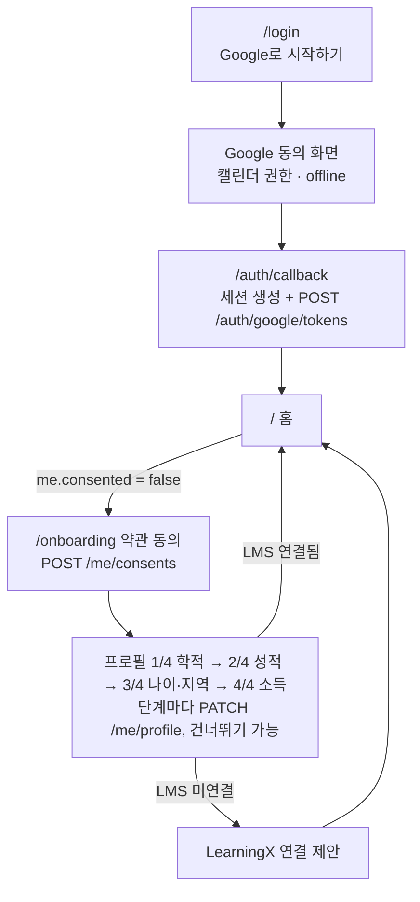

# 온보딩 구현 — 프롬프트 12 (로그인·약관 동의·프로필 4단계·LMS 연결 제안)

> 📝 기준: PRD v0.8 F-01·F-02·F-03·F-06 · API 명세 v0.3 4장 · 2026-10-06
>
> 함께 보는 파일: `Nextjs_이식_가이드.md`(이식이 먼저) · `Make_0-11_검토.md`

12번은 Make 대신 Next.js에서 바로 만들었다. 로그인은 Supabase Google 로그인에 캘린더 권한까지 실제로 붙였고, 동의·프로필 저장은 목데이터로 동작한다. 프로필 항목 정의를 `profileFields.ts` 한 곳에 모아 설정 화면 폼도 같은 정의를 쓰게 바꿨다. 그래서 설정에서 빠져 있던 5개 항목도 함께 채워졌다.

## 흐름



## 프로필 항목 (16개)

| 단계 | 항목 | 입력 | 비고 |
| --- | --- | --- | --- |
| 1 학적 | 학과, 학년, 재학 상태, 이수 학기 수 | 글자, 선택, 선택, 숫자(학기) | 이수 학기는 "정규 학기 이내" 판정용 |
| 2 성적 | 누적 취득학점, 직전학기 취득학점, 누적 평점, 직전학기 장학용 평점(F 포함), 평점 만점 | 숫자, 숫자, 숫자, 숫자, 선택(4.5·4.3) | 평점은 만점을 넘을 수 없다 |
| 3 나이·지역 | 생년월일, 병역 복무 개월 수, 거주 시·도, 거주 시·군·구 | 날짜, 숫자(개월), 선택(17개), 글자 | 병역은 해당자만 |
| 4 소득 | 학자금 지원구간, 기준 중위소득, 기초생활수급·차상위 | 선택(기초·차상위, 1–10구간), 숫자(%), 선택 | 민감 정보 안내 문구 표시 |

빈 칸은 `null`로 저장되어 "정보 필요"로 남는다. 모든 단계를 건너뛰어도 홈에 들어간다.

## 파일

| 경로 | 구분 | 역할 |
| --- | --- | --- |
| `src/lib/profileFields.ts` | 새 파일 | 16개 항목 정의, 폼 값 변환, 검증 |
| `src/components/profile/ProfileFieldInput.tsx` | 새 파일 | 항목 하나 입력(라벨·단위·안내·오류) |
| `src/components/ProfileForm.tsx` | 교체 | 설정 화면 폼. 같은 정의로 16개 전부 표시 |
| `src/components/onboarding/ConsentStep.tsx` | 새 파일 | 약관·개인정보 동의 |
| `src/components/onboarding/ProfileStep.tsx` | 새 파일 | 프로필 한 단계 |
| `src/components/onboarding/LmsInviteStep.tsx` | 새 파일 | LearningX 연결 제안(기존 `LmsConnectModal` 재사용) |
| `src/screens/Onboarding.tsx` | 교체 | 단계 진행과 저장 |
| `src/app/(auth)/layout.tsx` · `onboarding/page.tsx` · `login/page.tsx` | 새 파일 | 사이드바 없는 화면 |
| `src/app/auth/callback/route.ts` | 새 파일 | 로그인 콜백, 캘린더 토큰 전달 |
| `src/lib/supabase/client.ts` · `server.ts` | 새 파일 | Supabase 클라이언트 |
| `src/types/api.ts` · `src/mocks/accountStore.ts` · `src/api/settingsClient.ts` · `src/api/client.ts` | 수정(diff) | 동의 저장 목업, 첫 접속 시나리오 |

## 코드


#### `src/lib/profileFields.ts`

```ts
import type { Profile } from "@/types/api";

// 판정용 프로필 16개 항목을 온보딩 4단계와 설정 화면이 함께 쓴다 (ERD profiles 컬럼과 1:1)
export type ProfileKey = keyof Profile;
export type ProfileFormValues = Record<ProfileKey, string>;
export type ProfileErrors = Partial<Record<ProfileKey, string>>;

export interface ProfileFieldConfig {
  key: ProfileKey;
  label: string;
  kind: "text" | "number" | "date" | "select";
  options?: { value: string; label: string }[];
  allowEmpty?: boolean; // select에 "선택 안 함"을 둘지 (기본 true)
  min?: number;
  max?: number;
  step?: number;
  unit?: string;
  placeholder?: string;
  hint?: string;
}

export interface ProfileStepConfig {
  id: "academic" | "grades" | "age_region" | "income";
  title: string;
  description: string;
  sensitive?: boolean;
  fields: ProfileFieldConfig[];
}

const SIDO = [
  "서울특별시", "부산광역시", "대구광역시", "인천광역시", "광주광역시", "대전광역시",
  "울산광역시", "세종특별자치시", "경기도", "강원특별자치도", "충청북도", "충청남도",
  "전북특별자치도", "전라남도", "경상북도", "경상남도", "제주특별자치도",
];

export const profileSteps: ProfileStepConfig[] = [
  {
    id: "academic",
    title: "학적",
    description: "학과·학년·재학 상태 조건을 판정해요.",
    fields: [
      { key: "department", label: "학과", kind: "text", placeholder: "예: 인공지능학과" },
      {
        key: "grade",
        label: "학년",
        kind: "select",
        options: [1, 2, 3, 4, 5, 6].map((grade) => ({ value: String(grade), label: `${grade}학년` })),
      },
      {
        key: "enrollment_status",
        label: "재학 상태",
        kind: "select",
        options: [
          { value: "enrolled", label: "재학" },
          { value: "on_leave", label: "휴학" },
          { value: "deferred_graduation", label: "졸업 유예" },
          { value: "graduated", label: "졸업" },
        ],
      },
      {
        key: "semesters_completed",
        label: "이수 학기 수",
        kind: "number",
        min: 0,
        max: 16,
        step: 1,
        unit: "학기",
        hint: "\"정규 학기 이내\" 조건을 판정할 때 써요.",
      },
    ],
  },
  {
    id: "grades",
    title: "성적",
    description: "교내 장학금은 대부분 직전학기 성적을 봐요.",
    fields: [
      { key: "credits_total", label: "누적 취득학점", kind: "number", min: 0, max: 200, step: 0.5, unit: "학점" },
      { key: "credits_last_semester", label: "직전학기 취득학점", kind: "number", min: 0, max: 30, step: 0.5, unit: "학점" },
      { key: "gpa_total", label: "누적 평점", kind: "number", min: 0, max: 4.5, step: 0.01 },
      { key: "gpa_last_semester", label: "직전학기 장학용 평점(F 포함)", kind: "number", min: 0, max: 4.5, step: 0.01 },
      {
        key: "gpa_scale",
        label: "평점 만점",
        kind: "select",
        allowEmpty: false,
        options: [
          { value: "4.5", label: "4.5" },
          { value: "4.3", label: "4.3" },
        ],
      },
    ],
  },
  {
    id: "age_region",
    title: "나이·지역",
    description: "청년 정책은 만 나이와 거주지를 봐요.",
    fields: [
      { key: "birth_date", label: "생년월일", kind: "date" },
      {
        key: "military_service_months",
        label: "병역 복무 개월 수",
        kind: "number",
        min: 0,
        max: 60,
        step: 1,
        unit: "개월",
        hint: "해당자만 입력해요. 복무 기간만큼 청년 나이 상한이 늘어나는 정책이 있어요.",
      },
      { key: "region_sido", label: "거주 시·도", kind: "select", options: SIDO.map((sido) => ({ value: sido, label: sido })) },
      { key: "region_sigungu", label: "거주 시·군·구", kind: "text", placeholder: "예: 안산시" },
    ],
  },
  {
    id: "income",
    title: "소득",
    description: "소득 기준이 있는 장학금·청년 정책을 판정해요. 모르면 비워 두세요.",
    sensitive: true,
    fields: [
      {
        key: "income_bracket",
        label: "학자금 지원구간",
        kind: "select",
        options: Array.from({ length: 11 }, (_, bracket) => ({
          value: String(bracket),
          label: bracket === 0 ? "기초·차상위" : `${bracket}구간`,
        })),
      },
      {
        key: "median_income_pct",
        label: "기준 중위소득",
        kind: "number",
        min: 0,
        max: 500,
        step: 1,
        unit: "%",
        hint: "가구 기준이에요. 학자금 지원구간과 서로 바꿔 계산하지 않아요.",
      },
      {
        key: "welfare_status",
        label: "기초생활수급·차상위",
        kind: "select",
        options: [
          { value: "none", label: "해당 없음" },
          { value: "near_poverty", label: "차상위계층" },
          { value: "basic_livelihood", label: "기초생활수급" },
        ],
      },
    ],
  },
];

const numericKeys = new Set<ProfileKey>([
  "grade", "semesters_completed", "credits_total", "credits_last_semester", "gpa_total",
  "gpa_last_semester", "gpa_scale", "military_service_months", "income_bracket", "median_income_pct",
]);

export function toFormValues(profile: Profile): ProfileFormValues {
  const values = {} as ProfileFormValues;
  for (const key of Object.keys(profile) as ProfileKey[]) {
    const value = profile[key];
    values[key] = value === null || value === undefined ? "" : String(value);
  }
  return values;
}

// 빈 칸은 null(판정 불가로 남김), 숫자 항목은 number로 바꾼다
export function fromFormValues(values: ProfileFormValues, base: Profile): Profile {
  const next: Record<string, unknown> = { ...base };
  for (const key of Object.keys(values) as ProfileKey[]) {
    const raw = values[key].trim();
    if (key === "gpa_scale") next[key] = raw === "" ? base.gpa_scale : Number(raw);
    else next[key] = raw === "" ? null : numericKeys.has(key) ? Number(raw) : raw;
  }
  return next as unknown as Profile;
}

export function validateProfile(values: ProfileFormValues, fields: ProfileFieldConfig[]): ProfileErrors {
  const errors: ProfileErrors = {};
  for (const field of fields) {
    const raw = values[field.key]?.trim() ?? "";
    if (raw === "" || field.kind !== "number") continue;
    const value = Number(raw);
    if (Number.isNaN(value)) errors[field.key] = "숫자로 입력해 주세요.";
    else if (field.min !== undefined && value < field.min) errors[field.key] = `${field.min} 이상으로 입력해 주세요.`;
    else if (field.max !== undefined && value > field.max) errors[field.key] = `${field.max} 이하로 입력해 주세요.`;
  }
  const scale = Number(values.gpa_scale || "4.5");
  for (const key of ["gpa_total", "gpa_last_semester"] as const) {
    const onStep = fields.some((field) => field.key === key);
    if (onStep && values[key] !== "" && Number(values[key]) > scale) {
      errors[key] = `평점 만점(${scale})보다 클 수 없어요.`;
    }
  }
  return errors;
}
```

#### `src/components/profile/ProfileFieldInput.tsx`

```tsx
import type { ProfileFieldConfig } from "@/lib/profileFields";

interface ProfileFieldInputProps {
  field: ProfileFieldConfig;
  value: string;
  error?: string;
  onChange: (value: string) => void;
}

export default function ProfileFieldInput({ field, value, error, onChange }: ProfileFieldInputProps) {
  const id = `profile-${field.key}`;
  const messageId = `${id}-message`;
  const inputClass = `mt-2 h-[42px] w-full rounded-[10px] border bg-white px-3 text-[14px] text-[#181a20] outline-none focus:border-[#4f6ef7] ${
    error ? "border-[#c53030]" : "border-[#e5e7eb]"
  }`;
  const message = error ?? field.hint;

  return (
    <div>
      <label htmlFor={id} className="text-[13px] font-semibold text-[#181a20]">
        {field.label}
      </label>
      {field.kind === "select" ? (
        <select
          id={id}
          value={value}
          onChange={(event) => onChange(event.target.value)}
          aria-invalid={Boolean(error)}
          aria-describedby={message ? messageId : undefined}
          className={inputClass}
        >
          {field.allowEmpty !== false && <option value="">선택 안 함</option>}
          {field.options?.map((option) => (
            <option key={option.value} value={option.value}>
              {option.label}
            </option>
          ))}
        </select>
      ) : (
        <div className="relative">
          <input
            id={id}
            type={field.kind}
            inputMode={field.kind === "number" ? "decimal" : undefined}
            value={value}
            min={field.min}
            max={field.max}
            step={field.step}
            placeholder={field.placeholder}
            onChange={(event) => onChange(event.target.value)}
            aria-invalid={Boolean(error)}
            aria-describedby={message ? messageId : undefined}
            className={`${inputClass} ${field.unit ? "pr-12" : ""}`}
          />
          {field.unit && (
            <span className="pointer-events-none absolute right-3 top-[29px] -translate-y-1/2 text-[13px] text-[#667085]">
              {field.unit}
            </span>
          )}
        </div>
      )}
      {message && (
        <p id={messageId} className={`mt-1 text-[12px] leading-5 ${error ? "text-[#c53030]" : "text-[#667085]"}`}>
          {message}
        </p>
      )}
    </div>
  );
}
```

#### `src/components/ProfileForm.tsx`

```tsx
import { useEffect, useState } from "react";
import Button from "@/components/Button";
import ProfileFieldInput from "@/components/profile/ProfileFieldInput";
import {
  fromFormValues,
  profileSteps,
  toFormValues,
  validateProfile,
  type ProfileErrors,
  type ProfileFormValues,
} from "@/lib/profileFields";
import type { Profile } from "@/types/api";

interface ProfileFormProps {
  profile: Profile;
  saving?: boolean;
  submitLabel?: string;
  onCancel?: () => void;
  onSave: (profile: Profile) => void;
}

const allFields = profileSteps.flatMap((step) => step.fields);

// 설정 화면용: 온보딩 4단계와 같은 항목 정의를 한 화면에 모두 보여준다
export default function ProfileForm({
  profile,
  saving = false,
  submitLabel = "저장",
  onCancel,
  onSave,
}: ProfileFormProps) {
  const [values, setValues] = useState<ProfileFormValues>(() => toFormValues(profile));
  const [errors, setErrors] = useState<ProfileErrors>({});

  useEffect(() => setValues(toFormValues(profile)), [profile]);

  return (
    <form
      onSubmit={(event) => {
        event.preventDefault();
        const nextErrors = validateProfile(values, allFields);
        setErrors(nextErrors);
        if (Object.keys(nextErrors).length === 0) onSave(fromFormValues(values, profile));
      }}
    >
      <div className="flex flex-col gap-5">
        {profileSteps.map((step) => (
          <section key={step.id} className={step.sensitive ? "rounded-[14px] bg-[#fff8e1] p-4" : ""}>
            <h3 className="text-[15px] font-bold">{step.title}</h3>
            {step.sensitive && (
              <p className="mt-1 text-[12px] font-semibold text-[#b7791f]">자격 판정에만 쓰고, 탈퇴하면 바로 지워요</p>
            )}
            <div className="mt-3 grid grid-cols-2 gap-4 max-[600px]:grid-cols-1">
              {step.fields.map((field) => (
                <ProfileFieldInput
                  key={field.key}
                  field={field}
                  value={values[field.key]}
                  error={errors[field.key]}
                  onChange={(value) => setValues((current) => ({ ...current, [field.key]: value }))}
                />
              ))}
            </div>
          </section>
        ))}
      </div>
      <div className="mt-6 flex justify-end gap-2">
        {onCancel && <Button secondary onClick={onCancel}>취소</Button>}
        <Button type="submit" disabled={saving}>
          {saving ? "저장 중" : submitLabel}
        </Button>
      </div>
    </form>
  );
}
```

#### `src/components/onboarding/ConsentStep.tsx`

```tsx
import { useState } from "react";
import Button from "@/components/Button";

interface ConsentStepProps {
  saving: boolean;
  onAgree: () => void;
}

type ConsentKey = "terms" | "privacy";

// TODO(법무): 약관 전문이 확정되면 "보기"에서 전문 페이지로 연결한다
const items: { key: ConsentKey; title: string; summary: string[] }[] = [
  {
    key: "terms",
    title: "이용약관 동의 (필수)",
    summary: [
      "판정 결과는 공고 원문을 대신하지 않아요. 신청 전 원문을 꼭 확인해 주세요.",
      "직접 올린 포스터 공고는 다른 학생 피드에도 공개되고, 이름은 김*지처럼 가려져요.",
      "잘못된 공고는 신고할 수 있고, 서로 다른 3명이 신고하면 숨겨져요.",
    ],
  },
  {
    key: "privacy",
    title: "개인정보 수집·이용 동의 (필수)",
    summary: [
      "수집 항목: Google 계정 이름·이메일, 직접 입력한 판정용 프로필, 연결한 LMS의 과제·공지 정보",
      "이용 목적: 지원 자격 판정, 준비 일정 생성, 알림",
      "보관 기간: 탈퇴하면 바로 지워요",
    ],
  },
];

export default function ConsentStep({ saving, onAgree }: ConsentStepProps) {
  const [checked, setChecked] = useState<Record<ConsentKey, boolean>>({ terms: false, privacy: false });
  const [open, setOpen] = useState<ConsentKey | null>(null);
  const all = checked.terms && checked.privacy;

  return (
    <div>
      <h2 className="text-[22px] font-bold">시작하기 전에 동의가 필요해요</h2>
      <p className="mt-1 text-[14px] text-[#667085]">두 항목에 모두 동의하면 공고 판정을 시작할 수 있어요.</p>
      <label className="mt-6 flex cursor-pointer items-center gap-3 rounded-[14px] border border-[#e5e7eb] p-4 text-[15px] font-bold">
        <input
          type="checkbox"
          checked={all}
          onChange={(event) => setChecked({ terms: event.target.checked, privacy: event.target.checked })}
          className="size-4 accent-[#4f6ef7]"
        />
        모두 동의
      </label>
      <div className="mt-3 flex flex-col gap-2">
        {items.map((item) => (
          <div key={item.key} className="rounded-[14px] bg-[#f7f8fa] p-4">
            <div className="flex items-center justify-between gap-3">
              <label className="flex cursor-pointer items-center gap-3 text-[14px] font-semibold">
                <input
                  type="checkbox"
                  checked={checked[item.key]}
                  onChange={(event) => setChecked((current) => ({ ...current, [item.key]: event.target.checked }))}
                  className="size-4 accent-[#4f6ef7]"
                />
                {item.title}
              </label>
              <button
                type="button"
                onClick={() => setOpen(open === item.key ? null : item.key)}
                aria-expanded={open === item.key}
                className="shrink-0 text-[13px] font-semibold text-[#4f6ef7]"
              >
                {open === item.key ? "접기" : "보기"}
              </button>
            </div>
            {open === item.key && (
              <ul className="mt-3 list-disc pl-9 text-[12px] leading-5 text-[#667085]">
                {item.summary.map((line) => (
                  <li key={line}>{line}</li>
                ))}
              </ul>
            )}
          </div>
        ))}
      </div>
      <div className="mt-8 flex justify-end">
        <Button onClick={onAgree} disabled={!all || saving}>
          {saving ? "저장 중" : "동의하고 계속"}
        </Button>
      </div>
    </div>
  );
}
```

#### `src/components/onboarding/ProfileStep.tsx`

```tsx
import Button from "@/components/Button";
import ProfileFieldInput from "@/components/profile/ProfileFieldInput";
import type { ProfileErrors, ProfileFormValues, ProfileKey, ProfileStepConfig } from "@/lib/profileFields";

interface ProfileStepProps {
  step: ProfileStepConfig;
  index: number;
  total: number;
  values: ProfileFormValues;
  errors: ProfileErrors;
  saving: boolean;
  onChange: (key: ProfileKey, value: string) => void;
  onBack?: () => void;
  onSkip: () => void;
  onNext: () => void;
}

export default function ProfileStep({
  step,
  index,
  total,
  values,
  errors,
  saving,
  onChange,
  onBack,
  onSkip,
  onNext,
}: ProfileStepProps) {
  const last = index === total - 1;

  return (
    <div>
      <div className="flex items-center justify-between text-[12px] font-semibold text-[#667085]">
        <span>프로필 {index + 1}/{total}</span>
        <button type="button" onClick={onSkip} className="hover:text-[#4f6ef7]">
          건너뛰기
        </button>
      </div>
      <div className="mt-2 h-1.5 overflow-hidden rounded-full bg-[#e5e7eb]" aria-hidden="true">
        <div className="h-full rounded-full bg-[#4f6ef7]" style={{ width: `${((index + 1) / total) * 100}%` }} />
      </div>
      <h2 className="mt-6 text-[22px] font-bold">{step.title}</h2>
      <p className="mt-1 text-[14px] text-[#667085]">{step.description}</p>
      {step.sensitive && (
        <p className="mt-4 rounded-[10px] bg-[#fff8e1] p-3 text-[12px] font-semibold text-[#b7791f]">
          자격 판정에만 쓰고, 탈퇴하면 바로 지워요
        </p>
      )}
      <div className="mt-5 grid grid-cols-2 gap-4 max-[600px]:grid-cols-1">
        {step.fields.map((field) => (
          <ProfileFieldInput
            key={field.key}
            field={field}
            value={values[field.key]}
            error={errors[field.key]}
            onChange={(value) => onChange(field.key, value)}
          />
        ))}
      </div>
      <div className="mt-8 flex justify-between gap-2">
        {onBack ? <Button secondary onClick={onBack}>이전</Button> : <span />}
        <Button onClick={onNext} disabled={saving}>
          {saving ? "저장 중" : last ? "저장하고 계속" : "다음"}
        </Button>
      </div>
    </div>
  );
}
```

#### `src/components/onboarding/LmsInviteStep.tsx`

```tsx
import { useState } from "react";
import Button from "@/components/Button";
import LmsConnectModal from "@/components/LmsConnectModal";

export default function LmsInviteStep({ onFinish }: { onFinish: () => void }) {
  const [open, setOpen] = useState(false);
  const [connected, setConnected] = useState(false);

  return (
    <div>
      <h2 className="text-[22px] font-bold">LearningX도 연결할까요?</h2>
      <p className="mt-2 text-[14px] leading-6 text-[#667085]">
        과제 마감과 새 자료를 알려드려요. 토큰은 서버에 암호화해 보관하고, 연결을 해제하면 바로 지워요.
      </p>
      <div className="mt-8 flex justify-end gap-2">
        <Button secondary onClick={onFinish}>나중에</Button>
        <Button onClick={() => setOpen(true)}>연결하기</Button>
      </div>
      <LmsConnectModal
        open={open}
        onClose={() => {
          setOpen(false);
          if (connected) onFinish();
        }}
        onConnected={() => setConnected(true)}
      />
    </div>
  );
}
```

#### `src/screens/Onboarding.tsx`

```tsx
import { useEffect, useState } from "react";
import { getMe, getProfile, saveConsents, saveProfile } from "@/api/client";
import ConsentStep from "@/components/onboarding/ConsentStep";
import LmsInviteStep from "@/components/onboarding/LmsInviteStep";
import ProfileStep from "@/components/onboarding/ProfileStep";
import Skeleton from "@/components/Skeleton";
import {
  fromFormValues,
  profileSteps,
  toFormValues,
  validateProfile,
  type ProfileErrors,
  type ProfileFormValues,
} from "@/lib/profileFields";
import useAsyncData from "@/lib/useAsyncData";

const CONSENT_VERSION = "2026-10-05";

type Stage = { kind: "consent" } | { kind: "profile"; index: number } | { kind: "lms" };

interface OnboardingProps {
  onDone: () => void;
}

export default function Onboarding({ onDone }: OnboardingProps) {
  const request = useAsyncData(() => Promise.all([getMe(), getProfile()]), []);
  const [stage, setStage] = useState<Stage | null>(null);
  const [values, setValues] = useState<ProfileFormValues | null>(null);
  const [errors, setErrors] = useState<ProfileErrors>({});
  const [saving, setSaving] = useState(false);
  const [error, setError] = useState<string | null>(null);

  useEffect(() => {
    if (!request.data) return;
    const [me, profile] = request.data;
    setValues(toFormValues(profile));
    setStage(me.consented ? { kind: "profile", index: 0 } : { kind: "consent" });
  }, [request.data]);

  if (request.error) {
    return <p className="mx-auto max-w-[640px] rounded-[14px] bg-[#fef2f2] p-4 text-[#c53030]">{request.error}</p>;
  }
  if (!request.data || !stage || !values) {
    return <Skeleton className="mx-auto h-[420px] w-full max-w-[640px] rounded-[18px]" />;
  }

  const [me, profile] = request.data;
  const goNext = (index: number) => {
    setErrors({});
    setError(null);
    if (index + 1 < profileSteps.length) setStage({ kind: "profile", index: index + 1 });
    else if (me.lms?.status === "active") onDone();
    else setStage({ kind: "lms" });
  };

  const agree = async () => {
    setSaving(true);
    setError(null);
    try {
      await saveConsents(CONSENT_VERSION);
      setStage({ kind: "profile", index: 0 });
    } catch {
      setError("동의를 저장하지 못했어요. 잠시 후 다시 눌러 주세요.");
    } finally {
      setSaving(false);
    }
  };

  // 단계마다 저장해서, 중간에 나가도 입력한 값이 남는다
  const saveStep = async (index: number) => {
    const nextErrors = validateProfile(values, profileSteps[index].fields);
    setErrors(nextErrors);
    if (Object.keys(nextErrors).length > 0) return;
    setSaving(true);
    setError(null);
    try {
      await saveProfile(fromFormValues(values, profile));
      goNext(index);
    } catch {
      setError("프로필을 저장하지 못했어요. 입력한 값은 그대로 있으니 다시 눌러 주세요.");
    } finally {
      setSaving(false);
    }
  };

  return (
    <section className="mx-auto w-full max-w-[640px] rounded-[18px] border border-[#e5e7eb] bg-white p-8 max-[760px]:p-5">
      <p className="text-[13px] font-semibold text-[#4f6ef7]">UNIPIVOT 시작하기</p>
      <h1 className="mt-2 text-[24px] font-bold leading-[1.45]">{me.display_name}님에게 맞는 기회를 찾아드릴게요</h1>
      <div className="mt-6 border-t border-[#e5e7eb] pt-6">
        {stage.kind === "consent" && <ConsentStep saving={saving} onAgree={agree} />}
        {stage.kind === "profile" && (
          <ProfileStep
            step={profileSteps[stage.index]}
            index={stage.index}
            total={profileSteps.length}
            values={values}
            errors={errors}
            saving={saving}
            onChange={(key, value) => setValues((current) => (current ? { ...current, [key]: value } : current))}
            onBack={stage.index > 0 ? () => setStage({ kind: "profile", index: stage.index - 1 }) : undefined}
            onSkip={() => goNext(stage.index)}
            onNext={() => saveStep(stage.index)}
          />
        )}
        {stage.kind === "lms" && <LmsInviteStep onFinish={onDone} />}
        {error && <p role="alert" className="mt-4 text-[13px] text-[#c53030]">{error}</p>}
      </div>
    </section>
  );
}
```

#### `src/app/(auth)/layout.tsx`

```tsx
import type { ReactNode } from "react";

// 로그인·온보딩은 사이드바 없이 가운데 카드로 보여준다
export default function AuthLayout({ children }: { children: ReactNode }) {
  return <main className="min-h-dvh bg-[#f7f8fa] px-4 py-16 text-[#181a20] max-[760px]:py-8">{children}</main>;
}
```

#### `src/app/(auth)/onboarding/page.tsx`

```tsx
"use client";

import { useRouter } from "next/navigation";
import Onboarding from "@/screens/Onboarding";

export default function OnboardingPage() {
  const router = useRouter();
  return <Onboarding onDone={() => router.replace("/")} />;
}
```

#### `src/app/(auth)/login/page.tsx`

```tsx
"use client";

import { Suspense, useState } from "react";
import { useRouter, useSearchParams } from "next/navigation";
import { createBrowserSupabase } from "@/lib/supabase/client";

const useMocks = process.env.NEXT_PUBLIC_USE_MOCKS === "true";

const errorMessages: Record<string, string> = {
  auth: "로그인을 마치지 못했어요. 다시 시도해 주세요.",
  calendar_token: "캘린더 권한을 받지 못했어요. Google 동의 화면에서 캘린더 접근을 허용해 주세요.",
  missing_code: "로그인 정보가 없어요. 처음부터 다시 시도해 주세요.",
};

function GoogleMark() {
  return (
    <svg aria-hidden="true" width="18" height="18" viewBox="0 0 48 48">
      <path fill="#EA4335" d="M24 9.5c3.54 0 6.71 1.22 9.21 3.6l6.85-6.85C35.9 2.38 30.47 0 24 0 14.62 0 6.51 5.38 2.56 13.22l7.98 6.19C12.43 13.72 17.74 9.5 24 9.5z" />
      <path fill="#4285F4" d="M46.98 24.55c0-1.57-.15-3.09-.38-4.55H24v9.02h12.94c-.58 2.96-2.26 5.48-4.78 7.18l7.73 6c4.51-4.18 7.09-10.36 7.09-17.65z" />
      <path fill="#FBBC05" d="M10.53 28.59c-.48-1.45-.76-2.99-.76-4.59s.27-3.14.76-4.59l-7.98-6.19C.92 16.46 0 20.12 0 24c0 3.88.92 7.54 2.56 10.78l7.97-6.19z" />
      <path fill="#34A853" d="M24 48c6.48 0 11.93-2.13 15.89-5.81l-7.73-6c-2.15 1.45-4.92 2.3-8.16 2.3-6.26 0-11.57-4.22-13.47-9.91l-7.98 6.19C6.51 42.62 14.62 48 24 48z" />
    </svg>
  );
}

function LoginCard() {
  const router = useRouter();
  const errorCode = useSearchParams().get("error");
  const [pending, setPending] = useState(false);
  const [error, setError] = useState<string | null>(
    errorCode ? (errorMessages[errorCode] ?? errorMessages.auth) : null,
  );

  const signIn = async () => {
    setPending(true);
    setError(null);
    if (useMocks) {
      router.push("/onboarding");
      return;
    }
    const { error: signInError } = await createBrowserSupabase().auth.signInWithOAuth({
      provider: "google",
      options: {
        redirectTo: `${window.location.origin}/auth/callback`,
        // 마감일을 넣을 캘린더 권한과 refresh token을 로그인 때 함께 받는다 (API 4장)
        scopes: "https://www.googleapis.com/auth/calendar.events",
        queryParams: { access_type: "offline", prompt: "consent" },
      },
    });
    if (signInError) {
      setError("Google 로그인을 시작하지 못했어요. 잠시 후 다시 시도해 주세요.");
      setPending(false);
    }
  };

  return (
    <section className="mx-auto w-full max-w-[440px] rounded-[18px] border border-[#e5e7eb] bg-white p-8 text-center max-[760px]:p-6">
      <p className="text-[32px] font-bold text-[#4f6ef7]">UNIPIVOT</p>
      <h1 className="mt-4 text-[20px] font-bold leading-[1.45]">
        지원할 수 있는 장학금·정책·공모전을 찾아 준비 일정까지 만들어요
      </h1>
      <button
        type="button"
        onClick={signIn}
        disabled={pending}
        className="mt-8 flex h-[48px] w-full items-center justify-center gap-3 rounded-[10px] border border-[#e5e7eb] bg-white text-[15px] font-semibold text-[#181a20] transition hover:bg-[#f7f8fa] disabled:cursor-not-allowed disabled:opacity-50"
      >
        <GoogleMark />
        {pending ? "Google로 이동 중" : "Google로 시작하기"}
      </button>
      <p className="mt-3 text-[12px] leading-5 text-[#667085]">
        마감일을 Google Calendar에 넣기 위해 캘린더 권한을 함께 요청해요.
      </p>
      {error && (
        <p role="alert" className="mt-4 rounded-[10px] bg-[#fef2f2] p-3 text-[13px] text-[#c53030]">
          {error}
        </p>
      )}
    </section>
  );
}

export default function LoginPage() {
  return (
    <Suspense>
      <LoginCard />
    </Suspense>
  );
}
```

#### `src/app/auth/callback/route.ts`

```ts
import { NextResponse } from "next/server";
import { createServerSupabase } from "@/lib/supabase/server";

// Google 로그인 후 돌아오는 곳: 세션을 만들고, 캘린더 토큰을 백엔드에 한 번 넘긴다 (API 4장 POST /auth/google/tokens)
export async function GET(request: Request) {
  const { searchParams, origin } = new URL(request.url);
  const code = searchParams.get("code");
  if (!code) return NextResponse.redirect(`${origin}/login?error=missing_code`);

  const supabase = await createServerSupabase();
  const { data, error } = await supabase.auth.exchangeCodeForSession(code);
  if (error || !data.session) return NextResponse.redirect(`${origin}/login?error=auth`);

  const { access_token, provider_token, provider_refresh_token } = data.session;
  const response = await fetch(`${process.env.NEXT_PUBLIC_API_BASE_URL}/auth/google/tokens`, {
    method: "POST",
    headers: { "Content-Type": "application/json", Authorization: `Bearer ${access_token}` },
    body: JSON.stringify({ provider_token, provider_refresh_token }),
  });
  // refresh token을 못 받으면(422 GOOGLE_REFRESH_TOKEN_MISSING) 동의 화면부터 다시 받는다
  if (!response.ok) return NextResponse.redirect(`${origin}/login?error=calendar_token`);

  // 동의 전이면 홈의 AppFrame이 /onboarding으로 보낸다
  return NextResponse.redirect(`${origin}/`);
}
```

#### `src/lib/supabase/client.ts`

```ts
import { createBrowserClient } from "@supabase/ssr";

// 브라우저에서 쓰는 Supabase 클라이언트 (로그인·세션 토큰 조회에만 쓴다. 데이터는 FastAPI로만 받는다)
export function createBrowserSupabase() {
  return createBrowserClient(
    process.env.NEXT_PUBLIC_SUPABASE_URL!,
    process.env.NEXT_PUBLIC_SUPABASE_ANON_KEY!,
  );
}
```

#### `src/lib/supabase/server.ts`

```ts
import { createServerClient } from "@supabase/ssr";
import { cookies } from "next/headers";

// 라우트 핸들러(로그인 콜백)에서 쓰는 Supabase 클라이언트
export async function createServerSupabase() {
  const cookieStore = await cookies();
  return createServerClient(
    process.env.NEXT_PUBLIC_SUPABASE_URL!,
    process.env.NEXT_PUBLIC_SUPABASE_ANON_KEY!,
    {
      cookies: {
        getAll() {
          return cookieStore.getAll();
        },
        setAll(cookiesToSet) {
          try {
            cookiesToSet.forEach(({ name, value, options }) => cookieStore.set(name, value, options));
          } catch {
            // 서버 컴포넌트에서 부르면 쿠키를 쓸 수 없다. 라우트 핸들러에서는 정상 동작한다
          }
        },
      },
    },
  );
}
```

## 목데이터 수정 (diff)

동의를 저장하는 `saveConsents` 목업과, 상태 미리보기의 "첫 접속"에서 동의를 마치면 홈으로 들어가게 하는 처리다.

```diff
--- a/src/types/api.ts
+++ b/src/types/api.ts
@@ -49,4 +49,11 @@
   muted_notification_types: NotificationType[];
   calendar_auto_lms: boolean;
+}
+
+// POST /me/consents
+export interface ConsentResult {
+  terms_agreed_at: string;
+  privacy_agreed_at: string;
+  consent_version: string;
 }
```

```diff
--- a/src/mocks/accountStore.ts
+++ b/src/mocks/accountStore.ts
@@ -8,4 +8,5 @@
 } from "@/mocks/account";
 import type {
+  ConsentResult,
   LmsConnection,
   Me,
@@ -22,4 +23,5 @@
 const settingsState = clone(initialSettings);
 const lmsState = clone(initialLmsConnection);
+let consentGiven = false; // 상태 미리보기 "첫 접속"에서 동의를 마쳤는지
 
 export function getStoredMe(): Me {
@@ -81,5 +83,16 @@
 }
 
+export function hasStoredConsent(): boolean {
+  return consentGiven;
+}
+
+export function storeConsent(version: string, agreedAt: string): ConsentResult {
+  consentGiven = true;
+  meState.consented = true;
+  return { terms_agreed_at: agreedAt, privacy_agreed_at: agreedAt, consent_version: version };
+}
+
 export function deleteStoredAccount(): void {
+  consentGiven = false;
   meState.consented = false;
   meState.lms = null;
```

```diff
--- a/src/api/settingsClient.ts
+++ b/src/api/settingsClient.ts
@@ -3,8 +3,11 @@
   disconnectStoredLms,
   reconnectStoredCalendar,
+  storeConsent,
   updateStoredProfile,
   updateStoredSettings,
 } from "@/mocks/accountStore";
+import { mockNow } from "@/mocks/account";
 import type {
+  ConsentResult,
   LmsConnection,
   Me,
@@ -44,2 +47,7 @@
   return new Promise((resolve) => setTimeout(resolve, WAIT_MS));
 }
+
+// TODO(api): POST /me/consents { consent_version, agree_terms: true, agree_privacy: true }
+export function saveConsents(version: string): Promise<ConsentResult> {
+  return respond(storeConsent(version, mockNow));
+}
```

```diff
--- a/src/api/client.ts
+++ b/src/api/client.ts
@@ -18,4 +18,5 @@
   getStoredProfile,
   getStoredSettings,
+  hasStoredConsent,
 } from "@/mocks/accountStore";
 import {
@@ -109,5 +110,6 @@
   const result = clone(getStoredMe());
 
-  if (scenario === "first_visit") result.consented = false;
+  // 첫 접속 시나리오도 이번 세션에서 동의를 마치면 홈으로 들어간다
+  if (scenario === "first_visit" && !hasStoredConsent()) result.consented = false;
   if (scenario === "lms_disconnected") {
     result.lms = { status: "disconnected", last_synced_at: null };
@@ -303,4 +305,5 @@
   disconnectLms,
   reconnectCalendar,
+  saveConsents,
   saveProfile,
   saveSettings,
```


## Supabase·Google 설정

- [ ] Google Cloud OAuth 동의 화면에 `https://www.googleapis.com/auth/calendar.events` 범위를 추가하고, 앱 검증 전이므로 팀원·데모 계정을 테스트 사용자로 등록한다
- [ ] Google Cloud OAuth 클라이언트(웹)의 승인된 리디렉션 URI에 `https://<project-ref>.supabase.co/auth/v1/callback`을 넣는다
- [ ] Supabase 대시보드의 Auth 공급자 설정에서 Google을 켜고 클라이언트 ID·시크릿을 넣는다
- [ ] Supabase URL 설정의 Redirect URLs에 `http://localhost:3000/auth/callback`과 배포 주소의 `/auth/callback`을 넣는다
- [ ] `.env.local`을 채우고 `NEXT_PUBLIC_USE_MOCKS=false`로 로그인해 본다
- [ ] FastAPI `POST /auth/google/tokens`가 refresh token을 암호화해 저장하는지 확인한다(못 받으면 422 → 로그인 화면에 캘린더 권한 안내가 뜬다)

## 확인한 것

- 상태 미리보기 "첫 접속" → `/onboarding`으로 이동, 두 항목에 동의하기 전에는 "동의하고 계속"이 꺼져 있다
- 동의 → "프로필 1/4", 직전학기 평점에 4.8을 넣으면 "평점 만점(4.5)보다 클 수 없어요." 오류
- 소득 단계에 민감 정보 안내, "저장하고 계속" → LMS가 이미 연결된 목 계정이라 바로 홈
- 설정 화면 프로필 폼에 16개 항목 표시, 로그인 화면 표시

## 남은 것

- 약관 전문은 법무 검토 후 `ConsentStep`의 "보기"에 연결한다(코드에 `TODO(법무)`)
- 실제 API를 붙이면 `saveConsents`·`saveProfile`·`getMe`를 `apiFetch`로 바꾼다(이식 가이드 표)
- 목 모드에서는 온보딩 중 새로고침하면 입력이 사라진다. 실제 API에서는 단계마다 서버에 저장된다
- HY-in 재학생 인증(F-05)은 P1이라 설정에 비활성 버튼만 있다
